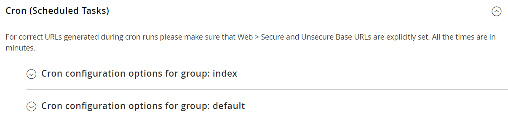

# Cron (tarefas agendadas)

O Adobe Commerce e o Magento Open Source executam algumas operações conforme agendado, executando periodicamente um script. Você pode controlar a execução e o agendamento de trabalhos cron do Commerce por meio do Administrador. As operações de armazenamento executadas de acordo com um cronograma cron incluem, mas não estão limitadas a:

- [Email](email-communications.md)
- [Regras de preço de catálogo](../merchandising-promotions/price-rules-catalog.md)
- [Boletins informativos](../merchandising-promotions/newsletters.md)
- [Geração de mapa do site XML](../merchandising-promotions/sitemap-xml.md)
- [Atualizações de taxa de moeda](../stores-purchase/currency-update.md)
- [Inventory management](../inventory-management/introduction.md)

>[!IMPORTANT]
>
>Os serviços da Commerce devem ser instalados no crontab para garantir que os componentes principais e algumas extensões de terceiros funcionem conforme esperado. Consulte as [instruções no _Guia de Instalação_](https://experienceleague.adobe.com/docs/commerce-operations/installation-guide/next-steps/configuration.html) para obter informações detalhadas sobre como instalar serviços no crontab.

Além disso, você pode configurar os seguintes itens para serem executados de acordo com um cronograma cron:

- Solicitar atualizações e reindexação da grade do sistema
- Duração do pagamento pendente

Verifique se as [URLs de base](../stores-purchase/store-urls.md) do armazenamento estão definidas corretamente para que as URLs geradas durante as operações cron estejam corretas. Para o Adobe Commerce na infraestrutura em nuvem, consulte [Configurar trabalhos do cron](https://experienceleague.adobe.com/docs/commerce-cloud-service/user-guide/configure/app/properties/crons-property.html) no _Guia do Commerce na Infraestrutura em Nuvem_. No local, consulte [Configurar e executar o con](https://experienceleague.adobe.com/docs/commerce-operations/configuration-guide/cli/configure-cron-jobs.html) no _Guia de Configuração_.

## Configurar cron

1. Na barra lateral _Admin_, vá para **[!UICONTROL Stores]** > _[!UICONTROL Settings]_>**[!UICONTROL Configuration]**.

1. No painel esquerdo, expanda **[!UICONTROL Advanced]** e escolha **[!UICONTROL System]**.

1. Expandir  a seção **[!UICONTROL Cron]**.

   {width="600" zoomable="yes"}

1. Conclua as configurações a seguir para os grupos **[!UICONTROL Index]** e **[!UICONTROL Default]**.

   As configurações são as mesmas em cada seção.

   - **[!UICONTROL Generate Schedules Every]** - Define a frequência com que o agendamento é gerado (em minutos). Os agendamentos são armazenados no banco de dados.
   - **[!UICONTROL Schedule Ahead for]** - Define com que antecedência os trabalhos cron são agendados (em minutos). Por exemplo, se esta configuração estiver definida como `10` e o cron for executado, os trabalhos cron serão agendados para os próximos 10 minutos.
   - **[!UICONTROL Missed if not Run Within]** - Define o tempo (em minutos) usado para determinar um trabalho perdido. Se o trabalho cron não for executado em seu horário agendado e o tempo especificado decorrer, ele não poderá ser executado e seu status será definido como `Missed`.
   - **[!UICONTROL History Cleanup Every]** - Define o tempo (em minutos) em que o histórico de tarefas concluídas é limpo no banco de dados.
   - **[!UICONTROL Success History Lifetime]** - Define a duração (em minutos) em que o histórico de trabalhos cron com status `Successful` permanece no banco de dados.
   - **[!UICONTROL Failure History Lifetime]** - Define a duração (em minutos) em que o histórico de trabalhos cron com status `Error` permanece no banco de dados.
   - **[!UICONTROL Use Separate Process]** - Define se todos os trabalhos cron do grupo são executados em um processo do sistema separado. Opções: `Yes` / `No`

   {width="600" zoomable="yes"}

1. Quando terminar, clique em **[!UICONTROL Save Config]**.
