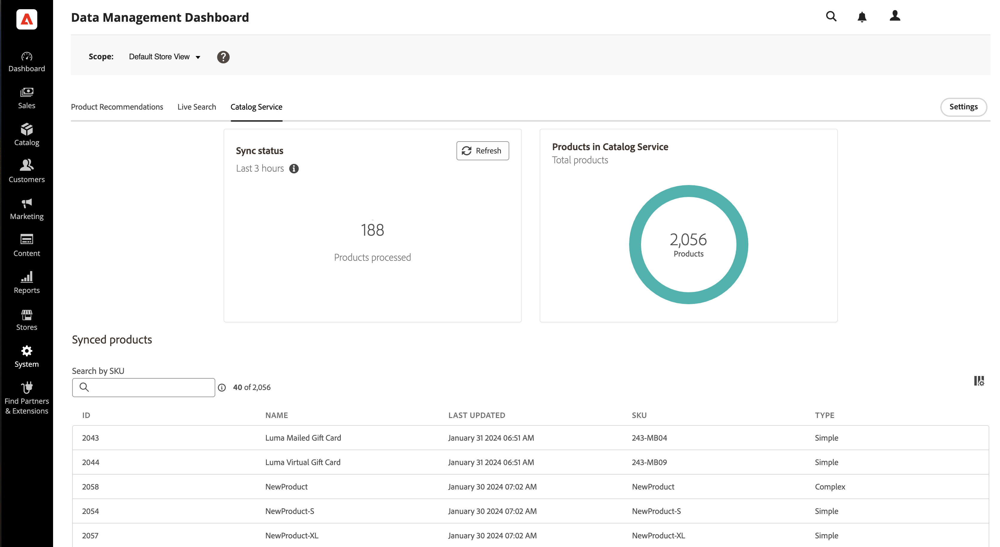

# Painel de gerenciamento de dados

O Painel de gerenciamento de dados oferece uma visão geral do status de sincronização para dados de produtos transferidos do banco de dados do Commerce para os serviços SaaS da Commerce. Os usuários podem monitorar convenientemente os status de sincronização de produtos e iniciar a ressincronização de dados a partir de um painel unificado. Esse recurso fornece informações valiosas sobre a disponibilidade de dados de produtos para sua loja, garantindo que eles possam ser exibidos imediatamente para seus compradores.

## Público-alvo

O Painel de Gerenciamento de Dados está disponível sem custo adicional para todos os comerciantes do Commerce que usam o [[!DNL Product Recommendations v6.0.0]](https://experienceleague.adobe.com/en/docs/commerce-merchant-services/product-recommendations/guide-overview), [[!DNL Live Search v4.1.0]](https://experienceleague.adobe.com/en/docs/commerce-merchant-services/live-search/guide-overview) ou [[!DNL Catalog Service v1.17]](https://experienceleague.adobe.com/en/docs/commerce-merchant-services/catalog-service/guide-overview) com uma licença ativa.

O Painel de Gerenciamento de Dados está localizado em *Sistema* > Transferência de Dados > *Painel de Gerenciamento de Dados*.

O painel contém os seguintes campos:

| Campo | Descrição |
|--- |--- |
| Escopo | Site específico para os dados sincronizados. |
| [!DNL Product Recommendations] | Exibe o status da sincronização, o número de produtos sincronizados e uma tabela dos [exibíveis](https://experienceleague.adobe.com/en/docs/commerce-admin/config/catalog/inventory#stock-options) produtos sincronizados para [!DNL Product Recommendations]. |
| [!DNL Live Search] | Exibe o status da sincronização, o número de produtos sincronizados e uma tabela dos [exibíveis](https://experienceleague.adobe.com/en/docs/commerce-admin/config/catalog/inventory#stock-options) produtos sincronizados para [!DNL Live Search]. |
| [!DNL Catalog Service] | Exibe o status da sincronização, o número de produtos sincronizados e uma tabela dos produtos sincronizados para [!DNL Catalog Service]. |
| Configurações | Abre uma caixa de diálogo onde você pode [ressincronizar manualmente os dados do catálogo](#resync-catalog-data). |
| Status de sincronização | Exibe o número de produtos que foram transferidos do banco de dados do Commerce para qualquer um dos serviços SaaS nas últimas três horas. Se você fizer atualizações pouco frequentes no catálogo, esse valor será frequentemente zero. Se uma sincronização estiver em andamento, clique em **[!UICONTROL Refresh]** para obter uma contagem atualizada. |
| Contagem de produtos | Reflete o número total de produtos de catálogo disponíveis para o serviço. Os painéis [!DNL Product Recommendations] e [!DNL Live Search] exibem o número total de produtos _exibíveis_. O [!DNL Catalog Service] não filtra produtos por exibível, portanto, se você tiver o [!DNL Catalog Service] e o [!DNL Live Search] ou o [!DNL Product Recommendations] instalados, é possível que os dois painéis mostrem dois valores diferentes para a contagem de produtos. |
| Produtos sincronizados | Fornece detalhes sobre os produtos no índice Commerce principal. Por padrão, essa tabela é classificada por &quot;Última atualização&quot;. Para localizar um produto específico, use o campo **[!UICONTROL Search by SKU]**. Para controlar quais colunas são exibidas, clique em **[!UICONTROL Customize Table]** à direita da tabela. |

## Uso do painel de Gerenciamento de dados

Ao atualizar produtos no banco de dados do Commerce, os dados do produto são transferidos para os serviços SaaS de acordo com a configuração do sistema. Quando o processo de sincronização é iniciado, **Contagem de produto** indica o número de produtos enviados para os serviços SaaS.

>[!IMPORTANT]
>
>O tempo necessário para concluir a sincronização varia de acordo com o tamanho do catálogo e o volume de dados atualizados.

Quando o número de produtos processados corresponde ao número de produtos atualizados, indica que a sincronização está concluída.

>[!NOTE]
>
>O Adobe também fornece uma interface de linha de comando e registros do sistema que desenvolvedores e integradores de sistemas podem usar para gerenciar e rastrear operações de sincronização e solucionar erros de serviços SaaS da Commerce. Para obter detalhes, consulte o [Guia de Exportação de Dados SaaS](https://experienceleague.adobe.com/en/docs/commerce-merchant-services/saas-data-export/overview).

### Lista de produtos sincronizados

Para ver os detalhes de um produto sincronizado, clique no produto na tabela.

### Ressincronizar dados do catálogo

Para garantir que seus serviços SaaS da Commerce estejam sempre atualizados com as informações mais recentes do produto, você deve [implementar um agendamento](https://experienceleague.adobe.com/en/docs/commerce-operations/configuration-guide/cli/manage-indexers#reindex) para sincronizar os dados do catálogo.

Embora você possa [iniciar manualmente](#manually-resync-catalog) uma ressincronização de dados de catálogo do banco de dados do Commerce para serviços SaaS, isso não é recomendado, pois pode aumentar a carga nos recursos de hardware. No entanto, a ressincronização manual do catálogo pode ser necessária nos seguintes cenários:

- Sempre que alterações significativas forem feitas no catálogo de produtos, como adicionar novos produtos, atualizar detalhes do produto ou modificar categorias

- Se você observar discrepâncias ou problemas de desempenho na exibição dos dados do produto em suas lojas

- Após qualquer atualização ou alteração nas integrações entre o banco de dados do Commerce e os serviços SaaS

- Ao implantar personalizações ou configurações que afetam o gerenciamento de dados do produto ou os processos de sincronização

Seguindo essas diretrizes e ressincronizando proativamente os dados do catálogo conforme necessário, você pode manter a consistência, a precisão e a confiabilidade dos dados em todo o ecossistema do Adobe Commerce.

#### Ressincronizar manualmente o catálogo

Se você precisar ressincronizar os dados do catálogo, clique em **[!UICONTROL Settings]** no lado direito da página para exibir uma caixa de diálogo onde você pode iniciar uma ressincronização. A ressincronização dos dados do catálogo força o serviço a buscar novamente os dados do banco de dados do Commerce nos serviços SaaS.

