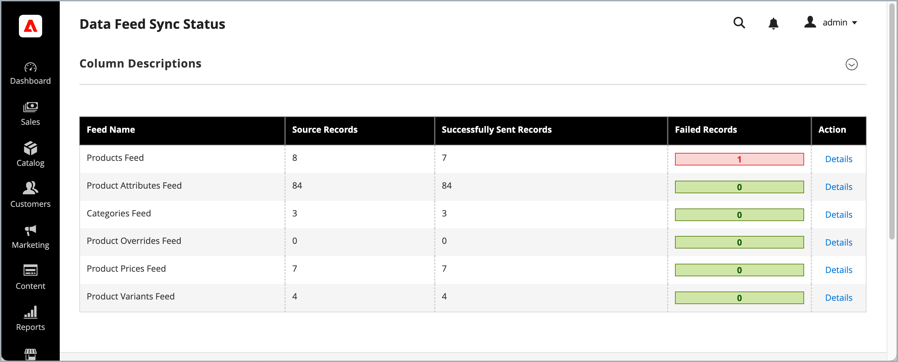

# Monitoramento do status de sincronização do feed de dados

A página [!UICONTROL Data Feed Sync Status] permite que os administradores do Commerce monitorem a integridade das exportações de feeds de dados de produtos e categorias na área de Administração.

## Público e disponibilidade {#audience}

A página Status da sincronização do feed de dados está disponível sem custo adicional para os comerciantes do Commerce com uma licença ativa para um dos seguintes serviços:

- [[!DNL Product Recommendations v6.0.0]](https://experienceleague.adobe.com/pt-br/docs/commerce/product-recommendations/guide-overview)
- [[!DNL Live Search v4.1.0]](https://experienceleague.adobe.com/pt-br/docs/commerce/live-search/overview)
- [[!DNL Catalog Service v1.17]](https://experienceleague.adobe.com/pt-br/docs/commerce/catalog-service/guide-overview)
- [[!DNL Adobe Commerce Optimizer Connector]](https://experienceleague.adobe.com/pt-br/docs/commerce/aco-optimizer-connector/overview)

A página Status de sincronização do feed de dados está disponível automaticamente nas configurações de serviço compatíveis da Commerce. Na Adobe Commerce na infraestrutura em nuvem e em implantações locais, se a página estiver ausente após a ativação de um serviço ou conector qualificado, siga as instruções de instalação manual abaixo. Não use o procedimento de instalação do Composer para experiências SaaS gerenciadas pelo produto.

## Acessar a página de status de sincronização {#access-data-feed-sync-status-page}

Na área Administrador, navegue até **[!UICONTROL System]** > **[!UICONTROL Data Transfer]** > **[!UICONTROL Data Feed Sync Status]**.

{width="600" zoomable="yes"}

>[!NOTE]
>
> Esta página relata somente o status da exportação. Um status de sucesso significa que os dados foram exportados com êxito - ele não confirma se os dados estão disponíveis nos serviços conectados. Consulte [Confirmar dados em serviços conectados](#confirm-data-in-connected-services) para obter detalhes.

## Feeds de exportação disponíveis

A lista de feeds de exportação disponíveis que você pode gerenciar na página Status da sincronização de dados depende dos serviços da Commerce conectados.

- **Para [!DNL Adobe Commerce on Cloud, On Premises, and Commerce as a Cloud Service] com o Commerce Services configurado:** Consulte [Feeds com Suporte](https://experienceleague.adobe.com/pt-br/docs/commerce/saas-data-export/reference/feed-table-reference#supported-feeds) no _Guia de Exportação de Dados SaaS_.

- **Para implantações do Adobe Commerce na nuvem ou locais configuradas com[!DNL Adobe Commerce Optimizer Connector]:** Consulte [Feeds com suporte](https://experienceleague.adobe.com/pt-br/docs/commerce/aco-optimizer-connector/reference/connector-reference#supported-feeds) no _Guia do Conector do Adobe Commerce Optimizer_.


## Resumo do status de sincronização do feed de dados {#data-feed-sync-status-summary}

A grade de resumo lista cada feed e suas contagens de exportação.

| Campo | Descrição |
| ----------------------------- | ---------------------------------------------------------------------------------------------------------------------------------------------------------------------------------------------------------------------------------------- |
| **Nome do feed** | Indexador de feed de uma entidade ou parte de uma entidade (produto, preço do produto). |
| **Registros Source** | Número de registros do Commerce que exigem sincronização. Pode exceder a contagem da grade de administração porque os itens de feed têm escopo (por exemplo, código do Modo de Exibição de Loja). |
| **Registros Enviados Com Êxito** | Número de itens de feed enviados com êxito do Commerce para o ponto de extremidade de serviço configurado. Isso não confirma a assimilação downstream ou a disponibilidade do catálogo. Se ocorrerem erros de sincronização, esse número poderá ser menor que o número de registros de origem. |
| **Registros com Falha** | Número de registros que falharam ao serem enviados para os serviços conectados do Commerce. |
| **Ação** | Selecione **[!UICONTROL Details]** para exibir a atividade de sincronização de um feed. |

## Detalhes do status de sincronização do feed de dados {#data-feed-sync-status-details}

Na página de resumo, selecione um nome de feed ou selecione **[!UICONTROL Details]** para exibir o status de exportação de cada item de feed:

{width="600" zoomable="yes"}

| Campo | Descrição |
| ---------------------- | -------------------------------------------------------------------------------------------------------------------------------------------------------------------------------------------------- |
| **ID do Item do Feed** | Identificador gerado automaticamente usado para fins do sistema |
| **ID da entidade** | O identificador exclusivo da entidade de origem (ID do produto, ID de categoria e assim por diante) |
| **Identificadores de Feed** | Identificadores exclusivos para o item de feed. Por exemplo, SKU e código de exibição da loja para o feed de produtos. Os valores variam de acordo com o feed. |
| **Status da exportação** | O [status de sincronização](#export-status-types) do item de feed, com indicadores codificados por cores |
| **Data da Última Sincronização** | Data e hora da tentativa de exportação ou envio mais recente da Commerce. Esse carimbo de data/hora não confirma a disponibilidade downstream. |
| **A Entidade Foi Excluída?** | Indica se a entidade foi excluída no Adobe Commerce. Os itens excluídos são exibidos somente se a sincronização falhar. |
| **ID da Solicitação** | Identificador exclusivo para a solicitação de sincronização. Forneça-o ao Suporte ao solucionar problemas de atualizações de entidade. |
| **Erro** | Informações detalhadas sobre o erro de falhas de sincronização |

Você pode gerenciar a exibição usando os seguintes controles:

- [!UICONTROL Mass Action] para agendar a ressincronização dos itens de feed selecionados
- [!UICONTROL Filters] e [!UICONTROL Columns]
- [!UICONTROL Default View] para criar e salvar um modo de exibição filtrado e alternar entre modos de exibição

### Indicadores de saúde do feed {#feed-health-indicators}

| **Indicador** | **Descrição** |
| ------------- | --------------- |
| Status do indexador | <ul><li>**Pronto**: o indexador está atualizado. Não é necessário reindexar.</li><li>**Reindexação necessária**: dados do Source alterados. Execute um reindex para capturar alterações recentes.</li><li>**Processando**: indexação em andamento.</li></ul> |
| Backlog de log de alterações | <ul><li>**Todas as sincronizadas**: nenhuma alteração pendente a ser processada.</li><li>**Itens na lista de pendências**: Número de alterações pendentes aguardando para serem processadas. Um backlog de mais de 1.000 itens pode indicar problemas de desempenho.</li></ul> |
| Modo do indexador | <ul><li>**Modo de agendamento** (recomendado): o indexador é executado de acordo com o agendamento, o que reduz o risco de perda de dados.</li><li>**Atualizar ao salvar** (tempo real): mostrado como um aviso na página. O modo em tempo real não é esperado e aumenta o risco de perda de dados sob carga.</li></ul> |

>[!TIP]
>
> Para saber mais sobre o processamento de índice, consulte o tópico [Gerenciamento de índice](index-management.md).

### Exportar tipos de status {#export-status-types}

| **Status** | **Descrição** | **Ação necessária** |
| ----------------------------- | ------------------------------------------------------------ | ------------------------------------------------------------------ |
| **Enviado ao serviço** | O item de feed foi enviado com sucesso do Commerce para processamento downstream. | Nenhum |
| **Falha, tentará novamente** | Falha ao enviar, mas o sistema tentará reenviar. | Monitor para resolução |
| **Falha, requer atenção** | Falha devido a um erro de aplicativo ou de dados. | Investigue e resolva o problema na coluna [!UICONTROL Error] |
| **Aguardando envio** | Alterações detectadas no log de alterações, mas ainda não processadas. | Estado de processamento normal |

## Monitorar status do feed de dados

Ao atualizar entidades relacionadas ao produto e à categoria no banco de dados do Commerce, os dados são transferidos para os serviços da Commerce de acordo com a configuração do feed. Você pode monitorar a atividade de exportação e seu status atual na página de resumo [!UICONTROL Data Feed Sync Status].

>[!IMPORTANT]
>
> O tempo necessário para concluir a sincronização de dados varia de acordo com o tamanho do catálogo, o volume de dados atualizados e o desempenho do serviço externo.

Quando a contagem enviada com sucesso corresponde à contagem de origem de um feed e nenhum item permanece aguardando envio ou falha, o Commerce conclui a exportação desse feed. Use o painel apropriado para [confirmar a disponibilidade downstream](#confirm-data-in-connected-services).

>[!NOTE]
>
> O Adobe também fornece ferramentas de interface de linha de comando e registros do sistema que desenvolvedores e integradores de sistemas podem usar para gerenciar e rastrear operações de sincronização. Para obter detalhes, consulte o [Guia de Exportação de Dados SaaS](https://experienceleague.adobe.com/pt-br/docs/commerce/saas-data-export/overview).

### Gerenciar exportações com falha {#manage-failed-exports}

Para analisar exportações com falha e agendar uma ressincronização:

1. Na página de resumo, localize o feed com registros com falha.
1. Selecione **[!UICONTROL Details]**.
1. Examine as mensagens de erro na coluna [!UICONTROL Error].
1. Selecione os registros a serem ressincronizados usando as caixas de seleção.
1. No menu [!UICONTROL Mass Action], selecione **[!UICONTROL Schedule Resync]**, selecione **[!UICONTROL Submit]** e confirme a operação.
1. Monitorar alterações de status na página de detalhes.

O sistema tenta automaticamente determinadas falhas.

#### Quando sincronizar novamente manualmente {#resync-feed-items}

Ressincronizar manualmente nestes casos:

- Os erros de autenticação ou permissão (códigos de status 401 ou 403) persistem
- Você corrigiu problemas de formato de dados que causavam erros de conteúdo
- Configuração de serviço externo ou pontos de extremidade alterados
- As personalizações que afetam a exportação de dados foram implantadas

### Confirmar dados em serviços conectados {#confirm-data-in-connected-services}

Para verificar a sincronização de ponta a ponta após a conclusão das exportações, use um dos métodos a seguir. Para os limites do status de exportação nesta página, consulte a [observação acima](#export-status-scope).

- **[!DNL Adobe Commerce as a Cloud Service]com serviços da Commerce:** Verifique o [Painel de Gerenciamento de Dados](data-dashboard.md) aplicável para confirmar a disponibilidade downstream.
- **Adobe Commerce na Nuvem ou no Local com o Adobe Commerce Optimizer Connector**: verifique primeiro o status de exportação do Commerce Admin e, em seguida, verifique a [página Sincronização de Dados](https://experienceleague.adobe.com/pt-br/docs/commerce/optimizer/setup/data-sync) em [!DNL Commerce Optimizer Studio]
- **[!DNL Adobe Commerce Optimizer] (independente):** Os dados não são exportados do back-end do Commerce. Use a [página de Sincronização de Dados](https://experienceleague.adobe.com/pt-br/docs/commerce/optimizer/setup/data-sync) em [!DNL Commerce Optimizer Studio] para confirmar a disponibilidade dos dados.

>[!TIP]
>
> Para saber mais sobre o processo de sincronização de dados, consulte [Sincronizar dados com a exportação de dados SaaS](https://experienceleague.adobe.com/pt-br/docs/commerce/saas-data-export/data-synchronization/data-sync-manage#view-and-manage-the-synchronization-process) no *Guia de Exportação de Dados SaaS*.

## Práticas recomendadas {#best-practices}

- Revise a página de resumo diariamente para feeds com altas taxas de falha.
- Examine os detalhes semanalmente para feeds críticos, como produtos e preços.
- Rastreie as tendências de sucesso de exportação mensalmente para identificar problemas recorrentes.

## Solução de problemas comuns {#troubleshoot-common-issues}

| Problema | Sintomas | O que fazer |
| ---------------------------------- | -------------------------------------------------------------------------------------------------------------------------------------------- | ------------------------------------------------------------------------------------------------------------------------------------------------------------------------------------------------------------------------------------ |
| Altas taxas de falha | Muitos registros mostram *Falha, requer atenção* status | <ul><li>Verificar o status e a configuração do serviço externo</li><li>Revisar mensagens de erro para padrões na coluna [!UICONTROL Error]</li><li>Após resolver o problema subjacente, consulte [Gerenciar e ressincronizar exportações com falha](#manage-failed-exports)</li><li>Entre em contato com o suporte do serviço externo, se necessário</li></ul> |
| Desempenho de exportação lento | Atualizações de backlog de changelog altas ou de status lento | <ul><li>Verificar [indicadores de integridade do feed](#feed-health-indicators) para o indexador e o status do backlog</li><li>Executar indexação novamente se **Reindexação necessária** for exibido</li><li>Monitorar tempos de resposta do serviço externo</li><li>Agendar exportações fora do horário de pico, quando possível</li><li>Analisar o desempenho e os recursos do sistema</li></ul> |
| Falhas de autenticação | Códigos de status 401 ou 403 na coluna [!UICONTROL Error] | <ul><li>Verificar credenciais e tokens da API</li><li>Verificar permissões de conta de serviço externo</li><li>Renovar tokens expirados ou entrar em contato com seu provedor de serviços</li><li>Após a restauração das credenciais, [ressincronizar os registros afetados](#manage-failed-exports)</li></ul> |
| Página Status de sincronização do feed de dados ausente | **[!UICONTROL Data Feed Sync Status]** não está listado em **[!UICONTROL System]** > **[!UICONTROL Data Transfer]** depois que você habilita um serviço conectado | <ul><li>Para o Commerce as a Cloud Service, confirme se um serviço qualificado está habilitado (consulte [Público e disponibilidade](#audience))</li><li>Somente para Commerce na Nuvem ou Local, [Instale a extensão manualmente](#install-the-extension)</li></ul> |

Adobe Commerce na infraestrutura em nuvem ou no local: confirme se um serviço qualificado ou o Adobe Commerce Optimizer Connector está ativado; se a página ainda estiver ausente, siga as instruções de instalação manual.
ACCS ou Adobe Commerce Optimizer: não instale o módulo manualmente; use a experiência de sincronização gerenciada pelo produto ou entre em contato com a equipe de suporte de serviço apropriada.

## Instalar a extensão {#install-the-extension}

A instalação manual é necessária para implantações do Adobe Commerce na nuvem ou locais somente se a página [!UICONTROL Data Feed Sync Status] estiver ausente na área de Administração depois que você habilitar um serviço qualificado. Consulte [Público e disponibilidade](#audience).

### Pré-requisitos

- Adobe Commerce 2.4.4+. Para obter requisitos detalhados, consulte [Requisitos do sistema](https://experienceleague.adobe.com/pt-br/docs/commerce-operations/installation-guide/system-requirements).
- [Extensão de Exportação de Dados do Adobe Commerce](https://experienceleague.adobe.com/pt-br/docs/commerce/saas-data-export/reference/manage-extension), versão 103.4.15 ou posterior
- Chaves de autenticação com permissão para baixar o pacote necessário do repositório do Adobe Commerce. Para criar chaves de autenticação e obter o acesso necessário ao pacote, consulte [Obter suas chaves de autenticação](https://experienceleague.adobe.com/pt-br/docs/commerce-operations/installation-guide/prerequisites/authentication-keys). Para instalações na nuvem, consulte o [Guia de Infraestrutura do Commerce na Nuvem](https://experienceleague.adobe.com/pt-br/docs/commerce-on-cloud/user-guide/develop/authentication-keys).
- Acesso à linha de comando do servidor de aplicativos do Adobe Commerce.

### Etapas de instalação

Adicionar o módulo `magento/module-data-exporter-status` usando o Composer:

```shell
composer require magento/module-data-exporter-status
```

Para ver as etapas detalhadas de instalação, consulte os guias a seguir:

- [Instalar extensão para Adobe Commerce na Infraestrutura em Nuvem](https://experienceleague.adobe.com/pt-br/docs/commerce-on-cloud/user-guide/configure-store/extensions)
- [Instalar extensão no Adobe Commerce no local](https://experienceleague.adobe.com/pt-br/docs/commerce-operations/installation-guide/tutorials/extensions)

>[!MORELIKETHIS]
>
> - [Painel de gerenciamento de dados](data-dashboard.md)
> - [Guia De Exportação De Dados SaaS](https://experienceleague.adobe.com/pt-br/docs/commerce/saas-data-export/overview)
