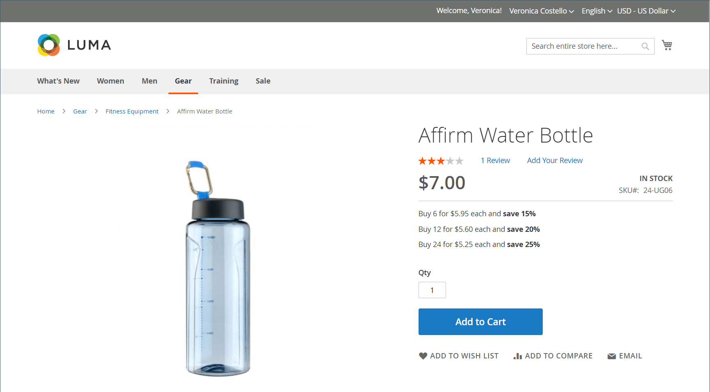
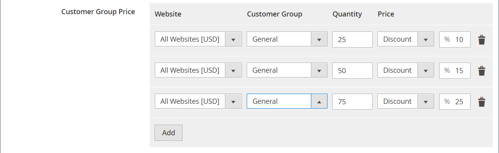

# Importar preços de camada

Em vez de inserir [preços de camada](../catalog/product-price-tier.md) manualmente para cada produto, pode ser mais eficiente [importar](data-import.md) os dados de preços. Antes de começar, crie um arquivo de amostra de dados de preço da camada exportados que você possa usar como modelo.

{width="700" zoomable="yes"}

## Etapa 1: Exportar os dados de preço da camada

O exemplo a seguir exporta dados de preços de camada para um único produto. Em seguida, você pode usar os dados exportados como um modelo para importações em massa de dados de preço da camada. Para saber mais sobre como exportar dados de preços avançados, consulte [Dados de preços avançados](data-attributes-product.md#advanced-pricing-attributes).

{width="600" zoomable="yes"}

1. Na barra lateral _Admin_, vá para **[!UICONTROL System]** > _[!UICONTROL Data Transfer]_>**[!UICONTROL Export]**.

1. Em _[!UICONTROL Export Settings]_, defina **[!UICONTROL Entity Type]**como `Advanced Pricing`.

1. Na grade **[!UICONTROL Entity Attributes]**, role para baixo até os atributos SKU e faça o seguinte:

   - Para preços de nível baseados em uma porcentagem de desconto, insira o SKU de cada produto a ser exportado, separado por vírgula.

     {width="600" zoomable="yes"}

   - Para preços de nível baseados em uma quantidade fixa, insira o SKU de cada produto.

   - Role para baixo e clique em **[!UICONTROL Continue]**.

1. Localize o arquivo de exportação no local de downloads do seu navegador da Web e abra o arquivo.

   {width="600" zoomable="yes"}

**_Dados de preço de camada exportados_**

As seguintes colunas estão incluídas nos dados exportados:

- `sku`
- `tier_price_website`
- `tier_price_customer_group`
- `tier_price_qty`
- `tier_price`
- `tier_price_value_type`

Use os dados exportados como um modelo para importar dados de preço de camada.

## Etapa 2: Atualizar os dados

1. Atualize os dados de preço da camada para cada produto, conforme necessário.

   Todos os produtos sem atualizações de preço por nível podem ser excluídos do arquivo CSV. Não há necessidade de reimportar os produtos que não foram alterados.

1. **[!UICONTROL Save]** o arquivo CSV atualizado.

>[!NOTE]
>
>O tamanho de um arquivo de importação não pode ser maior que 2 MB.

## Etapa 3: Importar os dados atualizados

1. Na barra lateral _Admin_, vá para **[!UICONTROL System]** > _[!UICONTROL Data Transfer]_>**[!UICONTROL Import]**.

1. Em _Importar Configurações_, defina **[!UICONTROL Entity Type]** como `Advanced Pricing`.

1. Defina **[!UICONTROL Import Behavior]** como `Add/Update`.

1. Em **[!UICONTROL File to Import]**, clique em **[!UICONTROL Choose File]** e selecione o arquivo que você preparou para importar do seu diretório.

1. No canto superior direito, clique em **[!UICONTROL Check Data]**.

1. Se o arquivo for válido, clique em **[!UICONTROL Import]**.

   Caso contrário, corrija cada problema com os dados listados na mensagem e tente importar o arquivo novamente.
