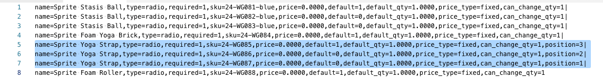

# Importar produtos do pacote

Um pacote de produtos apresenta uma seleção de itens e permite que os clientes escolham aqueles que desejam comprar. Todos os itens que compõem um pacote existem no catálogo como [Produtos simples](../catalog/product-create-simple.md) ou [Produtos virtuais](../catalog/product-create-virtual.md). Normalmente, os produtos do pacote são criados e atualizados pelo administrador. No entanto, você também pode importar dados para criar um produto de pacote ou exportar produtos de pacote existentes, editar os dados e importá-los de volta para o catálogo. O Sprite Yoga Companion Kit é um produto empacotado nos dados de amostra que são usados nos exemplos a seguir.

{width="700" zoomable="yes"}

## Alterar a ordem dos itens do pacote

Há duas maneiras de alterar a ordem dos itens em um produto de pacote.

### Método 1: arrastar e soltar

Ao trabalhar com uma [Pacote](../catalog/product-create-bundle.md) produto do Administrador, você pode arrastar e soltar itens e seções na posição.

{width="600" zoomable="yes"}

### Método 2: editar os dados do produto

A melhor maneira de entender a estrutura de um produto combinado é exportar o produto e examinar os dados em uma planilha. Você pode alterar a ordem dos itens de pacote exportando o produto e adicionando um parâmetro de posição aos dados de cada item. Os dados do item estão na `bundle_values` do produto exportado. Quando abertos em uma planilha, todos os itens associados ao produto estão em uma única célula como uma longa sequência de texto. A variável `bundle_values` contém os seguintes elementos para cada item:

- Nome da seção do item
- Controle de entrada
- Indicador de item obrigatório
- SKU
- Cor
- Preço
- Indicador de opção padrão
- Quantidade padrão
- Tipo de preço
- Indicador de quantidade editável

#### Etapa 1: exportar o produto do pacote

Nesta etapa, o Kit de companhia Sprite Yoga é exportado como um ([CSV](data-csv.md) arquivo. Você pode usar qualquer outro produto incluído no catálogo.

1. No _Admin_ barra lateral, vá para **[!UICONTROL System]** > _[!UICONTROL Data Transfer]_>**[!UICONTROL Export]**.

1. Em _Configurações de exportação_, definir **[!UICONTROL Entity Type]** para `Products`.

1. Na lista de atributos do produto, role para baixo até **[!UICONTROL SKU]** e insira o SKU do produto do pacote que você deseja exportar.

   O SKU é `24-WG080` para o produto neste exemplo.

1. Role para baixo até a parte inferior da seção e clique em **[!UICONTROL Continue]**.

1. No _[!UICONTROL Action]_coluna da_[!UICONTROL File name]_ , clique em **[!UICONTROL Select]** e escolha `Download`.

   O arquivo aparece no local de download usado pelo navegador.

#### Etapa 2: Editar os dados

1. Abra o arquivo CSV baixado em uma planilha.

1. Role para a direita até ver `bundle_values` coluna.

   No `bundle_values` , cada elemento é separado por vírgulas e cada item do pacote é separado do próximo com uma barra vertical. (O último item não termina com uma barra vertical.) Os dados do pacote exportados devem ser semelhantes ao seguinte exemplo:

   {width="600" zoomable="yes"}

1. Para facilitar a edição, copie o `bundle_values` dados e cole-os em um editor de texto, em seguida, adicione uma quebra de linha após cada item, para que cada item esteja em uma linha separada.

1. Após editar os dados, remova cuidadosamente as quebras de linha e cole os dados editados de volta na `bundle_values` coluna.

   Na ilustração a seguir, uma variável `position=[number]` parâmetro é adicionado a cada pulseira de ioga para alterar a ordem dos itens na lista da loja.

   {width="500" zoomable="yes"}

1. Após editar os dados, **[!UICONTROL Save]** o arquivo CSV.

#### Etapa 3: importar o produto atualizado

1. No _Admin_ barra lateral, vá para **[!UICONTROL System]** > _[!UICONTROL Data Transfer]_>**[!UICONTROL Import]**.

1. Em _[!UICONTROL Import Settings]_, definir **[!UICONTROL Entity Type]**para `Products`.

1. Definir **[!UICONTROL Import Behavior]** para `Replace`.

   Essa opção substitui os dados anteriores do produto do pacote, em vez de adicionar as alterações como itens adicionais.

1. Role para baixo até _Arquivo a importar_ e clique em **[!UICONTROL Choose File]**.

1. Selecione o arquivo CSV editado.

1. Clique em **[!UICONTROL Check Data]** e aguarde alguns momentos para que os dados sejam verificados.

1. Se o arquivo for válido, clique em **[!UICONTROL Import]**.

1. Quando o processo estiver concluído, acesse **[!UICONTROL System]** > _[!UICONTROL Tools]_>**[!UICONTROL Cache Management]**e clique em **[!UICONTROL Flush Cache Storage]**.

   Isso garante que o produto atualizado fique imediatamente disponível na loja.
