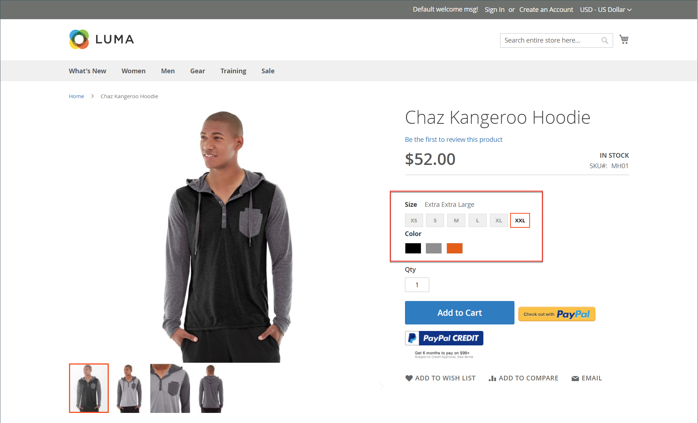
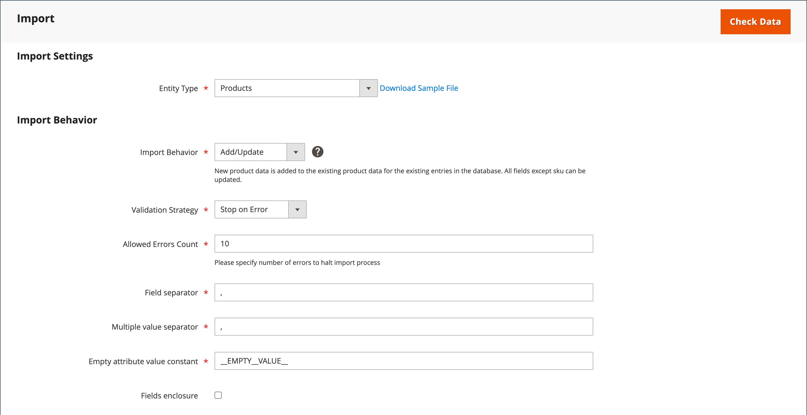

# Importar produtos configuráveis

A melhor maneira de entender como os dados configuráveis do produto são estruturados é exportar um produto configurável e suas variações e examinar os dados em uma planilha.

No exemplo a seguir, é possível adicionar um conjunto de variações de produto para um novo tamanho em cada cor. Primeiro, exporte o produto configurável e examine a estrutura de dados. Em seguida, atualize os dados e importe-os de volta para o catálogo. Se você não quiser passar pelo exercício de exportação de dados, é possível baixar o arquivo CSV usado no exemplo.

{width="700" zoomable="yes"}

## Etapa 1: verificar as configurações e os valores de atributo

1. Antes de começar, verifique se os atributos usados para variações de produto têm as configurações de propriedade necessárias.

   - [**[!UICONTROL Scope]**](../getting-started/websites-stores-views.md#scope-settings) - `Global`
   - [**[!UICONTROL Catalog Input Type for Store Owner]**](data-attributes-product.md) - O tipo de entrada de qualquer atributo usado para uma variação de produto deve ser um dos seguintes:

      - `Dropdown`
      - `Visual Swatch`
      - `Text Swatch`
      - `Multi-Select`

   - **[!UICONTROL Values Required]** - `Yes`

1. Se você estiver adicionando um tamanho ou cor, ou fazendo qualquer outra alteração em um atributo existente, atualize o atributo com o novo valor.

1. Na barra lateral _Admin_, vá para **[!UICONTROL Stores]** > _[!UICONTROL Attributes]_>**[!UICONTROL Product]**.

1. Localize o atributo na lista e abra-o no modo de edição.

1. Adicione o novo valor ao atributo.

   No exemplo a seguir, um novo tamanho é adicionado a uma Amostra de texto.

   {width="500" zoomable="yes"}

1. Quando terminar, clique em **[!UICONTROL Save Attribute]**.

1. Se você estiver adicionando um atributo, siga as instruções para [criar o atributo](../catalog/attribute-product-create.md) antes de começar.

## Etapa 2: exporte o produto configurável

1. Na barra lateral _Admin_, vá para **[!UICONTROL Catalog]** > **[!UICONTROL Products]**.

1. Encontre o produto configurável para exportar:

   - Clique em **[!UICONTROL Filters]**.
   - Defina **[!UICONTROL Type]** como `Configurable Product` e clique em **[!UICONTROL Apply Filters]**.
   - Escolha o produto configurável que deseja usar para a exportação de teste e anote o **[!UICONTROL SKU]**.

1. Na barra lateral _Admin_, vá para **[!UICONTROL System]** > _[!UICONTROL Data Transfer]_>**[!UICONTROL Export]**.

   {width="600" zoomable="yes"}

1. Em _[!UICONTROL Export Setting]s_, faça o seguinte:

   - Defina **[!UICONTROL Entity Type]** como `Products`.

   - Defina **[!UICONTROL Export File Format]** como `CSV`.

1. Em _[!UICONTROL Entity Attributes]_, role para baixo ou use o filtro de rótulo de atributo para localizar o atributo **[!UICONTROL SKU]**&#x200B;e faça o seguinte:

   - Insira o SKU do produto configurável que você escolheu exportar e clique em **[!UICONTROL Continue]**.

     {width="600" zoomable="yes"}

   - Procure o arquivo no local de download do navegador da Web e abra-o como uma planilha.

     O arquivo CSV tem uma linha separada para cada variação de produto simples e uma linha para o produto configurável. O `product_type column` mostra várias variações de produtos simples associadas a um produto configurável.

     {width="600" zoomable="yes"}

   - Role até a extremidade direita da planilha para localizar as seguintes colunas.

      - `configurable_variations` - Define a relação um para muitos entre o registro de produto configurável e cada variação.
      - `configurable_variation_labels` - Define o rótulo que identifica cada variação.

     Neste exemplo, os dados podem ser encontrados nas colunas CG e CH. Dependendo do número de variações, a cadeia de caracteres de dados na coluna `configurable_variations` pode ser longa. Os dados são usados como um índice para as variações de produtos associadas e têm a seguinte estrutura:

     ```text
     sku={{SKU_VALUE}},attribute1={{VALUE}},attribute2={{VALUE}}| sku={{SKU_VALUE}},attribute1={{VALUE}},attribute2={{VALUE}}
     ```

     Cada SKU é separado por um símbolo de barra vertical (|) e os atributos são separados por vírgula. O valor de cada atributo é representado pelo código do atributo, em vez do rótulo do atributo. Os dados reais aparecem da seguinte forma:

     ```text
     sku=MH01-XS-Black,size=XS,color=Black|sku=MH01-XS-Gray,size=XS,color=Gray|sku=MH01-XS-Orange,size=XS,color=Orange</pre>
     ```

1. Ao entender a estrutura dos dados configuráveis do produto, você pode editar os dados ou adicionar novas variações diretamente ao arquivo CSV.

   Para saber mais, consulte [Dados complexos](data-attributes-product.md#complex-product-data-attributes).

## Etapa 3: Editar os dados

No exemplo a seguir, o conjunto de tamanhos XL é copiado e colado na planilha para criar um conjunto de variações de produto para um novo tamanho em cada cor.

1. Copie o conjunto de variações de produto que deseja usar como modelo para os novos produtos.

   {width="600" zoomable="yes"}

1. Inserir os registros de linhas copiadas na planilha.

   Agora você tem dois conjuntos idênticos de variações de produtos simples.

   {width="600" zoomable="yes"}

1. Atualize os dados das novas variações nas seguintes colunas, conforme necessário.

   - `sku`
   - `name`
   - `url_key`
   - `additional_attributes`

   Para este exemplo, todas as referências `XL` são alteradas para `XXL`.

1. Atualize as informações na coluna `product_variations` do registro de produto configurável, para que as novas variações sejam incluídas como parte do produto configurável.

   Na linha com o registro de produto configurável, clique na célula que contém os dados `product_variations`. Em seguida, na barra de fórmulas, copie o último conjunto de parâmetros, começando com o símbolo da barra vertical.

   {width="600" zoomable="yes"}

1. Cole os parâmetros até o final dos dados e edite conforme necessário para as novas variações.

   Neste exemplo, os parâmetros `sku` e `size` são atualizados para o novo tamanho XXL.

1. Antes de importar os dados de volta para o catálogo, exclua todas as linhas que não foram alteradas.

   Neste exemplo, somente as três novas variações para o novo tamanho e a linha com o produto configurável atualizado são importadas de volta para o catálogo. As outras linhas podem ser excluídas do arquivo CSV. No entanto, não exclua a linha de cabeçalho com rótulos de coluna.

   {width="600" zoomable="yes"}

1. **[!UICONTROL Save]** o arquivo CSV.

   Os dados estão prontos para serem importados para o catálogo.

   >[!NOTE]
   >
   >O tamanho de um arquivo de importação não pode ser maior que 2 MB.

## Etapa 4: Importar os dados atualizados

1. Na barra lateral _Admin_, vá para **[!UICONTROL System]** > _[!UICONTROL Data Transfer]_>**[!UICONTROL Import]**.

1. Em _[!UICONTROL Import Settings]_, defina **[!UICONTROL Entity Type]**&#x200B;como `Products`.

1. Em _[!UICONTROL Import Behavior]_, defina **[!UICONTROL Import Behavior]**&#x200B;como `Add/Update`.

   {width="600" zoomable="yes"}

1. Em _[!UICONTROL File to Import]_, clique em **[!UICONTROL Choose File]**, navegue até o arquivo CSV que você preparou para importar e escolha o arquivo.

   {width="600" zoomable="yes"}

1. No canto superior direito, clique em **[!UICONTROL Check Data]**.

1. Se o arquivo for válido, clique em **[!UICONTROL Import]**.

   Caso contrário, corrija os problemas encontrados nos dados e tente novamente.

   {width="600" zoomable="yes"}

1. Quando a importação for concluída, clique em **[!UICONTROL Cache Management]** na mensagem na parte superior da página e atualize todos os caches inválidos.

   As novas variações de produtos agora estão disponíveis no catálogo do Administrador e na loja. Neste exemplo, o capuz agora está disponível em tamanho XXL para todas as cores.
