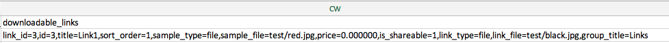

# Importar produtos baixáveis

O fluxo de importação de produtos baixáveis é o mesmo de [Produtos do Pacote](data-transfer-bundle-products.md) ou [Produtos Configuráveis](data-transfer-configurable-products.md). A diferença é que um produto baixável tem [links baixáveis](../catalog/product-create-downloadable.md) e [amostras baixáveis](../catalog/product-create-downloadable.md) com suas imagens.

O diretório raiz padrão para links e exemplos baixáveis é `<Magento-root-folder>/pub/media/import`. Se o módulo de armazenamento remoto estiver habilitado, o diretório raiz padrão para links e exemplos baixáveis será o diretório `<remote-storage-root-folder>/media/import`.

O arquivo CSV tem colunas separadas para `downloadable_links` e `downloadable_samples`.

- **Imagens de links baixáveis** — No exemplo a seguir, as imagens de links baixáveis (`red.jpg` e `black.jpg`) estão na pasta `<Magento-root-folder>/pub/media/import/test`. Se o armazenamento remoto estiver habilitado, essas imagens estarão na pasta `<remote-storage-root-folder>/media/import/test`.

  {width="600" zoomable="yes"}

- **Imagens de exemplo baixáveis** — No exemplo a seguir, a imagem de exemplo baixável (`white.jpg`) está na pasta `<Magento-root-folder>/pub/media/import/test`. Se o armazenamento remoto estiver habilitado, esta imagem estará na pasta `<remote-storage-root-folder>/media/import/test`.

  {width="400" zoomable="yes"}

Para obter mais informações sobre como habilitar e gerenciar o módulo de armazenamento remoto, consulte [Configurar armazenamento remoto](https://experienceleague.adobe.com/docs/commerce-operations/configuration-guide/storage/remote-storage/remote-storage.html) no _Guia de configuração_.
