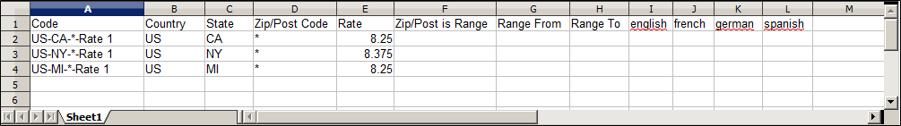

# Atualizar dados de alíquota de imposto

Se você faz negócios em vários estados e envia uma grande quantidade de produtos, pode ser muito demorado inserir alíquotas de imposto manualmente. É mais rápido e eficiente baixar as taxas de imposto por código postal e importá-las para o Commerce. O exemplo a seguir mostra como importar um conjunto de alíquotas de imposto específicas do estado baixadas de uma origem confiável. Avalara fornece [tabelas de alíquotas de impostos](https://www.avalara.com/taxrates/en/download-tax-tables.html), que você pode baixar sem custo, para cada CEP nos Estados Unidos.

>[!NOTE]
>
>Se você estiver interessado em automatizar suas vendas e usar a conformidade e os relatórios fiscais, poderá encontrar opções confiáveis da Commerce no site [Parceiros da Commerce](https://solutionpartners.adobe.com/s/directory/?solution=commerce).

## Etapa 1: Exportar os dados da alíquota do imposto do Commerce

1. Na barra lateral _Admin_, vá para **[!UICONTROL System]** > _[!UICONTROL Data Transfer]_>**[!UICONTROL Import/Export Tax Rates]**.

1. Clique em **[!UICONTROL Export Tax Rates]**.

1. Procure o arquivo no local de download do navegador da Web.

1. Salve e abra o arquivo em uma planilha.

   Este exemplo usa [!DNL OpenOffice Calc].

   Os dados exportados de alíquota do Commerce incluem as seguintes colunas:
   - Código
   - País
   - Estado
   - Código postal/Post
   - Taxa
   - Intervalo de
   - Intervalo Até
   - Uma coluna para cada exibição de loja

   {width="500" zoomable="yes"}

1. Abra os novos dados da alíquota do imposto em uma segunda instância da planilha para que você possa vê-los lado a lado.

1. Nos novos dados da alíquota do imposto, anote quaisquer dados adicionais da alíquota do imposto que você precise configurar no armazenamento antes que os dados sejam importados.

   Por exemplo, os dados de alíquota do imposto para a Califórnia também incluem:

   - `TaxRegionName`
   - `CombinedRate`
   - `StateRate`
   - `CountyRate`
   - `CityRate`
   - `SpecialRate`

   Se você precisar importar [zonas e alíquotas de imposto](../stores-purchase/tax-zones-rates.md) adicionais, defina-as primeiro pelo Administrador do seu armazenamento e atualize as [regras de imposto](../stores-purchase/tax-rules.md) conforme necessário. Em seguida, exporte os dados e abra o arquivo em um editor de texto para que ele possa ser usado como referência. No entanto, para manter esse exemplo simples, importamos apenas as colunas de alíquota de imposto padrão.

## Etapa 2: Preparar os dados de importação

Você tem duas planilhas abertas, lado a lado. Um contém a estrutura do arquivo de exportação do Commerce e o outro contém os novos dados de alíquota do imposto que você deseja importar.

1. Para criar um local para trabalhar na planilha com os novos dados de alíquota do imposto, insira quantas colunas em branco na extremidade direita forem necessárias para adicionar dados do arquivo de exportação do Commerce. Use cortar e colar para adicionar os dados e reorganizar as colunas de modo que correspondam à ordem do arquivo de dados de exportação do Commerce.

1. Renomeie os cabeçalhos de coluna para corresponder aos dados de exportação do Commerce.

1. Exclua todas as colunas que não tenham dados.

   Caso contrário, a estrutura do arquivo de importação deve corresponder aos dados de exportação originais do Commerce.

1. Antes de salvar o arquivo, role para baixo e verifique se as colunas de alíquota de imposto contêm apenas dados numéricos.

   Qualquer texto encontrado em uma coluna de alíquota do imposto impede que os dados sejam importados.

1. Salve os dados preparados como um arquivo .CSV.

   Quando solicitado, verifique se uma vírgula é usada como delimitador de campo e aspas duplas como delimitador de texto. Depois clique em **[!UICONTROL OK]**.

## Fase 3: Importar as alíquotas de imposto

1. Na barra lateral _Admin_, vá para **[!UICONTROL System]** > _[!UICONTROL Data Transfer]_>**[!UICONTROL Import/Export Tax Rates]**.

1. Clique em **[!UICONTROL Choose File]** e escolha o arquivo de alíquota de imposto CSV que você preparou para importar.

1. Clique em **[!UICONTROL Import Tax Rates]**.

   A importação dos dados pode levar vários minutos. Quando o processo for concluído, a mensagem `The tax rate has been imported` será exibida. Se você receber uma mensagem de erro, corrija o problema nos dados e tente novamente.

1. Na barra lateral _Admin_, vá para **[!UICONTROL Stores]** > _[!UICONTROL Taxes]_>**[!UICONTROL Tax Zones and Rates]**.

   As taxas importadas aparecem na lista.

1. Use os controles da página para exibir as novas alíquotas de imposto.

   {width="600" zoomable="yes"}

1. Execute algumas transações de teste em sua loja com clientes de CEPs diferentes para garantir que as novas alíquotas de imposto funcionem corretamente.
