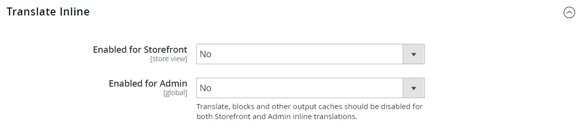

# Ferramentas do desenvolvedor

Use as ferramentas avançadas de desenvolvedor para determinar o modo de compilação durante o desenvolvimento de front-end, criar uma nova inclui na lista de permissões de endereços IP e exibir dicas de caminho de modelo. Também há ferramentas para fazer facilmente alterações pontuais no texto na interface da loja e do administrador.

- [Logs de Ação](action-log.md)  (somente Adobe Commerce)
- [Fluxo de trabalho de desenvolvimento de front-end](#frontend-development-workflow)
- [Uso de assinaturas de arquivo estático](#static-file-signatures)
- [Otimização do arquivo de recurso](#optimizing-resource-files)
- [Restrições do cliente do desenvolvedor](#client-restrictions)
- [Dicas de caminho do modelo](#template-path-hints)
- [Traduzir em linha](#translate-inline)

## Modos de operação

Sua instância Adobe Commerce ou Magento Open Source pode ser implantada para execução no _modo de produção_ ou no _modo de desenvolvedor_. As ferramentas e definições de configuração criadas especificamente para desenvolvedores só podem ser acessadas enquanto o armazenamento estiver em execução no _modo de desenvolvedor_.

O modo de operação pode ser alterado somente a partir da linha de comando do servidor por um usuário com permissões apropriadas. Consulte [Definir o modo de operação](https://experienceleague.adobe.com/docs/commerce-operations/configuration-guide/cli/set-mode.html) no _Guia de Configuração_ para obter mais informações.

A maioria dos tópicos na documentação do comerciante se aplica a uma instância do Commerce em execução no modo de produção. No entanto, as definições e ferramentas de configuração a seguir podem ser usadas apenas quando a instalação estiver sendo executada no modo de desenvolvedor.

## Fluxo de trabalho de desenvolvimento de front-end

O tipo de Fluxo de trabalho de desenvolvimento de front-end determina se ocorre Menos compilação no lado do cliente ou do servidor durante o desenvolvimento. Menos é uma extensão do CSS que tem recursos e convenções adicionais e que produz código simplificado. Compilação menor do lado do cliente é recomendada para o desenvolvimento de temas. A compilação do lado do servidor é o modo padrão. As opções de fluxo de trabalho de desenvolvimento não estão disponíveis para lojas no modo de produção.
Consulte [Compilação MENOS do lado do cliente vs. do lado do servidor](https://developer.adobe.com/commerce/frontend-core/guide/css/quickstart/compilation-mode/){:target=&quot;_blank&quot;} na documentação do desenvolvedor do Commerce.

>[!NOTE]
>
>A configuração do fluxo de trabalho de desenvolvimento de front-end está disponível somente no [Modo de desenvolvedor](../systems/developer-tools.md#operation-modes).

{width="600" zoomable="yes"}

1. Na barra lateral _Admin_, vá para **[!UICONTROL Stores]** > _[!UICONTROL Settings]_>**[!UICONTROL Configuration]**.

1. No painel esquerdo, expanda **[!UICONTROL Advanced]** e escolha **[!UICONTROL Developer]**.

1. Expandir  a seção **[!UICONTROL Front-end Development Workflow]**.

1. Defina **[!UICONTROL Workflow Type]** como um dos seguintes:

   - `Client side less compilation` - A compilação ocorre no navegador usando a biblioteca nativa `less.js`.
   - `Server side less compilation` - A compilação ocorre no servidor usando a biblioteca PHP Less. Esse é o modo padrão para produção.

1. Quando terminar, clique em **[!UICONTROL Save Config]**.

## Assinaturas de arquivos estáticos

Adicionar uma assinatura digital ao URL de arquivos estáticos permite que os navegadores detectem quando uma versão mais recente do arquivo estiver disponível. Os arquivos estáticos que podem ser rastreados com assinaturas digitais incluem JavaScript, CSS, imagens e fontes. A assinatura é anexada ao caminho diretamente após o URL base. Se a assinatura de um arquivo for diferente do que está armazenado no cache do navegador, a versão mais recente do arquivo será usada.

Consulte [Assinatura de conteúdo estático](https://experienceleague.adobe.com/docs/commerce-operations/configuration-guide/cache/static-content-signing.html){:target=&quot;_blank&quot;} na documentação do desenvolvedor do Commerce.

>[!NOTE]
>
>A configuração de Configurações de Arquivo Estático está disponível somente ao trabalhar no [modo de desenvolvedor](../systems/developer-tools.md#operation-modes).

{width="600" zoomable="yes"}

Para obter uma lista detalhada das definições de configuração, consulte [_Configurações do Arquivo Estático_](../configuration-reference/advanced/developer.md) na _Referência de Configuração_.

**_Para habilitar arquivos estáticos assinados:_**

1. Na barra lateral _Admin_, vá para **[!UICONTROL Stores]** > _[!UICONTROL Settings]_>**[!UICONTROL Configuration]**.

1. No painel esquerdo, expanda **[!UICONTROL Advanced]** e escolha **[!UICONTROL Developer]**.

1. Expandir  a seção **[!UICONTROL Static Files Settings]**.

1. Defina **[!UICONTROL Sign Static Files]** como `Yes`.

1. Quando terminar, clique em **[!UICONTROL Save Config]**.

## Otimização do arquivo de recurso

O tempo necessário para carregar arquivos de recursos pode ser reduzido com a mesclagem e o agrupamento de arquivos, além de minimizar o código.

- A mesclagem combina arquivos separados do mesmo tipo em um único arquivo.
- O agrupamento é uma técnica que agrupa arquivos separados para reduzir o número de solicitações HTTP necessárias para carregar uma página.
- A minificação remove espaços, quebras de linha e comentários, mas não afeta a funcionalidade do código. Como os arquivos minimizados não podem ser editados, o processo deve ser aplicado somente quando você estiver pronto para entrar em produção.

Por padrão, o Adobe Commerce e o Magento Open Source não mesclam, agrupam ou minimizam arquivos, e o desenvolvedor do projeto deve determinar quais métodos de otimização de arquivo devem ser usados.

Consulte [Práticas recomendadas de desempenho](https://experienceleague.adobe.com/docs/commerce-operations/performance-best-practices/overview.html) para obter mais informações.

>[!NOTE]
>
>Arquivos CSS e JavaScript podem ser otimizados somente no [Modo de Desenvolvedor](../systems/developer-tools.md#operation-modes).

| Tipo de arquivo | Operações suportadas |
| --------------- | -------------------- |
| Arquivos CSS | `MergeMinify` |
| Arquivos JavaScript | `MergeBundleMinify` |
| Arquivos de modelo | `Minify` |

{style="table-layout:auto"}

**_Para otimizar arquivos de recursos:_**

1. Na barra lateral _Admin_, vá para **[!UICONTROL Stores]** > _[!UICONTROL Settings]_>**[!UICONTROL Configuration]**.

1. No painel esquerdo, expanda **[!UICONTROL Advanced]** e escolha **[!UICONTROL Developer]**.

1. Para otimizar arquivos CSS, expanda  a seção **[!UICONTROL CSS Settings]** e faça o seguinte:

   - Defina **[!UICONTROL Merge CSS Files]** como `Yes`.
   - Defina **[!UICONTROL Minify CSS Files]** como `Yes`.

   {width="600" zoomable="yes"}

[_Configurações CSS_](../configuration-reference/advanced/developer.md)

1. Para otimizar arquivos JavaScript, expanda  a seção **[!UICONTROL JavaScript Settings]** e faça o seguinte:

   - Defina **[!UICONTROL Merge JavaScript Files]** como `Yes`.
   - Defina **[!UICONTROL Minify JavaScript Files]** como `Yes`.

   {width="600" zoomable="yes"}

1. Para minificar arquivos de modelo PHTML, expanda  a seção **[!UICONTROL Template Settings]** e defina **[!UICONTROL Minify Html]** como `Yes`.

   {width="600" zoomable="yes"}

1. Quando terminar, clique em **[!UICONTROL Save Config]**.

## Restrições do cliente

Antes de usar uma ferramenta como [dicas de caminho de modelo](#template-path-hints), adicione seu endereço IP à inclui na lista de permissões de Restrições de Cliente de Desenvolvedor para evitar interromper a experiência de compra dos clientes na loja. Se você não souber seu endereço IP, poderá pesquisá-lo online.

>[!NOTE]
>
>As Restrições de Cliente de Desenvolvedor podem ser definidas somente no [Modo de Desenvolvedor](../systems/developer-tools.md#operation-modes).

Para obter informações técnicas, consulte [VCL personalizado para permitir solicitações](https://experienceleague.adobe.com/docs/commerce-cloud-service/user-guide/cdn/custom-vcl-snippets/fastly-vcl-allowlist.html) no _Guia do Commerce na Infraestrutura da Nuvem_.

incluir na lista de permissões **_Para adicionar seu endereço IP ao arquivo:_**

1. Na barra lateral _Admin_, vá para **[!UICONTROL Stores]** > _[!UICONTROL Settings]_>**[!UICONTROL Configuration]**.

1. No painel esquerdo, expanda **[!UICONTROL Advanced]** e escolha **[!UICONTROL Developer]**.

1. Expandir  a seção **[!UICONTROL Developer Client Restrictions]**.

   {width="600" zoomable="yes"}

1. Para **[!UICONTROL Allow IPs]**, digite seu endereço IP.

   Se o acesso for necessário a partir de vários endereços IP, separe cada um com uma vírgula.

1. Quando terminar, clique em **[!UICONTROL Save Config]**.

1. Quando solicitado, atualize todos os caches inválidos.

## Dicas de caminho do modelo

As dicas do caminho de modelo são uma ferramenta de diagnóstico que adiciona uma notação ao caminho para cada modelo usado na página. As dicas do caminho do modelo podem ser habilitadas para a loja ou para o administrador.

>[!NOTE]
>
>As Dicas de Caminho do Modelo podem ser editadas somente no [modo de desenvolvedor](../systems/developer-tools.md#operation-modes).

Consulte [Localizar modelos, layouts e estilos](https://developer.adobe.com/commerce/frontend-core/guide/themes/debug/){:target=&quot;_blank&quot;} na documentação do desenvolvedor do Commerce.

{width="700" zoomable="yes"}

### Etapa 1: adicionar o endereço IP ao arquivo de inclui na lista de permissões

Antes de usar as dicas do caminho de modelo, adicione seu endereço IP ao [incluir na lista de permissões](#client-restrictions) para evitar interferência com os clientes que estão fazendo compras na loja. Quando terminar, limpe o cache do Commerce para remover todas as dicas do armazenamento.

{width="600" zoomable="yes"}

### Etapa 2: ativar dicas de caminho do modelo

1. Na barra lateral _Admin_, vá para **[!UICONTROL Stores]** > _[!UICONTROL Settings]_>**[!UICONTROL Configuration]**.

1. No painel esquerdo, expanda **[!UICONTROL Advanced]** e escolha **[!UICONTROL Developer]**.

1. Expanda  a seção **[!UICONTROL Debug]** e faça o seguinte:

   {width="600" zoomable="yes"}

   - Para ativar as dicas de caminho de modelo para o armazenamento, defina **[!UICONTROL Enabled Template Path Hints for Storefront]** como `Yes`.

   - Para habilitar dicas de caminho de modelo para o repositório somente quando a URL inclui o parâmetro `templatehints`, defina **Habilitar Dicas para Storefront com o Parâmetro de URL** para `Yes`. Em seguida, defina o valor do parâmetro, se necessário. O valor padrão é `magento`, mas você pode usar um valor personalizado. Por exemplo, se você alterar o valor para `lorem`, você usaria `mymagento.com?templatehints=lorem` para exibir dicas de modelo.

   - Para ativar as dicas de caminho de modelo para o Administrador, defina **[!UICONTROL Enabled Template Path Hints for Admin]** como `Yes`.

   - Para incluir os nomes dos blocos, defina **[!UICONTROL Add Block Class Type to Hints]** como `Yes`.

1. Quando terminar, clique em **[!UICONTROL Save Config]**.

### Etapa 3: limpar o cache

1. Na barra lateral _Admin_, vá para **[!UICONTROL System]** > _[!UICONTROL Tools]_>**[!UICONTROL Cache Management]**.

1. No canto superior direito, clique em **[!UICONTROL Flush Magento Cache]**.

## Converter em linha

Você pode usar a ferramenta Traduzir em linha no [modo de desenvolvedor](../systems/developer-tools.md#operation-modes) para retocar o texto na interface e refletir sua voz e marca. Quando o modo Traduzir em linha está ativado, qualquer texto na página que pode ser editado é contornado em vermelho. É fácil editar rótulos de campo, mensagens e outros textos que são exibidos na loja e no Administrador. Por exemplo, muitos temas usam terminologia como _Minha conta_, _Minha lista de desejos_ e _Meu painel_ para ajudar os clientes a encontrar uma solução. No entanto, você pode simplesmente usar as palavras _Conta_, _Lista de desejos_ e _Painel_.

>[!NOTE]
>
>A ferramenta Traduzir em Linha está disponível somente ao trabalhar no [modo de desenvolvedor](../systems/developer-tools.md#operation-modes).

Consulte [Visão geral das traduções](https://developer.adobe.com/commerce/frontend-core/guide/translations/) na documentação do desenvolvedor do Commerce.

{width="700" zoomable="yes"}

Se a loja estiver disponível em vários idiomas, você poderá fazer ajustes no texto traduzido para a localidade. No servidor, o texto da interface é mantido em um arquivo CSV separado para cada bloco de saída e é organizado por localidade. Como uma abordagem alternativa, em vez de usar a ferramenta _Traduzir em linha_, você também pode editar os arquivos CSV diretamente no servidor. Os arquivos de tradução são armazenados em `app/code/Magento/<module_name>/i18n/<language_locale>.csv`.

>[!NOTE]
>
>Para usar a ferramenta Traduzir em linha, o navegador deve permitir pop-ups.

### Etapa 1: Desativar caches de saída

1. Na barra lateral _Admin_, vá para **[!UICONTROL System]** > _[!UICONTROL Tools]_>**[!UICONTROL Cache Management]**.

1. Marque as seguintes caixas de seleção:

   - `Blocks HTML output`
   - `Page Cache`
   - `Translations`

1. Defina o controle **[!UICONTROL Actions]** como `Disable` e clique em **[!UICONTROL Submit]**.

### Etapa 2: ativar a ferramenta Traduzir em linha

1. Na barra lateral _Admin_, vá para **[!UICONTROL Stores]** > _[!UICONTROL Settings]_>**[!UICONTROL Configuration]**.

1. Para trabalhar com um modo de exibição de loja específico, defina a **[!UICONTROL Store View]** a ser atualizada.

1. No painel esquerdo, expanda **[!UICONTROL Advanced]** e escolha **[!UICONTROL Developer]**.

1. Expandir  a seção **[!UICONTROL Translate Inline]**.

   Desmarque a caixa de seleção **[!UICONTROL Use Website]** conforme necessário para modificar essas configurações.

   A opção _[!UICONTROL Enabled for Admin]_&#x200B;não está disponível ao editar um modo de exibição de loja específico.

   {width="600" zoomable="yes"}

1. Defina **[!UICONTROL Enabled for Storefront]** como `Yes`.

1. Quando terminar, clique em **[!UICONTROL Save Config]**.

1. Quando solicitado, atualize os caches inválidos, mas deixe os caches desativados como estão por enquanto.

### Etapa 3: atualizar o texto

1. Abra a vitrine em um navegador e vá para a página que deseja editar.

   Se necessário, use o seletor de idioma para alterar a exibição da loja. Cada cadeia de texto que pode ser traduzida é contornada em vermelho. Quando você passa o mouse sobre qualquer caixa de texto, um ícone de livro (  ) é exibido.

1. Clique no ícone de livro para abrir a janela _Traduzir_ e faça o seguinte:

   - Se a alteração for para o modo de exibição de loja específico, marque a caixa de seleção **[!UICONTROL Store View Specific]**.

   - Insira o novo texto **[!UICONTROL Custom]**.

1. Quando terminar, clique em **[!UICONTROL Submit]**.

   {width="700" zoomable="yes"}

1. Para ver as alterações no armazenamento, atualize o navegador.

1. Repita esse processo para que todos os elementos no armazenamento sejam alterados.

### Etapa 4: restaurar as configurações originais

1. Retorne ao administrador da sua loja.

1. Na barra lateral _Admin_, vá para **[!UICONTROL Stores]** > _[!UICONTROL Settings]_>**[!UICONTROL Configuration]**.

1. Defina **[!UICONTROL Store View]** para a exibição específica que foi editada.

1. No painel esquerdo, expanda **[!UICONTROL Advanced]** e escolha **[!UICONTROL Developer]**.

1. Expandir  a seção **[!UICONTROL Translate Inline]**.

1. Defina **[!UICONTROL Enabled for Frontend]** como `No`.

1. Quando terminar, clique em **[!UICONTROL Save Config]**.

1. Na barra lateral _Admin_, vá para **[!UICONTROL System]** > _[!UICONTROL Tools]_>**[!UICONTROL Cache Management]**.

1. Marque a caixa de seleção dos seguintes caches de saída que foram desabilitados anteriormente:

   - `Blocks HTML output`
   - `Page Cache`
   - `Translations`

1. Defina o controle **[!UICONTROL Actions]** como `Enable` e clique em **[!UICONTROL Submit]**.

1. Quando solicitado, atualize todos os caches inválidos.

### Etapa 5: verificar as alterações em seu armazenamento

Vá para a loja e examine cada página atualizada para verificar se as alterações estão corretas. Neste exemplo, `Customer Login` foi alterado para `Customer Sign In`. Se foram feitas alterações em uma exibição específica, use o Seletor de idioma para alternar para a exibição correta.

{width="700" zoomable="yes"}
