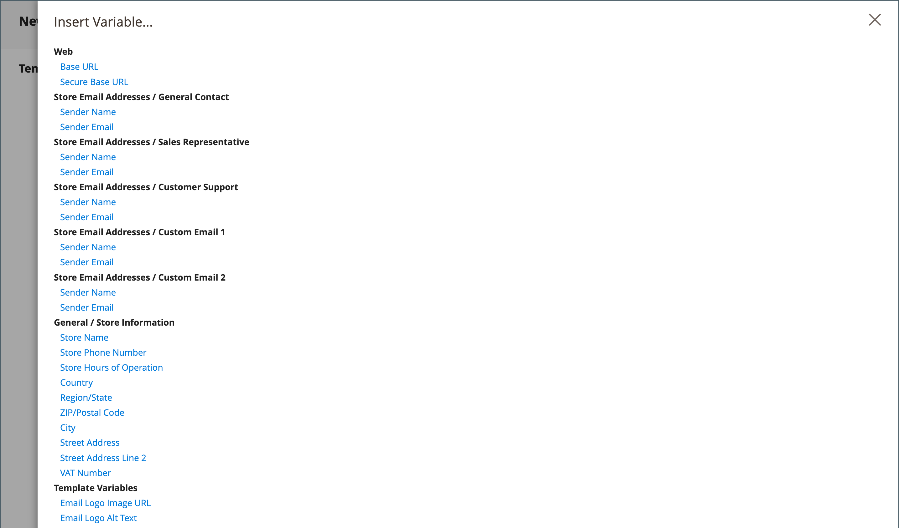

# Personalizar modelos de email

O Commerce inclui um template de email padrão para a seção do corpo de cada mensagem enviada pelo sistema. O modelo para o conteúdo do corpo é combinado com os modelos de cabeçalho e rodapé para criar a mensagem completa. O conteúdo é formatado com HTML e CSS, e pode ser facilmente editado e personalizado adicionando [variáveis](variables-predefined.md). Os modelos de email podem ser personalizados para cada visualização de site, loja ou loja. Se estiver usando modelos personalizados, atualize a [configuração do sistema](email-templates.md#configure-email-templates) para garantir que o modelo correto seja usado. Para saber como você pode usar declarações condicionais ao personalizar o modelo de email, consulte a [documentação do desenvolvedor](https://developer.adobe.com/commerce/frontend-core/guide/templates/email/#theme-based-customizations-1).

{width="500" zoomable="yes"}

Os templates padrão incluem o logotipo e informações da loja e podem ser usados sem mais personalizações. No entanto, como prática recomendada, você deve visualizar cada modelo e fazer as alterações necessárias antes de enviá-los aos clientes.

- [Modelo do cabeçalho](email-template-custom.md#header-template)
- [Modelo de rodapé](email-template-custom.md#footer-template)
- [Modelos de mensagem](email-template-custom.md#message-templates)

{width="700" zoomable="yes"}

## Informações do modelo

| Campo | Descrição |
| ----- | ----------- |
| [!UICONTROL Template Name] | O nome do seu modelo personalizado. |
| [!UICONTROL Insert Variable] | Insere uma variável no modelo na posição do cursor. |
| [!UICONTROL Template Subject] | O Assunto do modelo aparece na coluna Assunto e pode ser usado para classificar e filtrar os modelos na lista. |
| [!UICONTROL Template Content] | O conteúdo do template no HTML. |
| [!UICONTROL Template Styles] | Qualquer declaração de estilo CSS necessária para formatar o modelo pode ser inserida na caixa _[!UICONTROL Template Styles]_. |

{style="table-layout:auto"}

## Modelo do cabeçalho

Após concluir a [configuração](email-templates.md#configure-email-templates), o modelo de cabeçalho de email inclui seu logotipo vinculado à sua loja. Se você tem um conhecimento básico de HTML, pode facilmente usar [variáveis predefinidas](variables-predefined.md) para adicionar informações de contato de armazenamento ao cabeçalho.

### Etapa 1. Carregar o modelo padrão

1. Na barra lateral _Admin_, vá para **[!UICONTROL Marketing]** > _[!UICONTROL Communications]_>**[!UICONTROL Email Templates]**.

1. Clique em **[!UICONTROL Add New Template]**.

1. Na seção **[!UICONTROL Load default template]**, clique no seletor **[!UICONTROL Template]** e escolha `Magento_Email` > `Header`.

   {width="600" zoomable="yes"}

1. Clique em **[!UICONTROL Load Template]**.

   O código HTML e as variáveis do modelo aparecem no formulário.

### Etapa 2. Personalizar o modelo

1. Insira o **[!UICONTROL Template Name]** para seu cabeçalho personalizado.

1. Insira um **[!UICONTROL Template Subject]** para ajudar a organizar os modelos.

   Na grade, a lista de modelos pode ser classificada e filtrada pela coluna _[!UICONTROL Subject]_.

   {width="600" zoomable="yes"}

1. Na caixa **[!UICONTROL Template Content]**, modifique o HTML conforme necessário.

   >[!NOTE]
   >
   >Ao trabalhar no código do modelo, tenha cuidado para não substituir nada que esteja entre chaves duplas.

1. Para inserir uma [variável](variables-reference.md), posicione o cursor no código em que deseja colocar a variável e clique em **[!UICONTROL Insert Variable]**.

1. Escolha a variável que deseja inserir.

   {width="600" zoomable="yes"}

   Quando uma variável é selecionada, uma [marca de marcação](markup-tags.md) para a variável é inserida no código.

   Embora as variáveis da Loja de Endereço de Email sejam as mais frequentemente incluídas no cabeçalho, você pode inserir o código para qualquer sistema ou [variável personalizada](variables-custom.md) diretamente no modelo.

1. Se precisar fazer qualquer declaração CSS, insira os estilos na caixa **[!UICONTROL Template Styles]**.

1. Quando estiver pronto para revisar seu trabalho, clique em **[!UICONTROL Preview Template]**.

   Faça as alterações necessárias no modelo.

1. Quando terminar, clique em **[!UICONTROL Save Template]**.

   O cabeçalho personalizado agora aparece na lista de modelos de email disponíveis.

### Etapa 3. Atualizar a configuração

1. Na barra lateral _Admin_, vá para **[!UICONTROL Content]** > _[!UICONTROL Design]_>**[!UICONTROL Configuration]**.

1. Na grade, localize o modo de exibição de armazenamento que você deseja configurar e clique em **[!UICONTROL Edit]** na coluna _[!UICONTROL Action]_.

1. Role para baixo e expanda  na seção **[!UICONTROL Transactional Emails]**.

1. Escolha o **[!UICONTROL Header Template]** que é usado como padrão para notificações por email.

1. Quando terminar, clique em **[!UICONTROL Save Config]**.

{width="600" zoomable="yes"}

## Modelo de rodapé

O rodapé do modelo de email contém a linha de fechamento e assinatura da mensagem de email. Você pode alterar o fechamento para ajustá-lo ao seu estilo e adicionar outras informações, como o nome da empresa e o endereço abaixo do seu nome.

### Etapa 1. Carregar o modelo padrão

1. Na barra lateral _Admin_, vá para **[!UICONTROL Marketing]** > _[!UICONTROL Communications]_>**[!UICONTROL Email Templates]**.

1. Clique em **[!UICONTROL Add New Template]**.

1. Na seção **[!UICONTROL Load default template]**, clique no seletor **[!UICONTROL Template]** e escolha `Magento_Email` > `Footer`.

1. Clique em **[!UICONTROL Load Template]**.

   O código HTML e as variáveis do modelo aparecem no formulário.

### Etapa 2. Personalizar e visualizar o modelo

1. Digite o **[!UICONTROL Template Name]** para seu rodapé personalizado.

1. Insira um **[!UICONTROL Template Subject]** para ajudar a organizar os modelos.

   Na grade, os modelos podem ser classificados e filtrados pela coluna _[!UICONTROL Subject]_.

   {width="600" zoomable="yes"}

1. Na caixa **[!UICONTROL Template Content]**, modifique o HTML conforme necessário.

   >[!NOTE]
   >
   >Ao trabalhar no código do modelo, tenha cuidado para não substituir nada que esteja entre chaves duplas.

1. Para inserir uma [variável](variables-reference.md), posicione o cursor no código em que deseja colocar a variável e clique em **[!UICONTROL Insert Variable]**.

1. Escolha a variável que deseja inserir.

   Quando uma variável é selecionada, uma [marca de marcação](markup-tags.md) para a variável é inserida no código.

   Embora as variáveis de Contato da Loja sejam as mais frequentemente incluídas no rodapé, você pode inserir o código para qualquer sistema ou [variável personalizada](variables-custom.md) diretamente no modelo.

1. Se precisar fazer qualquer declaração CSS, insira os estilos na caixa **[!UICONTROL Template Styles]**.

### Etapa 3. Atualizar a configuração

1. Na barra lateral _Admin_, vá para **[!UICONTROL Content]** > _[!UICONTROL Design]_>**[!UICONTROL Configuration]**.

1. Na grade, localize o modo de exibição de armazenamento que você deseja configurar e clique em **[!UICONTROL Edit]** na coluna _[!UICONTROL Action]_.

1. Role para baixo e expanda  na seção **[!UICONTROL Transactional Emails]**.

1. Escolha o **[!UICONTROL Footer Template]** que é usado como rodapé padrão nas notificações por email.

1. Quando terminar, clique em **[!UICONTROL Save Config]**.

{width="600" zoomable="yes"}

## Modelos de mensagem

O processo de personalização do corpo de cada mensagem é o mesmo que personalizar o cabeçalho ou rodapé. A única diferença é o modelo de mensagem para cada atividade ou evento que aciona uma notificação. Você pode usar os modelos como estão ou personalizá-los para corresponder à sua voz e marca. Além do texto do modelo, há uma grande variedade de variáveis [predefinidas](variables-predefined.md) e [personalizadas](variables-custom.md) permitidas que você pode criar e incorporar no modelo.

### Etapa 1. Carregar o modelo padrão

1. Na barra lateral _Admin_, vá para **[!UICONTROL Marketing]** > _[!UICONTROL Communications]_>**[!UICONTROL Email Templates]**.

1. Clique em **[!UICONTROL Add New Template]**.

   {width="600" zoomable="yes"}

1. Faça o seguinte:

   - Em **[!UICONTROL Load default template]**, escolha a **[!UICONTROL Template]** que deseja personalizar.

   - Clique em **[!UICONTROL Load Template]**.

### Etapa 2. Personalizar o modelo

1. Para **[!UICONTROL Template Name]**, digite um nome para o modelo personalizado.

1. Se necessário, altere o **[!UICONTROL Template Subject]**.

   Esta é a primeira linha da mensagem, que é a saudação por padrão. Você pode deixá-la como está ou pode inserir algo mais descritivo.

1. Anote o caminho **[!UICONTROL Currently Used For]** para o modelo, que é o caminho usado para atualizar a configuração.

   {width="600" zoomable="yes"}

1. Na caixa **[!UICONTROL Template Content]**, modifique o HTML conforme necessário.

   O conteúdo consiste em uma combinação de tags HTML, diretivas CSS, variáveis e texto.

   >[!NOTE]
   >
   >Ao trabalhar no código do modelo, tenha cuidado para não digitar acidentalmente sobre o código delimitado por chaves duplas.

1. Para inserir uma variável, posicione o cursor no código onde deseja que a variável apareça.

   A seleção de variáveis varia de acordo com o modelo e inclui as variáveis [predefinidas](variables-predefined.md) e [personalizadas](variables-custom.md) permitidas, se disponíveis.

1. Clique em **[!UICONTROL Insert Variable]** e escolha a variável que deseja inserir.

   Um comando para inserir a variável é delimitado por chaves e adicionado ao código no local do cursor. Por exemplo:

   `customVar code=my_custom_variable`

1. Para fazer declarações CSS, insira os estilos em **[!UICONTROL Template Styles]**.

   {width="600" zoomable="yes"}

   >[!NOTE]
   >
   >Estilos personalizados são aplicados ao email somente se `{{template config_path="design/email/header_template"}}` estiver presente no _[!UICONTROL Template Styles]_. Para usar CSS personalizado sem um modelo de cabeçalho padrão, você deve fornecê-los aqui dentro da tag HTML `<style>`.

### Etapa 3. Atualizar a configuração

A trilha de navegação estrutural _[!UICONTROL Currently Used For]_mostra onde o modelo é usado. Neste exemplo, a configuração do modelo está na página_[!UICONTROL Customer Configuration]_, na seção _[!UICONTROL Create New Account Options]_e no campo_[!UICONTROL Default Welcome Email]_.

- Página - [!UICONTROL Customer Configuration]
- Seção - [!UICONTROL Create New Account Options]
- Campo - [!UICONTROL Default Welcome Email]

1. Na trilha de navegação estrutural **[!UICONTROL Currently Used For]**, clique no link para abrir a página de configuração do modelo.

   {width="600" zoomable="yes"}

1. Expanda a seção  e localize o campo do modelo de email que você personalizou.

1. Desmarque a caixa de seleção **[!UICONTROL Use system value]** e clique no nome do seu modelo personalizado.

   {width="600" zoomable="yes"}

1. Quando terminar, clique em **[!UICONTROL Save Config]**.

1. Na mensagem na parte superior do espaço de trabalho, clique em **[!UICONTROL Cache Management]** e limpe qualquer cache inválido.

### Etapa 4. Pré-visualizar e salvar o modelo

1. Quando estiver pronto para revisar seu trabalho, clique em **[!UICONTROL Preview Template]**.

1. Atualize o modelo conforme necessário.

1. Quando terminar, clique em **[!UICONTROL Save Template]**.

   Seu modelo personalizado agora está disponível na lista de modelos de email.
