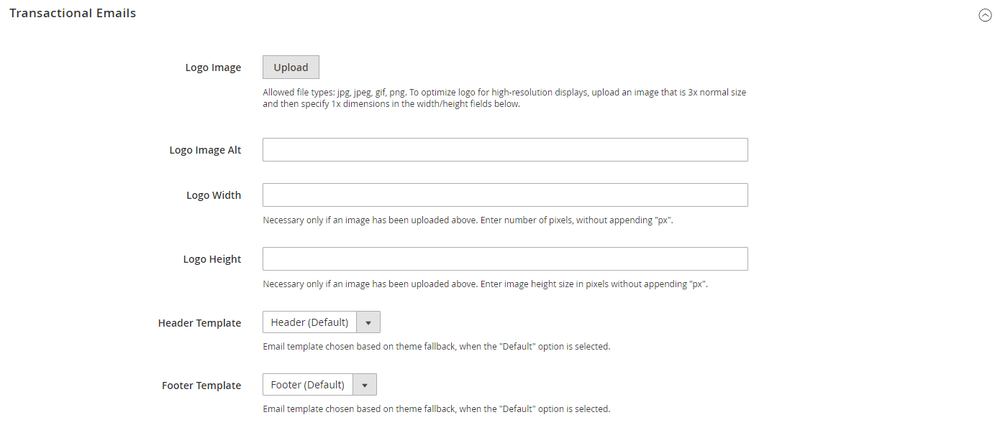

# Modelos de email

Os templates de email definem o layout, o conteúdo e a formatação das mensagens automatizadas enviadas pela loja. Eles são chamados de emails transacionais porque cada um está associado a um tipo específico de transação ou evento.

O Commerce inclui um conjunto de modelos de email responsivos acionados por vários eventos que ocorrem durante a operação da sua loja. Cada modelo é otimizado para qualquer tamanho de tela e pode ser visualizado no desktop, bem como em tablets e dispositivos móveis. Há vários modelos de email preparados relacionados a atividades do cliente, vendas, alertas de produto, ações de administrador e mensagens do sistema que você pode [personalizar](email-template-custom.md) para refletir sua marca.

Os emails do Commerce podem ser renderizados por clientes de email HTML e de texto simples. Pode haver alguma variação entre clientes na maneira como o email é renderizado.

## Preparar seu logotipo de email

Os logotipos podem ser salvos como qualquer um dos tipos de arquivos a seguir. Os logotipos com fundo transparente podem ser salvos como arquivos .GIF ou .PNG.

- JPG/JPEG
- GIF
- PNG

Há dimensões especificadas no modelo de cabeçalho. No entanto, para garantir que seu logotipo seja bem renderizado em dispositivos de alta resolução, a imagem carregada deve ter três vezes esse tamanho. Normalmente, a arte do logotipo original é criada como uma imagem vetorial, para que possa ser dimensionada sem perder a resolução. A imagem pode ser salva em um dos formatos de imagem de bitmap compatíveis.

<!-- -->

Para aproveitar o espaço vertical limitado no cabeçalho, recorte a imagem para eliminar qualquer espaço desperdiçado na parte superior ou inferior. Ao editar a imagem, tenha cuidado para preservar a proporção do logotipo, para que a altura e a largura sejam redimensionadas proporcionalmente.

Como regra, é possível tornar uma imagem menor que a original, mas não maior sem perder a resolução. Pegar uma imagem pequena e dimensioná-la em um editor de fotos diminui a resolução da imagem. Por exemplo, se as dimensões de exibição do logotipo tiverem 168 pixels de largura por 48 pixels de altura no modelo de cabeçalho, a imagem carregada deverá ter 504 pixels de largura por 144 pixels de altura.

| Dimension do logotipo | 1 x (tamanho da exibição) | 3 x (tamanho da imagem) |
|----------|----|----|
| Largura | 168 px | 504 px |
| Altura: | 48 px | 144 px |

{style="table-layout:auto"}

## Configurar modelos de email

A configuração determina o logotipo que aparece no modelo de cabeçalho padrão e qualquer [cabeçalho](email-template-custom.md#header-template) e [rodapé](email-template-custom.md#footer-template) modelos que você deseja usar para mensagens de email transacionais enviadas de suas lojas.

{width="600" zoomable="yes"}

Para obter uma lista detalhada das definições de configuração, consulte [_Emails transacionais_](../content-design/configuration.md) no _Guia de design e conteúdo_.

## Etapa 1. Carregar seu logotipo

1. No _Admin_ barra lateral, vá para **[!UICONTROL Content]** > _[!UICONTROL Design]_>**[!UICONTROL Configuration]**.

1. Localize a exibição de loja que deseja configurar e clique em **[!UICONTROL Edit]** no _[!UICONTROL Action]_coluna.

1. Em _[!UICONTROL Other Settings]_, expandir  o **[!UICONTROL Transactional Emails]**seção.

1. Para fazer upload do **[!UICONTROL Logo Image]**, clique em **[!UICONTROL Upload]** e selecione o arquivo do seu sistema.

1. Para **[!UICONTROL Logo Image Alt]**, insira um texto alternativo para identificar a imagem.

1. Insira o **[!UICONTROL Logo Width]** e **[!UICONTROL Logo Height]** em pixels.

   Insira cada valor como um número, sem o `px` abreviação. Esses valores se referem às dimensões de exibição do logotipo no cabeçalho, e não ao tamanho real da imagem.

## Etapa 2. Escolha os modelos de cabeçalho e rodapé

Se você tiver modelos personalizados de cabeçalho e rodapé para sua loja ou para diferentes lojas, poderá especificar quais modelos são usados para cada loja, de acordo com a [escopo](../getting-started/websites-stores-views.md#scope-settings) da configuração. Caso contrário, os templates padrão serão usados. Para saber mais, consulte [Personalização de modelos de email](email-template-custom.md).

1. Escolha o **[!UICONTROL Header Template]** a ser usado para todas as mensagens de email transacionais.

1. Escolha o **[!UICONTROL Footer Template]** a ser usado para todas as mensagens de email transacionais.

1. Quando terminar, clique em **[!UICONTROL Save Config]**.

## Lista de modelos de email

A lista de modelos de email é organizada em ordem alfabética por módulo.

### [!DNL Amazon_Payment]

| Modelo | Caminho de configuração |
|--- |--- |
| `Hard-declined Authorization` | n/d |
| `Soft-declined Authorization` | n/d |

{style="table-layout:auto"}

### [!DNL Magento_Checkout]

| Modelo | Caminho de configuração |
|--- |--- |
| `Payment Failed` | **Página:** [!UICONTROL Sales] > [[!UICONTROL Checkout]](../configuration-reference/sales/checkout.md) **Seção:** [!UICONTROL Payment Failed Emails] **Campo:** [!UICONTROL Payment Failed Template] |

{style="table-layout:auto"}

### [!DNL Magento_Company]

 (Disponível somente com o Adobe Commerce B2B)

| Modelo | Caminho de configuração |
|--- |--- |
| `Assign Company Admin` | **Página:** [!UICONTROL Customers] > [[!UICONTROL Company Configuration]](../configuration-reference/customers/company-configuration.md) **Seção:** [!UICONTROL Customer-Related Emails] **Campo:** [!UICONTROL Default 'Assign Company Admin' Email] |
| `Assign Company to Customer` | **Página:** [!UICONTROL Customers] > [Configuração da empresa ](../configuration-reference/customers/company-configuration.md) **Seção:** [!UICONTROL Customer-Related Emails]  **Campo:** [!UICONTROL Default 'Assign Company to Customer' Email] |
| `Company Admin Changed to Member` | **Página:** [!UICONTROL Customers] > [[!UICONTROL Company Configuration]](../configuration-reference/customers/company-configuration.md) **Seção:** [!UICONTROL Customer-Related Emails] **Campo:** [!UICONTROL Default 'Company Admin Changed To Member' Email] |
| `Company Admin Set Inactive` | **Página:** [!UICONTROL Customers] > [[!UICONTROL Company Configuration]](../configuration-reference/customers/company-configuration.md) **Seção:** [!UICONTROL Customer-Related Emails] **Campo:** [!UICONTROL Default 'Customer Status Inactive' Email] |
| `Company Invite` | n/d |
| `Company Registration Request` | **Página:** [!UICONTROL Customers] > [[!UICONTROL Company Configuration]](../configuration-reference/customers/company-configuration.md) **Seção:** [!UICONTROL Email Options - Company Registration] **Campo:** [!UICONTROL Default Company Registration Email] |
| `Company Status Active1` | **Página:** [!UICONTROL Customers] > [[!UICONTROL Company Configuration]](../configuration-reference/customers/company-configuration.md) **Seção:** [!UICONTROL Company Status Change] **Campo:** [!UICONTROL Default 'Company Status Change To Active 1" Email] |
| `Company Status Active2` | **Página:** [!UICONTROL Customers] > [[!UICONTROL Company Configuration]](../configuration-reference/customers/company-configuration.md) **Seção:** [!UICONTROL Company Status Change] **Campo:** [!UICONTROL Default 'Company Status Change To Active 2" Email] |
| `Company Status Blocked` | **Página:** [!UICONTROL Customers] > [[!UICONTROL Company Configuration]](../configuration-reference/customers/company-configuration.md) **Seção:** [!UICONTROL Company Status Change] **Campo:** [!UICONTROL Default 'Company Status Change To Blocked" Email] |
| `Company Status Pending Approval` | **Página:** [!UICONTROL Customers] > [[!UICONTROL Company Configuration]](../configuration-reference/customers/company-configuration.md) **Seção:** [!UICONTROL Company Status Change] **Campo:** [!UICONTROL Default 'Company Status Change To Pending Approval" Email] |
| `Company Status Rejected` | **Página:** [!UICONTROL Customers] > [[!UICONTROL Company Configuration]](../configuration-reference/customers/company-configuration.md) **Seção:** [!UICONTROL Company Status Change] **Campo:** [!UICONTROL Default 'Company Status Change To Rejected" Email] |
| `Customer Status Active` | **Página:** [!UICONTROL Customers] > [[!UICONTROL Company Configuration]](../configuration-reference/customers/company-configuration.md) **Seção:** [!UICONTROL Customer-Related Emails] **Campo:** [!UICONTROL Default 'Customer Status Active' Email] |
| `Customer Status Inactive` | **Página:** [!UICONTROL Customers] > [[!UICONTROL Company Configuration]](../configuration-reference/customers/company-configuration.md) **Seção:** [!UICONTROL Customer-Related Emails] **Campo:** [!UICONTROL Default 'Company Admin Inactive' Email] |
| `Sales Representative Assigned to Company` | **Página:** [!UICONTROL Customers] > [[!UICONTROL Company Configuration]](../configuration-reference/customers/company-configuration.md) **Seção:** [!UICONTROL Customer-Related Emails] **Campo:** [!UICONTROL Default 'Sales Rep Assigned' Email] |

{style="table-layout:auto"}

### [!DNL Magento_CompanyCredit]

 (Disponível somente com o Adobe Commerce B2B)

| Modelo | Caminho de configuração |
|--- |--- |
| `Credit Limit Allocated` | **Página:** [!UICONTROL Customers] > [[!UICONTROL Company Configuration]](../configuration-reference/customers/company-configuration.md) **Seção:** [!UICONTROL Company Credit] **Campo:** [!UICONTROL Allocated Email Template] |
| `Credit Limit Updated` | **Página:** [!UICONTROL Customers] > [[!UICONTROL Company Configuration]](../configuration-reference/customers/company-configuration.md) **Seção:** [!UICONTROL Company Credit] **Campo:** [!UICONTROL Updated Email Template] |
| `Credit Reimbursed` | **Página:** [!UICONTROL Customers] > [[!UICONTROL Company Configuration]](../configuration-reference/customers/company-configuration.md) **Seção:** [!UICONTROL Company Credit] **Campo:** [!UICONTROL Reimbursed Email Template] |
| `Order Refunded to Company Credit` | **Página:** [!UICONTROL Customers] > [[!UICONTROL Company Configuration]](../configuration-reference/customers/company-configuration.md) **Seção:** [!UICONTROL Company Credit] **Campo:** [!UICONTROL Refunded Email Template] |
| `Order Reverted to Company Credit` | **Página:** [!UICONTROL Customers] > [[!UICONTROL Company Configuration]](../configuration-reference/customers/company-configuration.md) **Seção:** [!UICONTROL Company Credit] **Campo:** [!UICONTROL Reverted Email Template] |

{style="table-layout:auto"}

### [!DNL Magento_Contact]

| Modelo | Caminho de configuração |
|--- |--- |
| `Contact Form` | **Página:** [!UICONTROL General] > [[!UICONTROL Contacts]](../configuration-reference/general/contacts.md) **Seção:** [!UICONTROL Email Options] **Campo:** [!UICONTROL Email Template] |

{style="table-layout:auto"}

### [!UICONTROL Magento_Customer]

| Modelo | Caminho de configuração |
|--- |--- |
| `Change Email` | **Página:** [!UICONTROL Customers] > [[!UICONTROL Customer Configuration]](../configuration-reference/customers/customer-configuration.md) **Seção:** [!UICONTROL Account Information Options] **Campo:** [!UICONTROL Change Email Template] |
| Alterar email e senha | **Página:** [!UICONTROL Customers] > [[!UICONTROL Customer Configuration]](../configuration-reference/customers/customer-configuration.md) **Seção:** [!UICONTROL Account Information Options] **Campo:** [!UICONTROL Change Email and Password Template] |
| `Forgot Password` | **Página:** [!UICONTROL Customers] > [[!UICONTROL Customer Configuration]](../configuration-reference/customers/customer-configuration.md) **Seção:** [!UICONTROL Password Options] **Campo:** Esqueceu o modelo de e-mail |
| `New Account` | **Página:** [!UICONTROL Customers] > [[!UICONTROL Customer Configuration]](../configuration-reference/customers/customer-configuration.md) **Seção:** [!UICONTROL Create New Account Options] **Campo:** Email de boas-vindas padrão |
| `New Account (Magento/luma)` | **Página:** [!UICONTROL Customers] > [[!UICONTROL Customer Configuration]](../configuration-reference/customers/customer-configuration.md) **Seção:** [!UICONTROL Create New Account Options] **Campo:** Email de boas-vindas padrão |
| `New Account Confirmation Key` | **Página:** [!UICONTROL Customers] > [[!UICONTROL Customer Configuration]](../configuration-reference/customers/customer-configuration.md) **Seção:** [!UICONTROL Create New Account Options] **Campo:** E-mail do link de confirmação |
| `New Account Confirmed` | **Página:** [!UICONTROL Customers] > [[!UICONTROL Customer Configuration]](../configuration-reference/customers/customer-configuration.md) **Seção:** [!UICONTROL Create New Account Options] **Campo:** Email de boas-vindas |
| `New Account Without Password` | **Página:** [!UICONTROL Customers] > [[!UICONTROL Customer Configuration]](../configuration-reference/customers/customer-configuration.md) **Seção:** [!UICONTROL Create New Account Options] **Campo:** Email De Boas-Vindas Padrão Sem Senha |
| `Remind Password` | **Página:** [!UICONTROL Customers] > [[!UICONTROL Customer Configuration]](../configuration-reference/customers/customer-configuration.md) **Seção:** [!UICONTROL Password Options] **Campo:** Lembrar Modelo de Email |
| `Reset Password` | **Página:** [!UICONTROL Customers] > [[!UICONTROL Customer Configuration]](../configuration-reference/customers/customer-configuration.md) **Seção:** [!UICONTROL Password Options]  **Campo:** Redefinir modelo de senha |

{style="table-layout:auto"}

### [!DNL Magento_CustomerBalance]

 (somente Adobe Commerce)

| Modelo | Caminho de configuração |
|--- |--- |
| `Store Credit Update` | **Página:** [!UICONTROL Customers] > [[!UICONTROL Customer Configuration]](../configuration-reference/customers/customer-configuration.md) **Seção:** [!UICONTROL Store Credit Options] **Campo:** [!UICONTROL Store Credit Update Email Template] |

{style="table-layout:auto"}

### [!UICONTROL Magento_Directory]

| Modelo | Caminho de configuração |
|--- |--- |
| `Currency Update Warnings` | **Página:** [!UICONTROL General] > [[!UICONTROL Currency Setup]](../configuration-reference/general/currency-setup.md) **Seção:** [!UICONTROL Scheduled Import Settings] **Campo:** [!UICONTROL Error Email Template] |

{style="table-layout:auto"}

### [!UICONTROL Magento_Email]

| Modelo | Caminho de configuração |
|--- |--- |
| `Footer` | n/d |
| `Footer (Magento/luma)` | n/d |
| `Header` | n/d |

{style="table-layout:auto"}

### [!UICONTROL Magento_GiftCard]

 (somente Adobe Commerce)

| Modelo | Caminho de configuração |
|--- |--- |
| `Gift Card(s) Purchase` | **Página:** [!UICONTROL Sales] > [[!UICONTROL Gift Cards]](../catalog/product-gift-card-create.md) **Seção:** [!UICONTROL Gift Card Email Settings] **Campo:** [!UICONTROL Gift Card Notification Email Template] |

{style="table-layout:auto"}

### [!DNL Magento_GiftCardAccount]

| Modelo | Caminho de configuração |
|--- |--- |
| `Gift Card Code/Balance` | **Página:** [!UICONTROL Sales] > [[!UICONTROL Gift Cards]](../catalog/product-gift-card-create.md) **Seção:** [!UICONTROL Email Sent from Gift Card Account Management] **Campo:** [!UICONTROL Gift Card Template] |

{style="table-layout:auto"}

### [!DNL Magento_GiftRegistry]

| Modelo | Caminho de configuração |
|--- |--- |
| `New Registry` | **Página:** [!UICONTROL  Customers] > [[!UICONTROL  Gift Registry]](../configuration-reference/customers/gift-registry.md)  **Seção:** [!UICONTROL Owner Notification] **Campo:** [!UICONTROL Email Template] |
| `Registry Sharing` | **Página:** [!UICONTROL  Customers] > [[!UICONTROL  Gift Registry]](../configuration-reference/customers/gift-registry.md)  **Seção:** [!UICONTROL Gift Registry Sharing] **Campo:** [!UICONTROL Email Template] |
| `Registry Update` | **Página:** [!UICONTROL  Customers] > [[!UICONTROL  Gift Registry]](../configuration-reference/customers/gift-registry.md)  **Seção:** [!UICONTROL Gift Registry Update] **Campo:** [!UICONTROL Email Template] |

{style="table-layout:auto"}

### [!DNL Magento_InventoryInStorePickupSales]

| Modelo | Caminho de configuração |
|--- |--- |
| `Order is Ready for Pickup` | **Página:** [!UICONTROL  Sales] > [[!UICONTROL  Sales Emails]](../configuration-reference/sales/sales-emails.md)  **Seção:** [!UICONTROL Order Ready For Pickup in Store] **Campo:** [!UICONTROL Order Ready For Pickup Email Template] |
| `Order is Ready for Pickup For Guest` | **Página:** [!UICONTROL  Sales] > [[!UICONTROL  Sales Emails]](../configuration-reference/sales/sales-emails.md)  **Seção:** [!UICONTROL Order Ready For Pickup in Store] **Campo:** [!UICONTROL Order Ready For Pickup Email Template for Guest] |

{style="table-layout:auto"}

### [!DNL Magento_Invitation]

| Modelo | Caminho de configuração |
|--- |--- |
| `Customer Invitation` | **Página:** [!UICONTROL Customers] > [[!UICONTROL Invitation]](../configuration-reference/customers/invitations.md) **Seção:** [!UICONTROL Email] **Campo:** [!UICONTROL Customer Invitation Email Template] |

{style="table-layout:auto"}

### [!DNL Magento_NegotiableQuote]

 (Disponível somente com o Adobe Commerce B2B)

| Modelo | Caminho de configuração |
|--- |--- |
| `Declined Quote` | **Página:** [!UICONTROL  Sales] > [[!UICONTROL  Sales Emails]](../configuration-reference/sales/sales-emails.md)  **Seção:** [!UICONTROL Quote] **Campo:** [!UICONTROL Declined Quote Template (to Buyer)] |
| `Expiration Date Reset` | **Página:** [!UICONTROL  Sales] > [[!UICONTROL  Sales Emails]](../configuration-reference/sales/sales-emails.md)  **Seção:** [!UICONTROL Quote] **Campo:** [!UICONTROL Expiration Date Reset] | **Página:** [!UICONTROL Sales] > [[!UICONTROL  Sales Emails]](../configuration-reference/sales/sales-emails.md)  **Seção:** [!UICONTROL Quote] **Campo:** [!UICONTROL Order Ready For Pickup Email Template] |
| `Expiration Warning` | **Página:** [!UICONTROL  Sales] > [[!UICONTROL  Sales Emails]](../configuration-reference/sales/sales-emails.md)  **Seção:** [!UICONTROL Quote] **Campo:** [!UICONTROL Quote Expiration (in 48 hrs)] |
| `Expiration Warning1` | **Página:** [!UICONTROL  Sales] > [[!UICONTROL  Sales Emails]](../configuration-reference/sales/sales-emails.md)  **Seção:** [!UICONTROL Quote] **Campo:** [!UICONTROL Quote Expiration (in 24 hrs)] |
| `New Quote` | **Página:** [!UICONTROL  Sales] > [[!UICONTROL  Sales Emails]](../configuration-reference/sales/sales-emails.md)  **Seção:** [!UICONTROL Quote] **Campo:** [!UICONTROL New Quote Template (to Seller)] |
| `Updated Quote` | **Página:** [!UICONTROL  Sales] > [[!UICONTROL  Sales Emails]](../configuration-reference/sales/sales-emails.md)  **Seção:** [!UICONTROL Quote] **Campo:** [!UICONTROL Updated Quote Template (to Seller)] |

{style="table-layout:auto"}

### [!DNL Magento_Newsletter]

| Modelo | Caminho de configuração |
|--- |--- |
| `Subscription Confirmation` | **Página:** [!UICONTROL Customers] > [[!UICONTROL Newsletter]](../configuration-reference/customers/newsletter.md) **Seção:** [!UICONTROL  Subscription Options] **Campo:** [!UICONTROL Confirmation Email Template] |
| `Subscription Success` | **Página:** [!UICONTROL Customers] > [[!UICONTROL Newsletter]](../configuration-reference/customers/newsletter.md) **Seção:** [!UICONTROL  Subscription Options] **Campo:** [!UICONTROL Success Email Template] |
| `Unsubscription Success` | **Página:** [!UICONTROL Customers] > [[!UICONTROL Newsletter]](../configuration-reference/customers/newsletter.md) **Seção:** [!UICONTROL  Subscription Options] **Campo:** [!UICONTROL Unsubscription Email Template] |

{style="table-layout:auto"}

### [!DNL Magento_ProductAlert]

| Modelo | Caminho de configuração |
|--- |--- |
| `Cron Error Warning` | **Página:** [!UICONTROL Catalog] > [[!UICONTROL Catalog]](../configuration-reference/catalog/catalog.md) **Seção:** [!UICONTROL Product Alerts Run Settings] **Campo:** [!UICONTROL Error Email Template] |
| `Price Alert` | **Página:** [!UICONTROL Catalog] > [[!UICONTROL Catalog]](../configuration-reference/catalog/catalog.md) **Seção:** [!UICONTROL Product Alerts] **Campo:** [!UICONTROL Price Alert Email Template] |
| `Stock Alert` | **Página:** [!UICONTROL Catalog] > [[!UICONTROL Catalog]](../configuration-reference/catalog/catalog.md) **Seção:** [!UICONTROL Product Alerts] **Campo:** [!UICONTROL Stock Alert Email Template] |

{style="table-layout:auto"}

### [!DNL Magento_PurchaseOrder]

| Modelo | Caminho de configuração |
|--- |--- |
| `Approved Purchase Order` | **Página:** [!UICONTROL  Sales] > [[!UICONTROL  Sales Emails]](../configuration-reference/sales/sales-emails.md)  **Seção:** [!UICONTROL Purchase Order Approval] **Campo:** [!UICONTROL Approved Purchase Order] |
| `Approved, requires payment` | **Página:** [!UICONTROL  Sales] > [[!UICONTROL  Sales Emails]](../configuration-reference/sales/sales-emails.md)  **Seção:** [!UICONTROL Purchase Order Approval] **Campo:** [!UICONTROL Approved, requires payment details (to Buyer)] |
| `Comment added to Purchase Order` | **Página:** [!UICONTROL  Sales] > [[!UICONTROL  Sales Emails]](../configuration-reference/sales/sales-emails.md)  **Seção:** [!UICONTROL Purchase Order Approval] **Campo:** [!UICONTROL Comment added to Purchase Order] |
| `Created and Auto-approved Purchase Order` | **Página:** [!UICONTROL  Sales] > [[!UICONTROL  Sales Emails]](../configuration-reference/sales/sales-emails.md)  **Seção:** [!UICONTROL Purchase Order Approval] **Campo:** [!UICONTROL Created and Automatically approved Purchase Order (to Buyer)] |
| `Created and automatically approved, requires payment details` | **Página:** [!UICONTROL  Sales] > [[!UICONTROL  Sales Emails]](../configuration-reference/sales/sales-emails.md)  **Seção:** [!UICONTROL Purchase Order Approval] **Campo:** [!UICONTROL Created and automatically approved, requires payment details (to Buyer)] |
| `Created and requires Approval Purchase Order` | **Página:** [!UICONTROL  Sales] > [[!UICONTROL  Sales Emails]](../configuration-reference/sales/sales-emails.md)  **Seção:** [!UICONTROL Purchase Order Approval] **Campo:** [!UICONTROL Created and requires Approval Purchase Order (to Buyer)] |
| `Error creating Order from Purchase Order` | **Página:** [!UICONTROL  Sales] > [[!UICONTROL  Sales Emails]](../configuration-reference/sales/sales-emails.md)  **Seção:** [!UICONTROL Purchase Order Approval] **Campo:** [!UICONTROL Error creating Order from Purchase Order (to Buyer)] |
| `Purchase Order requires Approval` | **Página:** [!UICONTROL  Sales] > [[!UICONTROL  Sales Emails]](../configuration-reference/sales/sales-emails.md)  **Seção:** [!UICONTROL Purchase Order Approval] **Campo:** [!UICONTROL Purchase Order requires Approval (to Approver)] |
| `Rejected Purchase Order` | **Página:** [!UICONTROL  Sales] > [[!UICONTROL  Sales Emails]](../configuration-reference/sales/sales-emails.md)  **Seção:** [!UICONTROL Purchase Order Approval] **Campo:** [!UICONTROL Rejected Purchase Order (to Buyer)] |

{style="table-layout:auto"}

### [!DNL Magento_Reminder]

 (somente Adobe Commerce)

| Modelo | Caminho de configuração |
|--- |--- |
| `Promotion Notification/Reminder` | **Página:** [!UICONTROL Customers] > [[!UICONTROL Promotions]](../configuration-reference/customers/promotions.md) **Seção:** [!UICONTROL Automated Email Reminder Rules] **Campo:** [!UICONTROL Reminder Email Sender] |

{style="table-layout:auto"}

### [!DNL Magento_Reward]

 (somente Adobe Commerce)

| Modelo | Caminho de configuração |
|--- |--- |
| `Balance Update` | **Página:** [!UICONTROL Customers] > [[!UICONTROL Reward Points]](../configuration-reference/customers/reward-points.md) **Seção:** [!UICONTROL Email Notification Settings] **Campo:** [!UICONTROL Balance Update Email] |
| `Points Expiry Warning` | **Página:** [!UICONTROL Customers] > [[!UICONTROL Reward Points]](../configuration-reference/customers/reward-points.md) **Seção:** [!UICONTROL Email Notification Settings] **Campo:** [!UICONTROL Reward Points Expiry Warning Email] |

{style="table-layout:auto"}

### [!DNL Magento_Rma]

 (somente Adobe Commerce)

| Modelo | Caminho de configuração |
|--- |--- |
| `New RMA` | **Página:** [!UICONTROL  Sales] > [[!UICONTROL  Sales Emails]](../configuration-reference/sales/sales-emails.md)  **Seção:** [!UICONTROL  RMA] **Campo:** [!UICONTROL RMA Email Template] |
| `New RMA for Guest` | **Página:** [!UICONTROL  Sales] > [[!UICONTROL  Sales Emails]](../configuration-reference/sales/sales-emails.md)  **Seção:** [!UICONTROL  RMA] **Campo:** [!UICONTROL RMA Email Template for Guest] |
| `RMA Admin Comments` | **Página:** [!UICONTROL  Sales] > [[!UICONTROL  Sales Emails]](../configuration-reference/sales/sales-emails.md)  **Seção:** [!UICONTROL  RMA Admin Comments] **Campo:** [!UICONTROL RMA Comment Email Template] |
| `RMA Admin Comments for Guest` | **Página:** [!UICONTROL  Sales] > [[!UICONTROL  Sales Emails]](../configuration-reference/sales/sales-emails.md)  **Seção:** [!UICONTROL  RMA Admin Comments] **Campo:** [!UICONTROL RMA Comment Email Template for Guest] |
| `RMA Authorization` | **Página:** [!UICONTROL  Sales] > [[!UICONTROL  Sales Emails]](../configuration-reference/sales/sales-emails.md)  **Seção:** [!UICONTROL  RMA Authorization] **Campo:** [!UICONTROL RMA Authorization Email Template] |
| `RMA Authorization for Guest` | **Página:** [!UICONTROL  Sales] > [[!UICONTROL  Sales Emails]](../configuration-reference/sales/sales-emails.md)  **Seção:** [!UICONTROL  RMA Authorization] **Campo:** [!UICONTROL RMA Authorization Email Template for Guest] |
| `RMA Customer Comments` | **Página:** [!UICONTROL  Sales] > [[!UICONTROL  Sales Emails]](../configuration-reference/sales/sales-emails.md)  **Seção:** [!UICONTROL RMA Customer Comments] **Campo:** [!DNL RMA Comment Email Template] |

{style="table-layout:auto"}

### [!DNL Magento_Sales]

| Modelo | Caminho de configuração |
|--- |--- |
| `Credit Memo Update` | **Página:** [!UICONTROL  Sales] > [[!UICONTROL  Sales Emails]](../configuration-reference/sales/sales-emails.md) **Seção:** [!UICONTROL Credit Memo Contents] **Campo:** [!UICONTROL Credit Memo Comment Email Template] |
| `Credit Memo Update (Magento/luma)` | **Página:** [!UICONTROL  Sales] > [[!UICONTROL  Sales Emails]](../configuration-reference/sales/sales-emails.md) **Seção:** [!UICONTROL Credit Memo Comments] **Campo:** [!UICONTROL Credit Memo Comment Email Template] |
| `Credit Memo Update for Guest` | **Página:** [!UICONTROL  Sales] > [[!UICONTROL  Sales Emails]](../configuration-reference/sales/sales-emails.md) **Seção:** [!UICONTROL Credit Memo Comments] **Campo:** [!UICONTROL Credit Memo Comment Email Template for Guest] |
| `Credit Memo Update for Guest (Magento/luma)` | **Página:** [!UICONTROL  Sales] > [[!UICONTROL  Sales Emails]](../configuration-reference/sales/sales-emails.md) **Seção:** [!UICONTROL Credit Memo Comments] **Campo:** [!UICONTROL Credit Memo Comment Email Template for Guest] |
| `Invoice Update` | **Página:** [!UICONTROL  Sales] > [[!UICONTROL  Sales Emails]](../configuration-reference/../configuration-reference/sales/sales-emails.md) **Seção:** [!UICONTROL Invoice Comments] **Campo:** [!UICONTROL Invoice Comment Email Template] |
| `Invoice Update (Magento/luma)` | **Página:** [!UICONTROL  Sales] > [[!UICONTROL  Sales Emails]](../configuration-reference/sales/sales-emails.md) **Seção:** [!UICONTROL Invoice Comments] **Campo:** [!UICONTROL Invoice Comment Email Template] |
| `Invoice Update for Guest` | **Página:** [!UICONTROL  Sales] > [[!UICONTROL  Sales Emails]](../configuration-reference/sales/sales-emails.md) **Seção:** [!UICONTROL Invoice Comments] **Campo:** [!UICONTROL Invoice Comment Email Template for Guest] |
| `Invoice Update for Guest (Magento/luma)` | **Página:** [!UICONTROL  Sales] > [[!UICONTROL  Sales Emails]](../configuration-reference/sales/sales-emails.md) **Seção:** [!UICONTROL Invoice Comments] **Campo:** [!UICONTROL Invoice Comment Email Template for Guest] |
| `New Credit Memo` | **Página:** [!UICONTROL  Sales] > [[!UICONTROL  Sales Emails]](../configuration-reference/sales/sales-emails.md) **Seção:** [!UICONTROL Credit Memo] **Campo:** [!UICONTROL Credit Memo Email Template] |
| `New Credit Memo (Magento/luma)` | **Página:** [!UICONTROL  Sales] > [[!UICONTROL  Sales Emails]]../configuration-reference/sales/sales-emails.md) **Seção:** [!UICONTROL Credit Memo] **Campo:** [!UICONTROL Credit Memo Email Template] |
| `New Credit Memo for Guest` | **Página:** [!UICONTROL  Sales] > [[!UICONTROL  Sales Emails]](../configuration-reference/sales/sales-emails.md) **Seção:** [!UICONTROL Credit Memo] **Campo:** [!UICONTROL Credit Memo Email Template for Guest] |
| `New Credit Memo for Guest (Magento/luma)` | **Página:** [!UICONTROL  Sales] > [[!UICONTROL  Sales Emails]](../configuration-reference/sales/sales-emails.md) **Seção:** [!UICONTROL Credit Memo] **Campo:** [!UICONTROL Credit Memo Email Template for Guest] |
| `New Invoice` | **Página:** [!UICONTROL  Sales] > [[!UICONTROL  Sales Emails]](../configuration-reference/sales/sales-emails.md) **Seção:** [!UICONTROL Invoice] **Campo:** [!UICONTROL Invoice Email Template] |
| `New Invoice (Magento/luma)` | **Página:** [!UICONTROL  Sales] > [[!UICONTROL  Sales Emails]](../configuration-reference/sales/sales-emails.md) **Seção:** [!UICONTROL Invoice] **Campo:** [!UICONTROL Invoice Email Template] |
| `New Invoice for Guest` | **Página:** [!UICONTROL  Sales] > [[!UICONTROL  Sales Emails]](../configuration-reference/sales/sales-emails.md) **Seção:** [!UICONTROL Invoice] **Campo:** [!UICONTROL Invoice Email Template for Guest] |
| `New Invoice for Guest (Magento/luma)` | **Página:** [!UICONTROL  Sales] > [[!UICONTROL  Sales Emails]](../configuration-reference/sales/sales-emails.md) **Seção:** [!UICONTROL Invoice] **Campo:** [!UICONTROL Invoice Email Template for Guest] |
| `New Order` | **Página:** [!UICONTROL  Sales] > [[!UICONTROL  Sales Emails]](../configuration-reference/sales/sales-emails.md) **Seção:** [!UICONTROL Order] **Campo:** [!UICONTROL New Order Confirmation Template] |
| `New Order (Magento/luma)` | **Página:** [!UICONTROL  Sales] > [[!UICONTROL  Sales Emails]](../configuration-reference/sales/sales-emails.md) **Seção:** [!UICONTROL Order] **Campo:** [!UICONTROL New Order Confirmation Template] |
| `New Order for Guest` | **Página:** [!UICONTROL  Sales] > [[!UICONTROL  Sales Emails]](../configuration-reference/sales/sales-emails.md) **Seção:** [!UICONTROL Order] **Campo:** [!UICONTROL New Order Confirmation Template for Guest] |
| `New Order for Guest (Magento/luma)` | **Página:** [!UICONTROL  Sales] > [[!UICONTROL  Sales Emails]](../configuration-reference/sales/sales-emails.md) **Seção:** [!UICONTROL Order] **Campo:** [!UICONTROL New Order Confirmation Template for Guest] |
| `New Shipment` | **Página:** [!UICONTROL  Sales] > [[!UICONTROL  Sales Emails]](../configuration-reference/sales/sales-emails.md) **Seção:** [!UICONTROL Shipment] **Campo:** [!UICONTROL Shipment Email Template] |
| `New Shipment (Magento/luma)` | **Página:** [!UICONTROL  Sales] > [[!UICONTROL  Sales Emails]](../configuration-reference/sales/sales-emails.md) **Seção:** [!UICONTROL Shipment] **Campo:** [!UICONTROL Shipment Email Template] |
| `New Shipment for Guest` | **Página:** [!UICONTROL  Sales] > [[!UICONTROL  Sales Emails]](../configuration-reference/sales/sales-emails.md) **Seção:** [!UICONTROL Shipment] **Campo:** [!UICONTROL Shipment Email Template for Guest] |
| `New Shipment for Guest (Magento/luma)` | **Página:** [!UICONTROL  Sales] > [[!UICONTROL  Sales Emails]](../configuration-reference/sales/sales-emails.md) **Seção:** [!UICONTROL Shipment] **Campo:** [!UICONTROL Shipment Email Template for Guest] |
| `Order Update` | **Página:** [!UICONTROL  Sales] > [[!UICONTROL  Sales Emails]](../configuration-reference/sales/sales-emails.md) **Seção:** [!UICONTROL Order Comments] **Campo:** [!UICONTROL Order Comment Email Template] |
| `Order Update (Magento/luma)` | **Página:** [!UICONTROL  Sales] > [[!UICONTROL  Sales Emails]](../configuration-reference/sales/sales-emails.md) **Seção:** [!UICONTROL Order Comments] **Campo:** [!UICONTROL Order Comment Email Template] |
| `Order Update for Guest` | **Página:** [!UICONTROL  Sales] > [[!UICONTROL  Sales Emails]](../configuration-reference/sales/sales-emails.md) **Seção:** [!UICONTROL Order Comments] **Campo:** [!UICONTROL Order Comment Email Template for Guest] |
| `Order Update for Guest (Magento/luma)` | **Página:** [!UICONTROL  Sales] > [[!UICONTROL  Sales Emails]](../configuration-reference/sales/sales-emails.md) **Seção:** [!UICONTROL Order Comments] **Campo:** [!UICONTROL Order Comment Email Template for Guest] |
| `Shipment Update` | **Página:** [!UICONTROL  Sales] > [[!UICONTROL  Sales Emails]](../configuration-reference/sales/sales-emails.md) **Seção:** [!UICONTROL Shipment Comments] **Campo:** [!UICONTROL Shipment Comment Email Template] |
| `Shipment Update (Magento/luma)` | **Página:** [!UICONTROL  Sales] > [[!UICONTROL  Sales Emails]](../configuration-reference/sales/sales-emails.md) **Seção:** [!UICONTROL Shipment Comments] **Campo:** [!UICONTROL Shipment Comment Email Template] |
| `Shipment Update for Guest` | **Página:** [!UICONTROL  Sales] > [[!UICONTROL  Sales Emails]](../configuration-reference/sales/sales-emails.md) **Seção:** [!UICONTROL Shipment Comments] **Campo:** [!UICONTROL Shipment Comment Email Template for Guest] |
| `Shipment Update for Guest (Magento/luma)` | **Página:** [!UICONTROL  Sales] > [[!UICONTROL  Sales Emails]](../configuration-reference/sales/sales-emails.md) **Seção:** [!UICONTROL Shipment Comments] **Campo:** [!UICONTROL Shipment Comment Email Template for Guest] |

{style="table-layout:auto"}

### [!DNL Magento_ScheduledImportExport]

 (somente Adobe Commerce)

| Modelo | Caminho de configuração |
|--- |--- |
| `Export Failed` | **Página:** [!UICONTROL Advanced] > [[!UICONTROL System]](../configuration-reference/advanced/system.md) **Seção:** [!UICONTROL Scheduled Import/Export File History Cleaning] **Campo:** [!UICONTROL Export Failed Template] |
| `File History Clean Failed` | **Página:** [!UICONTROL Advanced] > [[!UICONTROL System]](../configuration-reference/advanced/system.md) **Seção:** [!UICONTROL Scheduled Import/Export File History Cleaning] **Campo:** [!UICONTROL Error Email Template] |
| `Import Failed` | **Página:** [!UICONTROL Advanced] > [[!UICONTROL System]](../configuration-reference/advanced/system.md) **Seção:** [!UICONTROL Scheduled Import/Export File History Cleaning] **Campo:** [!UICONTROL Import Failed Template] |

{style="table-layout:auto"}

### [!DNL Magento_SendFriend]

| Modelo | Caminho de configuração |
|--- |--- |
| `Send Product Link to Friend` | **Página:** [!UICONTROL Catalog] > [[!UICONTROL Email to a Friend]](../configuration-reference/catalog/email-to-a-friend.md) **Seção:** [!UICONTROL Email Templates] **Campo:** [!UICONTROL Select Email Template] |

{style="table-layout:auto"}

### [!DNL Magento_Sitemap]

| Modelo | Caminho de configuração |
|--- |--- |
| `Sitemap Generation Settings` | **Página:** [!UICONTROL Catalog] > [[!UICONTROL XML Sitemap]](../configuration-reference/catalog/xml-sitemap.md) **Seção:** [!UICONTROL Generation Settings] **Campo:** [!UICONTROL Error Email Template] |

{style="table-layout:auto"}

### [!DNL Magento_TwoFactorAuth]

| Modelo | Caminho de configuração |
|--- |--- |
| `2FA Configuration Required by User` | n/d |
| `2FA Configuration Required for the Application` | n/d |

{style="table-layout:auto"}

### [!DNL Magento_User]

| Modelo | Caminho de configuração |
|--- |--- |
| `Forgot Admin Password` | **Página:** [!UICONTROL Advanced] > [[!UICONTROL Admin]](../configuration-reference/advanced/admin.md) **Seção:** [!UICONTROL Admin User Emails] **Campo:** Modelo de email de senha esquecida |
| `User Notification` | **Página:** [!UICONTROL Advanced] > [[!UICONTROL Admin]](../configuration-reference/advanced/admin.md) **Seção:** [!UICONTROL Admin User Emails] **Campo:** Modelo de notificação do usuário |
| `New User Notification` | **Página:** [!UICONTROL Advanced] > [[!UICONTROL Admin]](../configuration-reference/advanced/admin.md) **Seção:** [!UICONTROL Admin User Emails] **Campo:** [!UICONTROL New User Notification Template] |

{style="table-layout:auto"}

### [!DNL Magento_Wishlist]

| Modelo | Caminho de configuração |
|--- |--- |
| `Magento Wish List Sharing` | **Página:** [!UICONTROL Customers] > [[!UICONTROL Wish List]](../configuration-reference/customers/wishlist.md) **Seção:** [!UICONTROL Share Options] **Campo:** [!UICONTROL Email Template] |

{style="table-layout:auto"}
