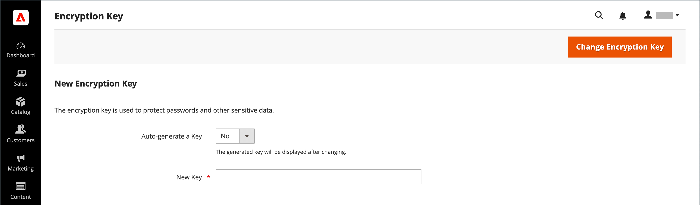

# Chave de criptografia

>[!NOTE]
>
>Se você tentou concluir essas etapas e está com problemas, consulte o artigo da Base de Dados de Conhecimento [Solução de Problemas de Rotação de Chaves de Criptografia: CVE-2024-34102](https://experienceleague.adobe.com/en/docs/commerce-knowledge-base/kb/troubleshooting/known-issues-patches-attached/troubleshooting-encryption-key-rotation-cve-2024-34102).

O Adobe Commerce e o Magento Open Source usam uma chave de criptografia para proteger senhas e outros dados confidenciais. Um algoritmo [!DNL ChaCha20-Poly1305] padrão do setor é usado com uma chave de 256 bits para criptografar todos os dados que exigem criptografia. Isso inclui dados de cartão de crédito e senhas de integração (módulo de pagamento e envio). Além disso, um algoritmo de hash seguro forte (SHA-256) é usado para executar o hash de todos os dados que não exigem descriptografia.

Durante a instalação inicial, você será solicitado a permitir que o Commerce gere uma chave de criptografia ou a inserir uma de sua preferência. A ferramenta encryption key permite alterar a chave conforme necessário. A chave de criptografia deve ser alterada regularmente para melhorar a segurança e, a qualquer momento, a chave original pode ser comprometida. Sempre que a chave é alterada, todos os dados herdados são recodificados usando a nova chave.

Para obter informações técnicas, consulte [Instalação avançada local](https://experienceleague.adobe.com/docs/commerce-operations/installation-guide/advanced.html) no _Guia de Instalação_.

>[!IMPORTANT]
>
>Antes de seguir estas instruções para alterar a chave de criptografia, verifique se o seguinte arquivo é gravável: `[your store]/app/etc/env.php`

**Para alterar uma chave de criptografia:**

As instruções a seguir exigem acesso a um terminal.

1. Habilitar [modo de manutenção](https://experienceleague.adobe.com/en/docs/commerce-operations/configuration-guide/setup/application-modes#maintenance-mode).

   ```bash
   bin/magento maintenance:enable
   ```

1. Desabilitar trabalhos cron.

   _Projetos de infraestrutura em nuvem:_

   ```bash
   ./vendor/bin/ece-tools cron:disable
   ```

   _Projetos locais_

   ```bash
   crontab -e
   ```

1. Na barra lateral _Admin_, vá para **[!UICONTROL System]** > _[!UICONTROL Other Settings]_>**[!UICONTROL Manage Encryption Key]**.

   {width="700" zoomable="yes"}

1. Siga um destes procedimentos:

   - Para gerar uma nova chave, defina **[!UICONTROL Auto-generate Key]** como `Yes`.
   - Para usar uma chave diferente, defina **[!UICONTROL Auto-generate Key]** como `No`. Em seguida, no campo **[!UICONTROL New Key]**, insira ou cole a chave que deseja usar.

1. Clique em **[!UICONTROL Change Encryption Key]**.

   >[!NOTE]
   >
   >Mantenha um registro da nova chave em um local seguro. É necessário descriptografar os dados, se ocorrer algum problema com seus arquivos.

1. Limpe o cache.

   _Projetos de infraestrutura em nuvem:_

   ```bash
   magento-cloud cc
   ```

   _Projetos locais:_

   ```bash
   bin/magento cache:flush
   ```

1. Habilitar trabalhos cron.

   _Projetos de infraestrutura em nuvem:_

   ```bash
   ./vendor/bin/ece-tools cron:enable
   ```

   _Projetos locais:_

   ```bash
   crontab -e
   ```

1. Desabilitar modo de manutenção.

   ```bash
   bin/magento maintenance:disable
   ```
