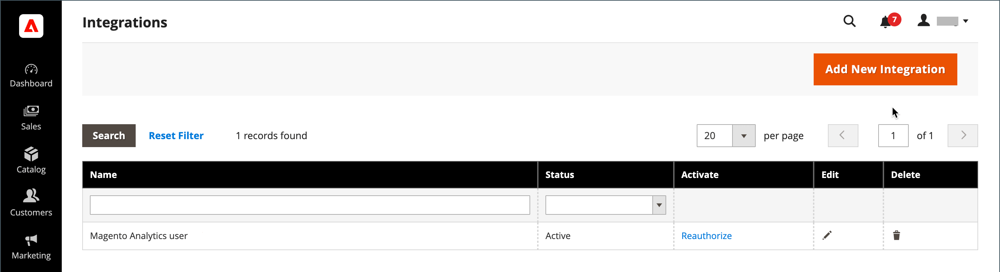
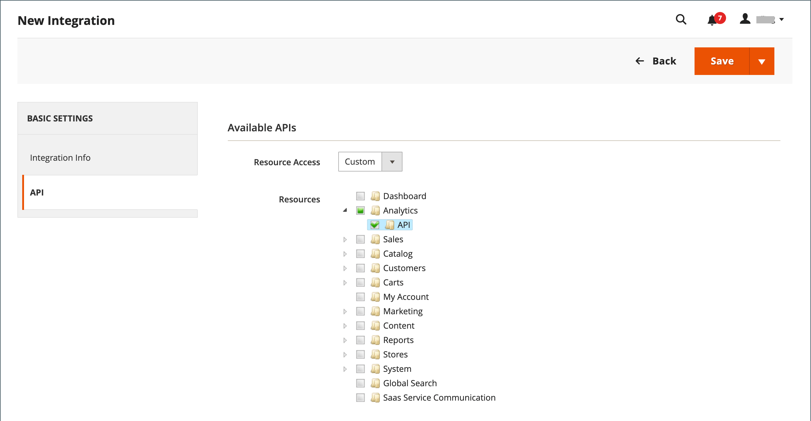
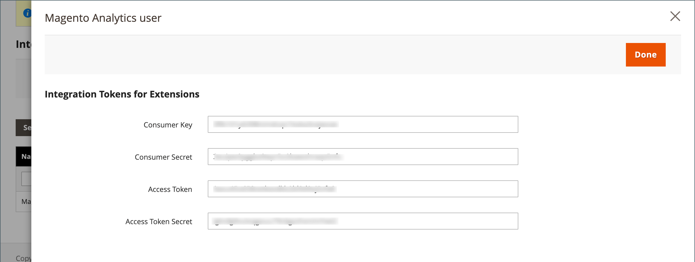
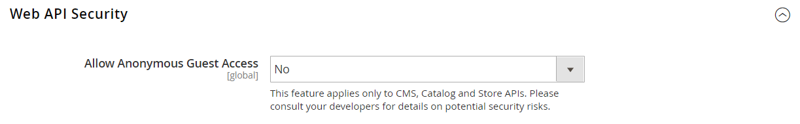

# Integrações

A definição de uma integração no Administrador do Commerce estabelece a localização das credenciais do OAuth e o URL de redirecionamento para integrações de terceiros e identifica os recursos de API disponíveis que são necessários para a integração. Para obter informações mais detalhadas sobre o processo de registro da integração, consulte [Autenticação baseada em OAuth](https://developer.adobe.com/commerce/webapi/get-started/authentication/gs-authentication-oauth/) na documentação do desenvolvedor do Commerce.

{width="700" zoomable="yes"}

## Fluxo de trabalho de integração

1. **Autorizar a integração** - Vá para a página **[!UICONTROL System]** > _[!UICONTROL Extensions]_>**[!UICONTROL Integrations]**, localize a integração relevante e autorize.
1. **Verificar e estabelecer logon** - Quando solicitado, aceite o acesso solicitado. Se redirecionado a terceiros, faça logon no sistema ou crie uma conta. Após um logon bem-sucedido, você retorna à página de integração.
1. **Receber confirmação de integração autorizada** - O sistema envia uma notificação de que a integração foi autorizada com êxito. Depois de configurar uma integração e receber as credenciais, não é mais necessário fazer chamadas para acessar ou solicitar tokens.

## Adicionar uma integração

1. Na barra lateral _Admin_, vá para **[!UICONTROL System]** > _[!UICONTROL Extensions]_>**[!UICONTROL Integrations]**.

   {width="600" zoomable="yes"}

1. Insira as seguintes informações de integração:

   - Insira o **[!UICONTROL Name]** da integração e o endereço **[!UICONTROL Email]** do contato.

   - Insira o **[!UICONTROL Callback URL]** para onde as credenciais do OAuth podem ser enviadas ao usar o OAuth para troca de token. É altamente recomendado usar `https://`.

   - Insira o **[!UICONTROL Identity Link URL]** para redirecionar os usuários para uma conta de terceiros com essas credenciais de integração do Adobe Commerce ou do Magento Open Source.

   >[!NOTE]
   >
   > O rótulo de aviso `Integration not secure` é exibido próximo a cada nome de integração na grade [!UICONTROL Integrations] como lembrete, até que as URLs HTTPS sejam salvas nos campos [!UICONTROL Callback URL] e [!UICONTROL Identity Link URL].

   - Quando solicitado, digite sua senha para confirmar sua identidade.

1. No painel esquerdo, escolha **[!UICONTROL API]** e faça o seguinte:

   - Defina **[!UICONTROL Resource Access]** como um dos seguintes:

      - `All`
      - `Custom`

   - Para obter acesso personalizado, marque a caixa de seleção de cada recurso necessário.

     {width="600" zoomable="yes"}

1. Quando terminar, clique em **[!UICONTROL Save]**.

## Ativar uma integração

Por padrão, uma integração salva é exibida na grade com um status `Inactive`. Para ativá-la, conclua as seguintes etapas:

1. Na barra lateral _Admin_, vá para **[!UICONTROL System]** > _[!UICONTROL Extensions]_>**[!UICONTROL Integrations]**.

1. Localize a integração recém-criada e clique no link **[!UICONTROL Activate]**.

1. No canto superior direito, clique em **[!UICONTROL Allow]**.

   Essa ação exibe os Tokens de integração para extensões. Copie essas informações em um local seguro e criptografado para uso com sua integração.

   {width="600" zoomable="yes"}

1. No canto superior direito, clique em **[!UICONTROL Done]**.

## Reautorizar uma integração

Para gerar um novo Token de acesso de integração e Segredo do Token de acesso, a integração do Administrador foi reautorizada:

1. Na barra lateral _Admin_, vá para **[!UICONTROL System]** > _[!UICONTROL Extensions]_>**[!UICONTROL Integrations]**.

1. Encontre a integração com o status **[!UICONTROL Active]**.

1. Na coluna _[!UICONTROL Activate]_, clique em **[!UICONTROL Reauthorize]**.

1. Clique em **[!UICONTROL Reauthorize]** para aprovar o acesso aos recursos da API.

1. Salve os novos tokens de integração para extensões e clique em **[!UICONTROL Done]**.

## Alterar a configuração de segurança de acesso de convidado à API

Por padrão, o sistema não permite acesso de convidado anônimo à CMS, ao catálogo e a outros recursos de armazenamento. Se precisar alterar a configuração, faça o seguinte:

1. Na barra lateral _Admin_, vá para **[!UICONTROL Stores]** > _[!UICONTROL Settings]_>**[!UICONTROL Configuration]**.

1. No painel esquerdo, expanda **[!UICONTROL Services]** e escolha **[!UICONTROL Magento Web API]**.

1. Expandir  a seção **[!UICONTROL Web API Security Setting]**.

   {width="600" zoomable="yes"}

1. Defina **[!UICONTROL Allow Anonymous Guest Access]** como `Yes`.

1. Quando terminar, clique em **[!UICONTROL Save Config]**.

Para obter mais informações, consulte [Restrição de acesso a APIs da Web anônimas](https://developer.adobe.com/commerce/webapi/rest/use-rest/anonymous-api-security/) na documentação para desenvolvedores do Commerce.

## Excluir uma integração

1. Na barra lateral _Admin_, vá para **[!UICONTROL System]** > _[!UICONTROL Extensions]_>**[!UICONTROL Integrations]**.

1. Localize a integração existente e clique no ícone (  ) na coluna **[!UICONTROL Delete]**.

1. Para confirmar sua ação, clique em **[!UICONTROL OK]**.
