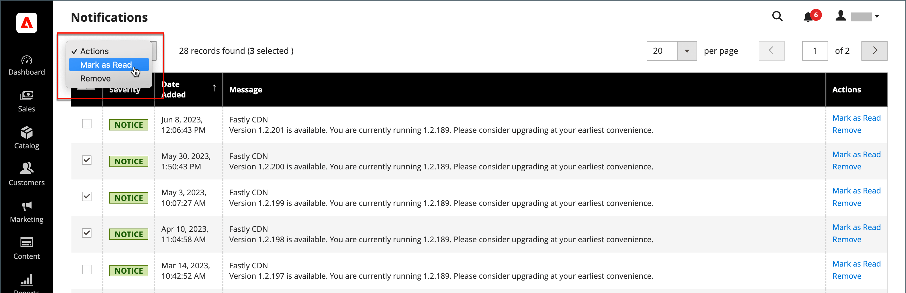

# Notificações do sistema

A página _Notificações_ lista todas as mensagens classificadas por gravidade, com a mais recente no topo. Os comandos Ação podem ser usados para marcar mensagens individuais como lidas, exibir informações mais detalhadas ou remover a mensagem da caixa de entrada.

1. Siga um destes procedimentos para abrir a página _[!UICONTROL Notifications]_:

   - Clique no ícone _Notificação_ no cabeçalho. Se houver uma ou mais novas mensagens exibidas, clique em **[!UICONTROL See All]**.

   - Na barra lateral _Admin_, vá para **[!UICONTROL System]** > _[!UICONTROL Other Settings]_>**[!UICONTROL Notifications]**.

1. Na coluna **[!UICONTROL Action]**, siga um destes procedimentos:

   - Para obter mais informações, clique em **[!UICONTROL Read Details]** para abrir a página vinculada em uma nova janela.

   - Para manter a mensagem em sua caixa de entrada, clique em **[!UICONTROL Mark As Read]**.

     {width="700" zoomable="yes"}

   - Para excluir a mensagem, clique em **[!UICONTROL Remove]**.

1. Para aplicar uma ação a várias mensagens, siga um destes procedimentos:

   - Marque a caixa de seleção na primeira coluna para cada mensagem a ser gerenciada.
   - Para selecionar várias mensagens, defina o controle **[!UICONTROL Mass Actions]** conforme necessário.

1. Defina o controle **[!UICONTROL Actions]** como um dos seguintes:

   - `Mark as Read`
   - `Remove`

1. Clique em **[!UICONTROL Submit]** para concluir o processo.
