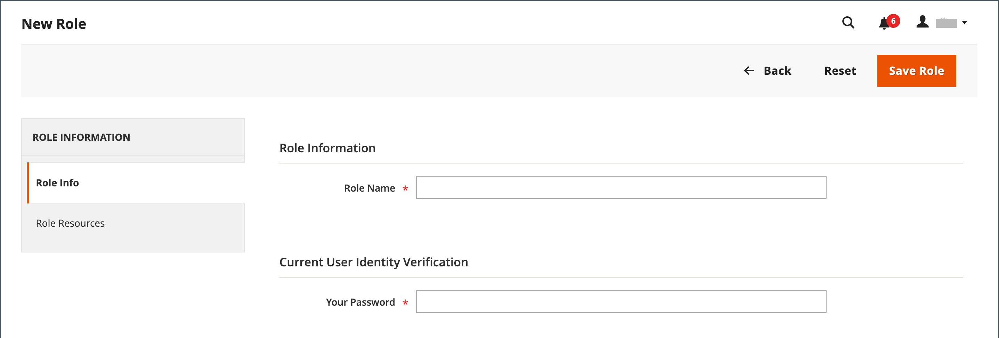

# Funções do usuário

Para conceder a alguém acesso restrito ao Administrador, a primeira etapa é criar uma função com o nível apropriado de permissões. Depois que a função for salva, você pode adicionar novos usuários e atribuir a função restrita para conceder a eles acesso limitado ao Administrador.

{width="600" zoomable="yes"}

## Definir uma função

1. No _Admin_ barra lateral, vá para **[!UICONTROL System]** > _[!UICONTROL Permissions]_>**[!UICONTROL User Roles]**.

1. No canto superior direito, clique em **[!UICONTROL Add New Role]**.

1. Conclua as etapas para definir a função:

### Etapa 1: adicionar o nome da função

1. Em _[!UICONTROL Role Information]_, insira um descritivo **[!UICONTROL Role Name]**.

1. Em _[!UICONTROL Current User Identity Verification]_, digite sua senha.

   {width="600" zoomable="yes"}

### Etapa 2: Atribuir recursos

>[!IMPORTANT]
>
>Ao atribuir recursos, desative o acesso à ferramenta Permissões se estiver limitando o acesso de uma determinada função. Caso contrário, os usuários poderão modificar suas próprias permissões.

1. Definir **[!UICONTROL Role Scopes]** a um dos seguintes:

   - `All`
   - `Custom`

   Se definida como `Custom` para uma instalação multissite, marque a caixa de seleção do site e armazene onde a função será usada.

   {width="600" zoomable="yes"}

   >[!NOTE]
   >
   >Usuários com um `Custom` Os escopos de função não podem criar sites e categorias, atribuir produtos a categorias ou editar produtos em _[!UICONTROL All Store Views]_escopo quando são atribuídos a armazenamentos restritos. Esses usuários também não podem executar outros_ global _ações que afetam escopos onde não têm acesso.

1. Em _[!UICONTROL Roles Resources]_, definir **[!UICONTROL Resource Access]**para `Custom`.

1. No **[!UICONTROL Resource]** estrutura em árvore, marque a caixa de seleção de cada recurso de administrador que a função pode acessar.

   Para criar uma função de Administrador com acesso às configurações de imposto, escolha os recursos Vendas/Imposto e Sistema/Imposto. Se estiver configurando um site para uma região diferente do padrão [ponto de origem da remessa](../stores-purchase/shipping-settings.md#point-of-origin), você deve permitir acesso aos recursos do Sistema/Envio para a função. As configurações de entrega determinam a alíquota de imposto da loja usada para preços de catálogo.

   {width="600" zoomable="yes"}

   A lista de permissões disponíveis pode incluir opções adicionais para extensões agrupadas e instaladas. Ao selecionar a permissão mais alta para cada recurso, você atribui todas as permissões disponíveis para o usuário.

   >[!NOTE]
   >
   >Um usuário administrador deve ter **[!UICONTROL Sales / Archive]** permissões para que o escopo da função veja as _[!UICONTROL Invoices]_,_[!UICONTROL Credit Memos]_, e _[!UICONTROL Shipments]_pedido [guias](../stores-purchase/order-processing.md).

1. Quando terminar, clique em **[!UICONTROL Save Role]**.

   A função agora aparece na grade e pode ser atribuída a contas de usuário.

## Atribuir uma função aos usuários

1. No _[!UICONTROL Roles]_, abra o registro no modo de edição.

1. Em _[!UICONTROL Current User Identity Verification]_, digite a senha da sua conta de usuário.

1. No painel esquerdo, escolha **[!UICONTROL Role Users]**.

   A variável _[!UICONTROL Role Users]_será exibida somente depois que uma nova função for salva.

   {width="600" zoomable="yes"}

1. Para pesquisar um registro de usuário específico, faça o seguinte:

   - Insira o valor no filtro de pesquisa na parte superior de uma coluna e pressione **Enter**.

   - Quando estiver pronto para retornar à lista completa, clique em **[!UICONTROL Reset Filter]**.

1. Marque a caixa de seleção de qualquer usuário a ser atribuído à função.

1. Clique em **[!UICONTROL Save Role]**.

## Editar uma função

1. No _Admin_ barra lateral, vá para **[!UICONTROL System]** > _[!UICONTROL Permissions]_>**[!UICONTROL User Roles]**.

1. Localize a função usando filtros acima da grade e clique no nome da função.

1. Faça as alterações necessárias.

   Revise as etapas para criar uma função de usuário para obter informações sobre as configurações da função.

1. Quando solicitado, digite sua senha para confirmar sua identidade.

1. Clique em **[!UICONTROL Save Role]**.

## Excluir uma função

1. No _Admin_ barra lateral, vá para **[!UICONTROL System]** > _[!UICONTROL Permissions]_>**[!UICONTROL User Roles]**.

1. Localize a função usando filtros acima da grade e abra no modo de edição.

1. No canto superior direito, clique em **[!UICONTROL Delete Role]**.

1. Para confirmar a ação, clique em **[!UICONTROL OK]**.

## Demonstração das funções do usuário

Assista a este vídeo para saber mais sobre o gerenciamento de funções de usuário:

>[!VIDEO](https://video.tv.adobe.com/v/343654?quality=12)

## Recursos de função

O acesso aos recursos a seguir pode ser atribuído a uma função personalizada. Consulte a página vinculada para saber mais sobre os recursos associados a cada recurso.

 - Somente Adobe Commerce

 - Disponível com B2B somente para Adobe Commerce

| Recurso |   |   |
| --- | --- | --- |
| [`Dashboard`](../getting-started/admin-dashboard.md) |  |  |
| [`Sales`](../stores-purchase/sales-menu.md) | [`Operations`](../stores-purchase/orders.md) |  |
|  | [`Quotes`](../b2b/quotes.md)   [`Orders`](../stores-purchase/orders.md) [`Invoices`](../stores-purchase/invoices.md) [`Shipments`](../stores-purchase/shipments.md) [`Credit Memos`](../stores-purchase/credit-memos.md) [`Billing Agreements`](../stores-purchase/paypal-billing-agreements.md) [`Returns`](../stores-purchase/returns.md)  [`Transactions`](../stores-purchase/transactions.md) |
|  | [`Archive`](action-log-archive.md)![Adobe Commerce] |  |
|  | [`Shopping Cart Management`](../stores-purchase/cart.md) |  |
| [`Catalog`](../catalog/catalog-menu.md) | [`Category Permissions`](../catalog/categories.md)  |  |
|  | [`Inventory`](../inventory-management/introduction.md) | [`Products`](../catalog/products-list.md) [`Categories`](../catalog/categories.md) |
|  | [`Shared Catalog`](../b2b/catalog-shared-create.md)  | [`Manage Shared Catalog`](../b2b/catalog-shared-manage.md) |
| [`Customers`](../customers/guide-overview.md) | [`All Customers`](../customers/customers-all.md) [`Now Online`](../customers/now-online.md) [`Customer Groups`](../customers/customer-groups.md) [`Segments`](../customers/customer-segments.md)  |  |
|  | [`Login as Customer`](../customers/login-as-customer.md) | `Allow Login as Customer Button` `View Login as Customer Log`  |
|  | [`Companies`](../b2b/account-companies.md)  | [`Manage Companies`](../b2b/account-company-manage.md)  `Add New Company`  `Delete Company`  `Reimburse Balance` |
| [`Carts`](../stores-purchase/shopping-assisted-cart-manage.md) | [`Manage carts`](../stores-purchase/shopping-assisted-cart-manage.md) |  |
| [`My Account`](../customers/account-dashboard-my-account.md) |  |  |
| [`Marketing`](../merchandising-promotions/marketing-menu.md) | [`Promotions`](../merchandising-promotions/marketing-menu.md#uicontrol-promotions) | [`Catalog Price Rule`](../merchandising-promotions/price-rules-catalog.md)  [`Cart Price Rules`](../merchandising-promotions/price-rules-cart.md)  [`Related Products Rules`](../merchandising-promotions/product-related-rules.md) [`Gift Card Accounts`](../stores-purchase/product-gift-card-accounts.md)  |
|  | [`Private Sales`](../merchandising-promotions/events-private-sales.md)  | [`Events`](../merchandising-promotions/event-create.md)  [`Invitations`](../merchandising-promotions/invitations.md) |
|  | `Communications` | [`Email Templates`](email-templates.md)  [`Newsletter Template`](../merchandising-promotions/newsletter-template.md)  [`Newsletter Queue`](../merchandising-promotions/newsletter-queue.md)  [`Newsletter Subscribers`](../merchandising-promotions/newsletter-subscribers.md)  [`Email Reminders`](../merchandising-promotions/email-reminder-rules.md) |
|  | `Sales Channel` | [`Amazon Sales Channel`](https://experienceleague.adobe.com/docs/commerce-channels/amazon/overview.html) |
|  | [`SEO & Search`](../merchandising-promotions/marketing-menu.md#uicontrol-seo--search) | [`Search Terms`](../catalog/search-terms.md)  [`Search Synonyms`](../catalog/search-terms.md#search-synonyms)  [`URL Rewrites`](../merchandising-promotions/url-rewrite-custom.md)  [`Site Map`](../merchandising-promotions/sitemap-xml.md) |
|  | [`User Content`](../merchandising-promotions/product-reviews-moderate.md) | [`All Reviews`](../merchandising-promotions/product-reviews.md)  [`Pending Reviews`](../merchandising-promotions/product-reviews-moderate.md)   |  |
| [`Content`](../content-design/content-menu.md) | [`Elements`](../content-design/content-menu.md#uicontrol-elements)) | [`Pages`](../content-design/pages.md) [`Hierarchy`](../content-design/page-hierarchy.md)  [`Blocks`](../content-design/blocks.md) [`Dynamic Blocks`](../content-design/dynamic-blocks.md)  [`Widgets`](../content-design/widgets.md) [`Media Gallery`](../content-design/media-gallery.md) |  |
|  | [`Design`](../content-design/introduction.md#design) | [`Themes`](../content-design/themes.md) [`Schedule`](../content-design/schedule.md) |  |
|  | [Preparo de conteúdo](../content-design/content-staging.md)   |  |
| [`Reports`](../getting-started/reports-menu.md) | [`Marketing`](../getting-started/marketing-reports.md) | `Shopping Cart` [`Search Terms`](../catalog/search-terms.md#search-terms-report) `Newsletter Problem Reports` |  |
|  | [`Reviews`](../getting-started/review-reports.md)  |  |
|  | [`Sales`](../getting-started/sales-reports.md) |  |
|  | `System Insights`  | [`Site-Wide Analysis Tool`](https://experienceleague.adobe.com/docs/commerce-operations/tools/site-wide-analysis-tool/access.html) |
|  | [`Customers`](../getting-started/customer-reports.md) [`Products`](../getting-started/product-reports.md) [`Private Sales`](../getting-started/private-sales-reports.md)  [`Statistics`](../getting-started/reports-menu.md#uicontrol-statistics) [`Business Intelligence`](../getting-started/business-intelligence.md) |  |
| [`Stores`](../stores-purchase/stores.md) | [`Settings`](../stores-purchase/stores-menu.md) | [`All Stores`](../stores-purchase/stores.md) [`Configuration`](../configuration-reference/guide-overview.md) [`Terms and Conditions`](../stores-purchase/terms-and-conditions.md) [`Order Status`](../stores-purchase/order-status.md) |  |
|  | [`Inventory`](../inventory-management/sources-stocks.md) | [`Sources`](../inventory-management/sources-manage.md) [`Stocks`](../inventory-management/stocks-manage.md) |  |
|  | [`Taxes`](../stores-purchase/taxes.md) |  |  |
|  | [`Currency`](../stores-purchase/currency.md) | [`Currency Rates`](../stores-purchase/currency-update.md) [`Currency Symbols`](../stores-purchase/currency-configuration.md#step-5-customize-currency-symbols-optional) |  |
|  | [`Attributes`](../catalog/product-attributes.md) | [`Product`](../catalog/attribute-product-create.md) [`Update Attributes`](../catalog/attribute-product-create.md) [`Attribute Set`](../catalog/attribute-sets.md) [`Ratings`](../merchandising-promotions/product-reviews.md#create-custom-ratings) |
|  | [`Other Settings`](../stores-purchase/stores-menu.md) | [`Customer Groups`](../customers/customer-groups.md) |
| [`System`](system-menu.md) | [`Data Transfer`](data-transfer.md) | [`Import`](data-import.md) [`Export`](data-export.md) [`Import/Export Tax Rates`](data-transfer-tax-rates.md) [`Import History`](data-import.md#import-history) |  |
|  | [`Magento Connect`](../getting-started/commerce-marketplace.md) | `Connect Manager` `Package Extensions` |  |
|  | [`Tools`](system-menu.md#tools) | [`Cache Management`](cache-management.md) [`Backups`](backups.md) [`Index Management`](index-management.md) [`Change Indexer Mode`](index-management.md) |  |
|  | [`Permissions`](permissions.md) | [`All Users`](permissions-users-all.md) [`Locked Users`](permissions-users-all.md#locked-users) [`User Roles`](permissions-user-roles.md) |
| [`Action Log`](action-log.md) | [`Report`](action-log.md) [`Archive`](action-log-archive.md) |
|  | [`Other Settings`](system-menu.md) | [`Notifications`](notifications.md) [`Custom Variables`](variables-custom.md) [`Manage Encryption Key`](encryption-key.md) |  |
| [`Global Search`](../getting-started/admin-workspace.md#workspace-search) |  |  |

{style="table-layout:auto"}
