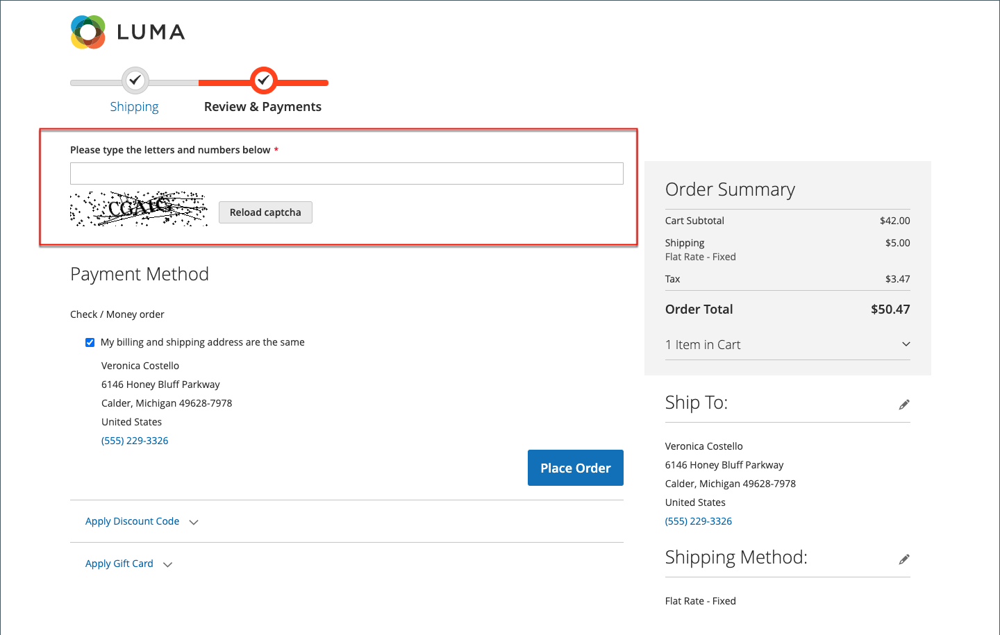

# CAPTCHA

Um CAPTCHA é um dispositivo visual que garante que um ser humano, em vez de um computador (ou &quot;bot&quot;), esteja interagindo com o site. CAPTCHA é um acrônimo de _Teste de Turing público completamente automatizado para diferenciação entre computadores e humanos_. Ele pode ser usado para acesso de Administrador e várias ações de loja iniciadas por clientes registrados. O Adobe Commerce e o Magento Open Source oferecem suporte ao CAPTCHA padrão descrito neste tópico e [Google reCAPTCHA](security-google-recaptcha.md).

É possível recarregar o CAPTCHA quantas vezes forem necessárias, clicando no ícone Recarregar no canto superior direito da imagem. O CAPTCHA é totalmente configurável e pode ser definido para aparecer sempre ou somente após um número definido de tentativas de logon com falha.

{width="700" zoomable="yes"}

## Configurar CAPTCHA para o administrador

Para obter um nível extra de segurança, você pode adicionar um CAPTCHA à página Fazer logon do administrador e Esqueceu a senha. Os usuários administradores podem recarregar o CAPTCHA exibido clicando no _Recarregar_  no canto superior direito da imagem. O número de recarregamentos é ilimitado.

{width="300"}

1. No _Admin_ barra lateral, vá para **[!UICONTROL Stores]** > _[!UICONTROL Settings]_>**[!UICONTROL Configuration]**.

1. No painel esquerdo, expanda **[!UICONTROL Advanced]** e escolha **[!UICONTROL Admin]**.

1. No canto superior direito, defina **[!UICONTROL Store View]** para `Default`.

   Se a variável [escopo](../getting-started/websites-stores-views.md#scope-settings) da sua instalação do Commerce incluir vários sites, escolha os sites nos quais deseja que a configuração CAPTCHA seja aplicada.

1. Expandir  o **[!UICONTROL CAPTCHA]** seção.

1. Definir **[!UICONTROL Enable CAPTCHA in Admin]** para `Yes`. Em seguida, conclua as opções restantes da seguinte maneira:

   {width="600" zoomable="yes"}

   - Insira o nome do **[!UICONTROL Font]** a ser usado para símbolos CAPTCHA (padrão: `LinLibertine`).

     Para adicionar sua própria fonte, o arquivo de fonte deve residir no mesmo diretório da instalação do Commerce e deve ser declarado no `config.xml` arquivo do módulo Captcha em `app/code/Magento/Captcha/etc`.

   - Selecione qualquer uma das seguintes opções **[!UICONTROL Forms]** onde o CAPTCHA deve ser usado. Para escolher vários formulários, mantenha pressionada a tecla Ctrl (PC) ou Command (Mac).

      - `Admin Login`
      - `Admin Forgot Password`

   - Definir **[!UICONTROL Displaying Modes]** a um dos seguintes:

      - `Always` — CAPTCHA é sempre necessário para fazer logon no Admin.
      - `After number of attempts to login` — Essa opção se aplica somente ao formulário de Logon do administrador. Quando selecionado, a variável _[!UICONTROL Number of Unsuccessful Attempts to Login]_é exibido. Insira o número de tentativas de logon que deseja permitir. Um valor de 0 (zero) é semelhante à definição de Modo de exibição como `Always`.

     Para rastrear o número de tentativas de logon malsucedidas, cada tentativa de logon com um endereço de email e a partir de um endereço IP é contada. O número máximo de tentativas de logon permitidas no mesmo endereço IP é 1.000. Essa limitação se aplica somente quando CAPTCHA está ativado.

   - Para **[!UICONTROL Number of Unsuccessful Attempts to Login]**, digite o número de vezes que o administrador pode tentar fazer logon antes que o CAPTCHA apareça. Se definido como zero (`0`), CAPTCHA é sempre necessário.

   - Para **[!UICONTROL CAPTCHA Timeout (minutes)]**, digite o número de minutos antes de o CAPTCHA expirar. Quando o CAPTCHA expira, o administrador deve recarregar a página.

   - Insira o **[!UICONTROL Number of Symbols]** para aparecer no CAPTCHA. Até oito (`8`) podem ser usados. Para um número variável de símbolos que muda com cada CAPTCHA, insira um intervalo (como `5-8`).

   - Para **[!UICONTROL Symbols Used in CAPTCHA]**, insira as letras (a-z e A-Z) e os números (0-9) que devem aparecer aleatoriamente no CAPTCHA. Símbolos difíceis de distinguir de outros símbolos, como `i`, `l`ou `1`, não estão incluídos no conjunto padrão de símbolos CAPTCHA.

   - Definir **[!UICONTROL Case Sensitive]** para `Yes` se você quiser exigir que os administradores insiram os caracteres em maiúsculas ou minúsculas exatamente como mostrado no CAPTCHA.

1. Quando terminar, clique em **[!UICONTROL Save Config]**.

## Configurar CAPTCHA para a loja

Os clientes podem ser solicitados a inserir um CAPTCHA sempre que fizerem logon em suas contas ou após várias tentativas malsucedidas de logon. Além disso, vários formulários usados na loja podem ser configurados para exigir verificação pelo CAPTCHA.

{width="700" zoomable="yes"}

1. No _Admin_ barra lateral, vá para **[!UICONTROL Stores]** > _[!UICONTROL Settings]_>**[!UICONTROL Configuration]**.

1. No painel esquerdo, expanda **[!UICONTROL Customers]** e escolha **[!UICONTROL Customer Configuration]**.

1. Expandir  o **[!UICONTROL CAPTCHA]** seção.

{width="600" zoomable="yes"}

1. Definir **[!UICONTROL Enable CAPTCHA on Storefront]** para `Yes`. Em seguida, conclua as opções restantes da seguinte maneira:

   - Insira o nome do **[!UICONTROL Font]** a ser usado para os símbolos CAPTCHA (padrão: `LinLibertine`).

     Para adicionar sua própria fonte, o arquivo de fonte deve residir no mesmo diretório da instalação do Commerce e deve ser declarado no `config.xml` arquivo do módulo CAPTCHA.

   - Selecione qualquer uma das seguintes opções **[!UICONTROL Forms]** onde o CAPTCHA deve ser usado. Para escolher vários formulários, mantenha pressionada a tecla Ctrl (PC) ou Command (Mac).

      - `Applying coupon code`
      - `Checkout/Placing Order`
      - `Create user`
      - `Login`
      - `Forgot password`
      - `Contact Us`
      - `Change password`
      - `Share Wishlist Form`
      - `Payflow Pro` (consulte [correção de segurança](https://experienceleague.adobe.com/docs/commerce-knowledge-base/kb/troubleshooting/payments/paypal-payflow-pro-active-carding-activity.html) _Knowledge base_ artigo)
      - `Send to Friend Form`  (somente Magento Open Source)
      - `Add Gift Card Code`  (somente Adobe Commerce)
      - `Create company`  (Disponível com B2B somente para Adobe Commerce)

   - Definir **[!UICONTROL Displaying Mode]** a um dos seguintes:

      - `Always` — CAPTCHA é sempre necessário para acessar os formulários selecionados.
      - `After number of attempts to login` — Digite o número de tentativas de login antes do CAPTCHA aparecer. Um valor de 0 (zero) é semelhante a &quot;Sempre&quot;. Quando selecionado, o número de tentativas de login malsucedidas é exibido. Essa opção não se aplica ao formulário Esqueceu a senha, que, se ativado, sempre exibe o CAPTCHA.

   - Para **[!UICONTROL Number of Unsuccessful Attempts to Login]**, digite o número de vezes que um cliente pode fazer logon sem sucesso antes que o CAPTCHA seja exibido. Se definido como zero (`0`), CAPTCHA é sempre usado.

   - Para **[!UICONTROL CAPTCHA Timeout (minutes)]**, digite o número de minutos antes de o CAPTCHA expirar. Quando o CAPTCHA expira, o cliente deve recarregar a página para gerar um novo CAPTCHA.

   - Insira o **[!UICONTROL Number of Symbols]** para aparecer no CAPTCHA. Até oito (`8`) podem ser usados. Para um número variável de símbolos que muda com cada CAPTCHA, insira um intervalo (como `5-8`).

   - Para **[!UICONTROL Symbols Used in CAPTCHA]**, insira as letras (a-z e A-Z) e os números (0-9) que devem aparecer aleatoriamente no CAPTCHA. O conjunto padrão de caracteres não inclui símbolos semelhantes, como `I` ou `1`. Para obter melhores resultados, use símbolos que os usuários possam identificar prontamente.

   - Definir **[!UICONTROL Case Sensitive]** para `Yes` se você quiser exigir que os clientes insiram os caracteres em maiúsculas ou minúsculas exatamente como mostrado no CAPTCHA.

1. Quando terminar, clique em **[!UICONTROL Save Config]**.
