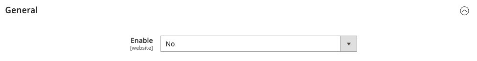
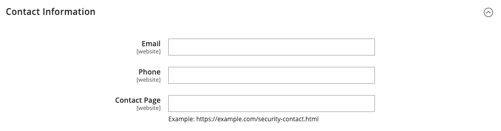

# Relatórios de problemas de segurança

O arquivo `security.txt` contém informações de contato e links relacionados à segurança que podem ser usados por pesquisadores de segurança para relatar preocupações de segurança sobre o site. Se suas informações de segurança forem alteradas com o tempo, verifique se elas estão atualizadas no arquivo `security.txt`.

**_Para configurar security.txt:_**

1. Na barra lateral _Admin_, vá para **[!UICONTROL Stores]** > _[!UICONTROL Settings]_>**[!UICONTROL Configuration]**.

1. No painel esquerdo, em _[!UICONTROL Security]_, clique em **[!UICONTROL Security.txt]**.

1. Na seção _[!UICONTROL General]_, defina **[!UICONTROL Enable]**&#x200B;como `Yes`.

   {width="600" zoomable="yes"}

1. Em _[!UICONTROL Contact Information]_, digite o seguinte:

   - O endereço de email e o número de telefone da pessoa que gerencia problemas de segurança na sua loja.

   - A URL da sua loja **[!UICONTROL Contact Page]**. Esta página pode ser uma lista de contatos de segurança de armazenamento ou sua página _Fale Conosco_.

   {width="600" zoomable="yes"}

1. Em _[!UICONTROL Other Information]_, digite o seguinte:

   - A URL da sua chave pública **[!UICONTROL Encryption]**. Por exemplo: `https://example.com/pgp-key.txt`

   - A URL de uma página **[!UICONTROL Acknowledgments]** na qual os pesquisadores de segurança são reconhecidos por seus esforços em nome de sua loja.

   - Seu **[!UICONTROL Preferred Languages]** para comunicações relacionadas à segurança. Insira o [código de idioma](https://en.wikipedia.org/wiki/List_of_ISO_639-1_codes) de dois caracteres padrão para cada idioma suportado, separado por vírgula. Por exemplo, para especificar inglês, espanhol e francês, digite `en, es, fr`. Todos os idiomas especificados têm a mesma prioridade, independentemente da ordem de aparência.

   - A URL de uma página **[!UICONTROL Hiring]** que lista oportunidades de emprego relacionadas à segurança na sua loja.

   - A URL da página de segurança **[!UICONTROL Policy]**.

   - A URL de um arquivo digital **[!UICONTROL Signature]** salvo no servidor. Por exemplo: `https://mystore.com/.well-known/security.txt.sig`

   A assinatura digital deve ser configurada na CLI (Command-Line Interface, interface de linha de comando) do servidor. Para saber mais, consulte [Security.txt](https://github.com/magento/security-package/blob/1.0-develop/Securitytxt/README.md) no GitHub.

   {width="600" zoomable="yes"}

1. Quando terminar, clique em **[!UICONTROL Save Config]**.
