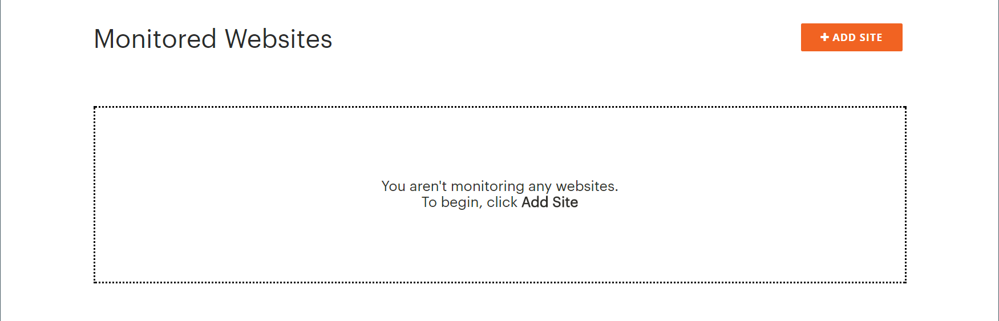
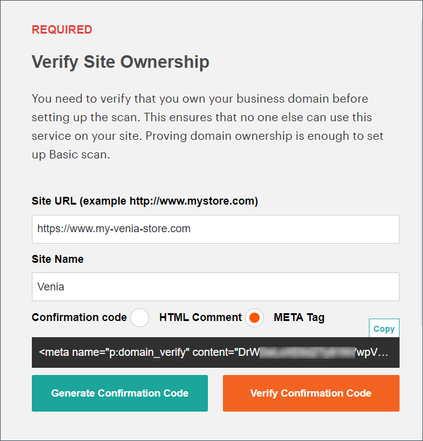
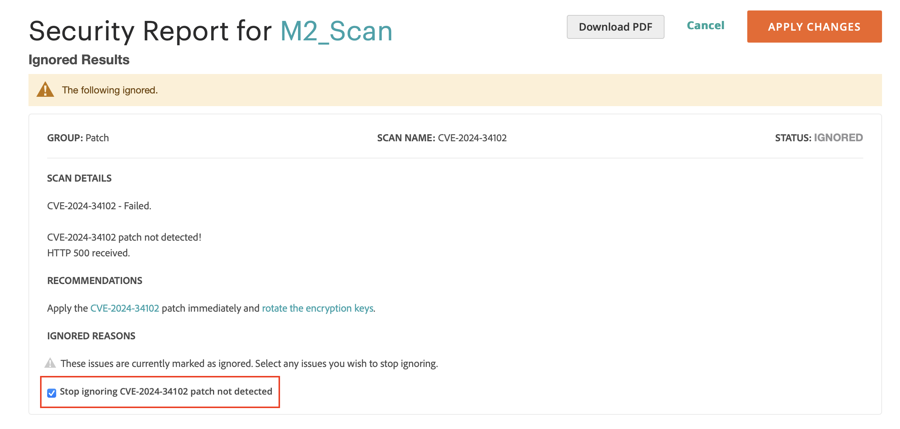

# Verificação de segurança

A Ferramenta de verificação de segurança da Adobe Commerce oferece monitoramento de segurança gratuito para seus sites Adobe Commerce e Magento Open Source. A ferramenta funciona como um serviço baseado na Web que você pode acessar por meio da sua conta do Adobe Commerce online em [account.magento.com](https://account.magento.com/customer/account/login).

{width="600" zoomable="yes"}

>[!NOTE]
>
>A Adobe fornece esse serviço sem custo, embora os comerciantes devam aceitar os termos que limitam a responsabilidade da Adobe com base nos resultados da verificação e na configuração do site.

## Cobertura da varredura

A Ferramenta de Verificação de Segurança opera por protocolos HTTP e HTTPS para detectar malware, identificar vulnerabilidades de segurança e ajudar a manter a postura de segurança da sua loja. A ferramenta está disponível para todos os comerciantes, desenvolvedores e pessoal designado responsável pela segurança do site.

A Ferramenta de verificação de segurança oferece recursos abrangentes de monitoramento de segurança que ajudam a manter um ambiente de armazenamento seguro:

- Obtenha o insight no status de segurança em tempo real de sua loja.
- Receba sugestões com base nas práticas recomendadas para ajudar a resolver problemas.
- Programar uma verificação de segurança para execução semanal, diária ou sob demanda.
- Executar mais de 21.000 testes de segurança para ajudar a identificar malware em potencial.
- Acesse relatórios históricos de segurança que rastreiam e monitoram o progresso de seus sites.
- Acesse o relatório de varredura que mostra verificações bem-sucedidas e falhas, com qualquer ação recomendada.

>[!NOTE]
>
>Você não pode excluir testes de segurança específicos das verificações da Ferramenta de verificação de segurança para Adobe Commerce. No entanto, você pode usar o autoatendimento em [ignorando falhas](#manage-scan-failures) como falsos positivos, se aplicável.

## Access

A Ferramenta de verificação de segurança mantém controles de acesso rigorosos para proteger as informações do seu site. Somente você pode verificar seu site porque a ferramenta requer a verificação da propriedade do domínio por meio da conta da Adobe Commerce. Cada site se conecta à sua conta por meio de um token exclusivo, impedindo a varredura não autorizada por terceiros.

A ferramenta se concentra especificamente em domínios do Adobe Commerce e suas vulnerabilidades de segurança. Embora sua loja na web possa incluir páginas de outras plataformas, a Ferramenta de verificação de segurança deve verificar somente o conteúdo gerado pela Adobe Commerce para garantir resultados confiáveis. A digitalização de páginas que não são do Adobe Commerce pode gerar avaliações de vulnerabilidade não confiáveis.

## Executar uma verificação

O processo de varredura verifica o site em relação a problemas de segurança conhecidos e identifica patches e atualizações ausentes do Adobe Commerce que podem deixar sua loja vulnerável a ataques.

>[!TIP]
>
>Para projetos de infraestrutura em nuvem do Commerce, consulte [Configurar a Ferramenta de Verificação de Segurança](https://experienceleague.adobe.com/en/docs/commerce-on-cloud/user-guide/launch/overview#set-up-the-security-scan-tool).

Para executar uma varredura:

1. Na página inicial da Commerce, entre na sua [conta Commerce/Magento](../getting-started/commerce-account-create.md).

1. Revise e aceite os termos para usar a Ferramenta de verificação de segurança.

   1. No painel esquerdo, escolha **[!UICONTROL Security Scan]**.
   1. Clique em **[!UICONTROL Go to Security Scan]**.
   1. Leia o **[!UICONTROL Terms and Conditions]**.
   1. Clique em **[!UICONTROL Agree]** para continuar.

1. Na página _[!UICONTROL Monitored Websites]_, clique em **[!UICONTROL +Add Site]**.

   Se você tiver vários sites com domínios diferentes, configure uma verificação separada para cada domínio.

   {width="600" zoomable="yes"}

1. Para verificar a propriedade do domínio do site adicionando um código de confirmação, siga um destes procedimentos:

   **vitrine da Commerce**:

   1. Insira o **[!UICONTROL Site URL]** e **[!UICONTROL Site Name]**.
   1. Clique em **[!UICONTROL Generate Confirmation Code]**.
   1. Clique em **Copiar** para copiar seu código de confirmação para a área de transferência.

      {width="400" zoomable="yes"}

   1. Faça logon no Admin da loja como um usuário com privilégios totais de administrador e faça o seguinte:

      1. Na barra lateral _Admin_, vá para **[!UICONTROL Content]** > _[!UICONTROL Design]_>**[!UICONTROL Configuration]**.
      1. Localize seu site na lista e clique em **[!UICONTROL Edit]**.
      1. Expandir  a seção **[!UICONTROL HTML Head]**.
      1. Role para baixo até **[!UICONTROL Scripts and Style Sheets]** e clique na caixa de texto ao final de qualquer código existente. Cole o código de confirmação na caixa de texto.

         {width="600" zoomable="yes"}

      1. Quando terminar, clique em **[!UICONTROL Save Configuration]**.

   **vitrine da PWA**:

   1. Insira o **[!UICONTROL Site URL]** e **[!UICONTROL Site Name]**.

   1. Para **[!UICONTROL Confirmation Code]**, escolha a opção `META Tag` e clique em **[!UICONTROL Generate Code]**.

   1. Clique em **[!UICONTROL Copy]** para copiar a marca META do código de confirmação gerado para a área de transferência.

      {width="400" zoomable="yes"}

   1. Vá para o diretório do projeto da loja PWA Studio e faça o seguinte:

      1. No diretório do projeto PWA Studio, vá para `packages > venia-concept > template.html`.
      1. Adicione o código de confirmação copiado (a tag META gerada) ao cabeçalho do HTML e salve as alterações.

         {width="600" zoomable="yes"}

      1. Volte para a CLI do PWA Studio e use o fio para instalar dependências de projeto e executar o comando build de projeto.

         ```sh
         yarn install &&
         yarn build
         ```

      1. *No seu projeto na nuvem*, crie uma pasta `pwa` e copie o conteúdo dentro da pasta `dist` do projeto da vitrine.

         ```sh
         mkdir pwa && cp -r <path to your storefront project>/dist/* pwa
         ```

      1. Use a ferramenta Git CLI para preparar, confirmar e enviar essas alterações para o projeto na nuvem.

         ```sh
         git add . &&
         git commit -m "Added storefront file bundles" &&
         git push origin
         ```

         Depois que o processo de criação for concluído, as alterações serão implantadas na loja da PWA.

1. Retorne à página _[!UICONTROL Security Scan]_na sua conta do Commerce e clique em **[!UICONTROL Verify Confirmation Code]**para estabelecer a propriedade do domínio.

1. Após uma confirmação bem-sucedida, configure as opções do **[!UICONTROL Set Automatic Security Scan]** para um dos seguintes tipos:

   **Verificar Semanalmente (recomendado)**:

   Escolha os **[!UICONTROL Week Day]**, **[!UICONTROL Time]** e **[!UICONTROL Time Zone]** nos quais a verificação deve ocorrer todas as semanas.

   Por padrão, a verificação é programada para começar toda semana à meia-noite de sábado, UTC, e continuar até a madrugada de domingo.

   {width="500" zoomable="yes"}

   **Verificar Diariamente**:

   Escolha as **[!UICONTROL Time]** e **[!UICONTROL Time Zone]** em que a verificação deve ocorrer todos os dias.

   Por padrão, a verificação é agendada para começar todos os dias à meia-noite, UTC.

   {width="500" zoomable="yes"}

1. Digite o **[!UICONTROL Email Address]** onde deseja receber notificações de verificações concluídas e atualizações de segurança.

   {width="400" zoomable="yes"}

1. Quando terminar, clique em **[!UICONTROL Submit]**.

   Após verificar a propriedade do domínio, o site é exibido na lista Sites monitorados da sua conta da Commerce.

1. Se você tiver vários sites com domínios diferentes, repita esse processo para configurar uma verificação de segurança para cada um.

## Gerenciar falhas de verificação

A Ferramenta de verificação de segurança permite gerenciar falhas de verificação diretamente na exibição de relatório. Você pode marcar falhas específicas de verificação como falsos positivos e excluí-las da sua pontuação de risco.

### Benefícios do gerenciamento de falhas de verificação

O gerenciamento de falhas de verificação ajuda você a manter uma visão geral de segurança mais precisa do armazenamento:

- Redução de falsos positivos nos relatórios de segurança.
- Concentrando-se em questões de segurança relevantes que precisam de atenção.
- Mantendo uma visão mais clara do verdadeiro status de segurança da sua loja.
- Eliminação da necessidade de entrar em contato com o suporte para falsos positivos conhecidos.
- Economizando tempo com falhas de varredura autogerenciável que você já tenha investigado.

Cenários comuns nos quais você pode querer marcar uma falha de verificação como falso positivo incluem:

- Quando você já tiver aplicado uma correção de segurança que a ferramenta de varredura não detectou.
- Quando um problema detectado não é aplicável à configuração de armazenamento específica.
- Quando tiver implementado uma medida de segurança alternativa que resolva a preocupação.
- Quando a falha da verificação se baseia em uma configuração definida intencionalmente para as necessidades da sua empresa.

### Ignorar falhas de verificação

Para gerenciar as falhas de varredura identificadas como falsos positivos, siga estas etapas:

1. Na página _[!UICONTROL Monitored Websites]_, clique em **[!UICONTROL View Report]**para o site que você deseja gerenciar.

1. Na exibição de relatório, localize a verificação com falha que deseja marcar como falso positivo.

1. Clique em **[!UICONTROL Ignore]** para a falha da verificação específica.

   {width="600" zoomable="yes"}

1. Clique em **[!UICONTROL Apply Changes]** para salvar sua seleção.

A falha de verificação ignorada é movida para a seção _[!UICONTROL Ignored Results]_e é excluída da sua pontuação de risco.

### Parar de ignorar falhas de verificação

Se precisar restaurar uma falha de varredura ignorada anteriormente para o monitoramento ativo, siga estas etapas:

1. Na exibição de relatório, role até a seção _[!UICONTROL Ignored Results]_.

1. Clique em **[!UICONTROL Stop Ignoring]** para a falha de verificação que você deseja restaurar.

   {width="600" zoomable="yes"}

1. Clique em **[!UICONTROL Apply Changes]** para salvar sua seleção.

A falha na verificação retorna à seção _[!UICONTROL Failed Scans]_e é incluída na sua pontuação de risco.

### Exibir falhas de verificação ignoradas

Os resultados ignorados são exibidos em uma seção separada do relatório e a pontuação de risco é atualizada automaticamente para refletir somente as falhas de verificação ativas. Você pode gerenciar várias falhas de varredura de uma só vez, selecionando vários itens antes de aplicar as alterações.

{width="600" zoomable="yes"}
