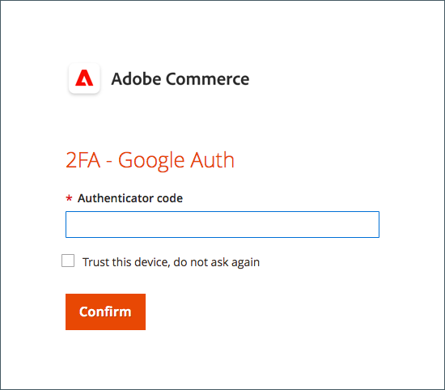
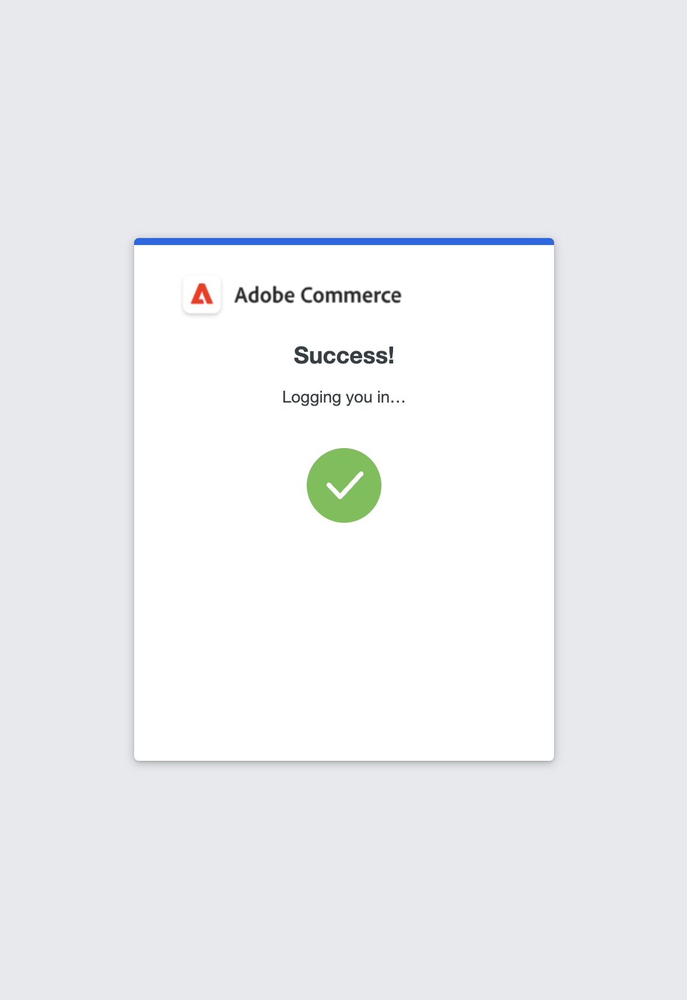

# Configuração da autenticação de dois fatores para contas de usuário

Estas instruções mostram como configurar a autenticação de dois fatores durante o logon inicial na Adobe Commerce ou no Magento Open Source e como autenticar sua identidade usando os seguintes aplicativos e dispositivos.

Para obter instruções completas, consulte [Logon de administrador](../getting-started/admin-signin.md).

>[!NOTE]
>
>Os armazenamentos que habilitaram a autenticação [!DNL Adobe Identity Management Services] (IMS) têm o Adobe Commerce nativo e o Magento Open Source 2FA desabilitados. Os usuários administradores que estão conectados à instância do Commerce com suas credenciais do Adobe não precisam se autenticar novamente para muitas tarefas administrativas. A autenticação é tratada pelo Adobe IMS quando o usuário administrador faz logon em sua sessão atual. Consulte [[!DNL Adobe Identity Management Service] (IMS) Visão geral da integração](../getting-started/adobe-ims-integration-overview.md).

## [!DNL Google Authenticator]

### Etapa 1: configurar [!DNL Google Authenticator]

1. Insira suas credenciais de conta e entre no _Administrador_. Uma nova tela do autenticador é exibida com um código QR.

1. Abra o aplicativo **[!UICONTROL Google Authenticator]** no dispositivo móvel.

1. Clique no sinal de mais ( **+** ) para adicionar uma entrada e alinhar a caixa vermelha com o código QR para digitalizar com a câmera no seu smartphone.

1. Quando o telefone reconhece o código QR e adiciona uma entrada, insira esse código de 6 dígitos no campo _Admin_ **[!UICONTROL Authenticator code]**.

1. Quando terminar, clique em **[!UICONTROL Confirm]**.

   {width="300"}

### Etapa 2: entrar com [!DNL Google Authenticator]

1. Insira suas credenciais de conta e entre no _Administrador_ da Commerce.

   {width="300"}

1. Abra o [!DNL Google Authenticator] em seu dispositivo móvel.

1. Quando solicitado, insira o código de autenticação de seis dígitos.

1. Para salvar a autenticação para logons futuros, marque a caixa de seleção **[!UICONTROL Trust this device, do not ask again]**.

1. Quando terminar, clique em **[!UICONTROL Confirm]**.

## [!DNL Duo Security]

O [!DNL Duo] oferece uma avaliação gratuita e cobra de acordo com o número de usuários associados à conta. Siga as [instruções para configurar sua conta e baixar o aplicativo](https://duo.com/product/multi-factor-authentication-mfa/duo-mobile-app).

### Etapa 1: configurar [!DNL Duo Security]

1. Insira suas credenciais de conta e entre no _Administrador_.

1. Quando a página Instalação do [!DNL Duo] for exibida, clique em **[!UICONTROL Get Started]** e faça o seguinte:

   {width="300"}

1. Selecione sua opção. Você pode escolher Touch ID, Duo Mobile, Security Key ou Phone Number. Este exemplo mostra a opção Duo Mobile or Phone Number.

1. Quando solicitado, digite seu número de telefone e clique em **[!UICONTROL Continue]**.

   Confirme a propriedade enviando e verificando a senha no número de telefone.

1. Quando for solicitado instalar o [!DNL Duo Mobile] para o seu tipo de telefone, clique em **[!UICONTROL I have Duo Mobile]**.

1. Abra [!DNL Duo Mobile] e verifique o código QR para sincronizar o autenticador com o Adobe Commerce. Uma marca de seleção é exibida quando a ativação é concluída.

1. Você pode adicionar mais dispositivos (se necessário) ou ignorar. A configuração foi concluída e você pode fazer logon com o Duo.

   {width="300"}

### Etapa 2: entrar com [!DNL Duo Security]

O exemplo a seguir mostra as opções para `Ask me to choose an authenticator method`:

1. Quando solicitado, insira suas credenciais de _Administrador_ para entrar.

   {width="300"}

1. Escolha &quot;Fazer logon com Duo&quot; para receber uma notificação por push no aplicativo Duo para dispositivos móveis, &quot;Fazer logon com Touch ID&quot; ou &quot;Prosseguir com outra opção configurada durante a configuração&quot;.

1. Aprove a solicitação do aplicativo Duo/Touch ID/Mensagem de texto e você será conectado com sucesso.

   {width="300"}

## [!DNL Authy]

O [!DNL Authy] oferece seu aplicativo e serviço sem custo para os usuários. Siga as instruções para baixar e configurar o aplicativo para seu dispositivo ou navegador. Para saber mais, consulte a [[!DNL Authy] documentação](https://authy.com/features/setup/).

### Etapa 1: configurar o Authy

1. Insira suas credenciais de conta e entre no _Administrador_.

   ![[!DNL Authy] inscrição](./assets/storefront-2fa-authy-auth.png){width="300"}

1. Quando solicitado a se registrar no Authy, faça o seguinte:

   - Selecione seu país.

   - Insira seu número de telefone.

   - Selecione o **[!UICONTROL Verification method]**: `SMS` ou `Call Me`

   Clique em **[!UICONTROL Continue]**. Uma mensagem é enviada ao seu telefone por SMS ou uma chamada.

1. Insira o código de verificação recebido e clique em **[!UICONTROL Verify]**.

1. Quando terminar, clique em **[!UICONTROL Confirm]**.

   ![[!DNL Authy] código de verificação](./assets/storefront-2fa-authy-verify.png){width="300"}

### Etapa 2: entrar com [!DNL Authy]

1. Insira suas credenciais de conta e entre no _Administrador_.

   ![[!DNL Authy] - entrada](./assets/storefront-2fa-authy-access.png){width="300"}

1. Escolha um dos seguintes métodos para autenticar:

   - `Use one touch` — Envia um alerta para o aplicativo [!DNL Authy]. No aplicativo, aceite o acesso.
   - `Use authy token` — Solicita que você insira um código do aplicativo [!DNL Authy].

1. Se tiver problemas para fazer logon, escolha o método que deseja usar para receber o código. Em seguida, insira o código recebido para acessar o _Admin_.

   O aplicativo inclui esses métodos de emergência adicionais.

   - `Send me a code via SMS` — Uma mensagem SMS de texto é enviada para o dispositivo móvel configurado.
   - `Send me a code via phone call` — O usuário recebe uma chamada telefônica com um código.

   Sua conta foi verificada e aberta.

## U2F ([!DNL Yubikey] e outros dispositivos)

Siga as instruções do provedor de soluções para configurar seu dispositivo U2F. Para obter mais informações, consulte a documentação do fornecedor, como [[!DNL YubiKey]](https://support.yubico.com/hc/en-us/articles/360013790339-Getting-Started-with-Your-YubiKey) por [!UICONTROL Yubico].

1. Insira suas credenciais de conta e entre no _Administrador_.

   {width="300"}

1. Pressione o botão na tecla.

   A autenticação dispara imediatamente e abre o _Administrador_.

1. Insira o **[!UICONTROL U2F key]** em uma porta USB no computador.
