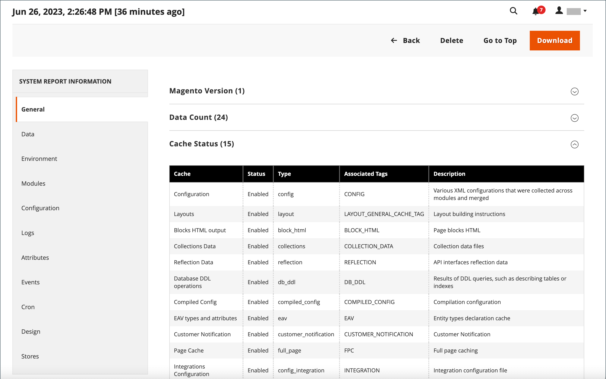

# Ferramentas de suporte

{{ee-feature}}

As ferramentas de suporte foram criadas para identificar problemas conhecidos no sistema. Eles podem ser usados como um recurso durante os processos de desenvolvimento e otimização e como uma ferramenta de diagnóstico para ajudar nossa equipe de suporte a identificar e resolver problemas.

## Relatórios do sistema

A ferramenta de relatório do sistema oferece a capacidade de tirar instantâneos periódicos completos ou parciais do sistema e salvá-los para referência futura. Você pode comparar as configurações de desempenho antes e depois dos ciclos de desenvolvimento de código ou as alterações nas configurações do servidor. A ferramenta de relatório do sistema pode reduzir drasticamente o tempo gasto na preparação e envio das informações exigidas pelo suporte para iniciar uma investigação.

Na grade Relatórios do sistema, é possível visualizar e baixar relatórios existentes, excluir relatórios e criar relatórios.

### Acessar relatórios do sistema

Na barra lateral _Admin_, vá para **[!UICONTROL System]** > _[!UICONTROL Support]_>**[!UICONTROL System Report]**.

{width="600" zoomable="yes"}

### Gerar um relatório

1. Clique em **[!UICONTROL New Report]**.

1. Na lista **[!UICONTROL Groups]**, selecione cada conjunto de informações que deseja incluir no relatório. Por padrão, todos os grupos são selecionados.

   {width="600" zoomable="yes"}

1. No canto superior direito, clique em **[!UICONTROL Create]**.

   O relatório pode levar alguns minutos para ser gerado, dependendo do número de tipos de relatório selecionados. Quando o relatório estiver pronto, ele será exibido na parte superior da grade com a data e a hora geradas.

### Exibir informações do módulo

Você pode encontrar informações úteis sobre módulos instalados.

**_Para exibir informações de relatório para cada módulo instalado:_**

1. Na barra lateral _Admin_, vá para **[!UICONTROL System]** > _[!UICONTROL Support]_>**[!UICONTROL System Report]**.
1. Clique em **[!UICONTROL New Report]**.
1. Selecione `Modules` na lista **[!UICONTROL Groups]**.
1. Clique em **[!UICONTROL Create]**.
1. Depois que o relatório for gerado, clique em **[!UICONTROL Select]** e depois em **[!UICONTROL View]** para ver todas as versões do módulo.
1. Clique em **[!UICONTROL Download]** para baixar o relatório.

### Gerenciar relatórios do sistema

Na coluna **[!UICONTROL Action]** da grade, selecione uma das seguintes opções:

- `View` - Use esta função para exibir os detalhes do relatório.
- `Delete` - Use esta função para excluir o relatório gerado da lista.
- `Download` - Use essa função para salvar o relatório como um arquivo HTML.

### Exibir detalhes do relatório do sistema

1. Para o relatório que você precisa, selecione **[!UICONTROL View]** na coluna _[!UICONTROL Actions]_.

1. No painel esquerdo, expanda  cada seção do relatório para exibir os detalhes.

   {width="600" zoomable="yes"}

### Relatórios de sistema disponíveis

| Grupo de relatório | Informações incluídas |
| ------------ | -------------------- |
| [!UICONTROL General] | Versão do Adobe Commerce Contagem de Dados Status do Cache Status do Índice |
| [!UICONTROL Environment] | Informações do ambiente Status do MySQL |
| [!UICONTROL Data] | Categorias Duplicadas Por Chave De URL Produtos Duplicados Por Chave De URL Produtos Duplicados Por SKU Pedidos Duplicados Por Id De Incremento Usuários Duplicados Por Email Dados De Categorias Corrompidas |
| [!UICONTROL Modules] | Lista de Módulos Personalizados Lista de Módulos Desabilitados Lista de Todos os Módulos |
| [!UICONTROL Configuration] | Configuração Dados de `app/etc/env.php` Métodos de Envio Métodos de Pagamento Matriz de Funcionalidade de Pagamentos |
| [!UICONTROL Logs] | Arquivos de Log Principais Mensagens do Sistema Principais Mensagens do Sistema de Hoje Principais Mensagens de Depuração Principais Mensagens de Hoje Principais Mensagens de Exceção Principais Mensagens de Hoje |
| [!UICONTROL Attributes] | Atributos EAV Definidos pelo Usuário Novos Atributos EAV Tipos de Entidade Todos os Atributos EAV Atributos EAV de Categoria Atributos EAV de Produto Atributos EAV de Cliente Atributo EAV de Endereço de Cliente Atributos EAV de Item RMA |
| [!UICONTROL Events] | Eventos Globais Personalizados Eventos Personalizados De Administrador Eventos Personalizados De Front-End Eventos Personalizados De Documento Eventos Personalizados Do Crontab Eventos Personalizados De REST Eventos Personalizados Do SOAP Eventos Globais Principais Eventos Principais De Administrador Eventos Principais De Front-End Eventos Principais De Documento Eventos Principais Do Crontab Eventos Principais Do REST Eventos Principais Do SOAP Todos Os Eventos Globais De Administrador Todos Os Eventos De Front-End Todos Os Eventos De Documento Todos Os REST Eventos Todos Os Eventos Da SOAP Todos Os Eventos Crontab  |
| [!UICONTROL Cron] | Cron Agenda por código de status Cron Agenda por código de trabalho Erros na fila de Cron Agenda Lista de Cron Agenda Cron Tarefas Cron Globais Personalizadas Tarefas Cron Configuráveis Personalizadas Tarefas Cron Globais Principais Tarefas Cron Configuráveis Principais Todas as Tarefas Cron Globais Todas as Tarefas Cron Configuráveis |
| [!UICONTROL Design] | Lista de Temas Adminhtml Lista de Temas de Front-end |
| [!UICONTROL Stores] | Árvore do Site Lista de Sites Lista de Lojas Lista de Exibições da Loja |
| Conector do OMS  _(visível com integração do OMS)_ | Versão do conector Monitoramento do conector Resultados do Processamento de Mensagens |

{style="table-layout:auto"}
