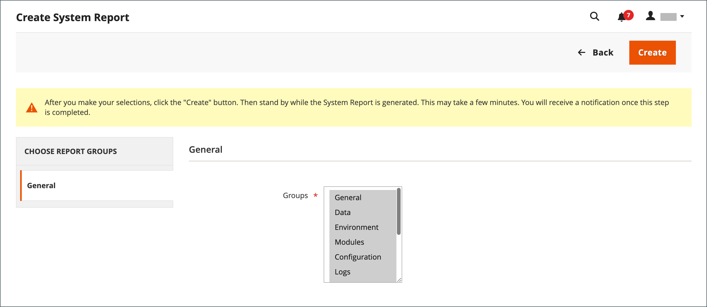

# Ferramentas de suporte

{{ee-feature}}

As ferramentas de suporte foram criadas para identificar problemas conhecidos no sistema. Eles podem ser usados como um recurso durante os processos de desenvolvimento e otimização e como uma ferramenta de diagnóstico para ajudar nossa equipe de suporte a identificar e resolver problemas.

## Coletor de dados

O coletor de dados coleta as informações sobre seu sistema necessárias para que nossa equipe de suporte solucione problemas na instalação do Adobe Commerce. O backup criado leva vários minutos para ser concluído e inclui um dump de código e de banco de dados. Os dados podem ser exportados para um arquivo XML CSV ou do Excel.

{width="600" zoomable="yes"}

### Executar o coletor de dados

1. No _Admin_ barra lateral, vá para **[!UICONTROL System]** > _[!UICONTROL Support]_>**[!UICONTROL Data Collector]**.

1. No canto superior direito, clique em **[!UICONTROL New Backup]**.

   O backup leva alguns minutos para ser gerado. É possível monitorar os resultados do processamento clicando em **[!UICONTROL Refresh Status]**. Quando concluído, o backup é exibido no _[!UICONTROL Data Collector]_grade.

1. Para exibir um log com os detalhes do backup, faça o seguinte:

   - No _[!UICONTROL Action]_coluna, selecione **[!UICONTROL Show Log]**.

   - Clique em **[!UICONTROL Back]** para retornar à grade.

   {width="600" zoomable="yes"}

### Exportar dados de backup

1. Na primeira coluna, marque a caixa de seleção do backup a ser exportado.

1. Use o **[!UICONTROL Export]** para escolher o formato dos dados de exportação.

   {width="600" zoomable="yes"}

1. Acesse o arquivo do local de download do navegador da Web e **[!UICONTROL Save]** o mesmo.

### Baixar dados de backup

Depois que o backup é gerado, é possível baixar a cópia dos dados do Code e do DB.

1. Localize a entidade de backup necessária na grade.

1. Verifique se ele tem um `Complete` status.

1. Clique no nome da entidade em _[!UICONTROL Code Dump]_ou_[!UICONTROL DB Dump]_ colunas.

O processo de download deve iniciar automaticamente.

## Excluir dados de backup

1. No _Admin_ barra lateral, vá para **[!UICONTROL System]** > _[!UICONTROL Support]_>**[!UICONTROL Data Collector]**.

1. Localize e selecione os dados de backup a serem excluídos.

1. No _[!UICONTROL Action]_clique em **[!UICONTROL Delete]**.

1. Para confirmar a ação, clique em **[!UICONTROL OK]**.

## Relatórios do sistema

A ferramenta de relatório do sistema oferece a capacidade de tirar instantâneos periódicos completos ou parciais do sistema e salvá-los para referência futura. Você pode comparar as configurações de desempenho antes e depois dos ciclos de desenvolvimento de código ou as alterações nas configurações do servidor. A ferramenta de relatório do sistema pode reduzir drasticamente o tempo gasto na preparação e envio das informações exigidas pelo suporte para iniciar uma investigação.

Na grade Relatórios do sistema, é possível visualizar e baixar relatórios existentes, excluir relatórios e criar relatórios.

### Acessar relatórios do sistema

No _Admin_ barra lateral, vá para **[!UICONTROL System]** > _[!UICONTROL Support]_>**[!UICONTROL System Report]**.

{width="600" zoomable="yes"}

### Gerar um relatório

1. Clique em **[!UICONTROL New Report]**.

1. No **[!UICONTROL Groups]** selecione cada conjunto de informações que deseja incluir no relatório. Por padrão, todos os grupos são selecionados.

   {width="600" zoomable="yes"}

1. No canto superior direito, clique em **[!UICONTROL Create]**.

   O relatório pode levar alguns minutos para ser gerado, dependendo do número de tipos de relatório selecionados. Quando o relatório estiver pronto, ele será exibido na parte superior da grade com a data e a hora geradas.

### Exibir informações do módulo

Você pode encontrar informações úteis sobre módulos instalados.

**_Para exibir informações de relatório para cada módulo instalado:_**

1. No _Admin_ barra lateral, vá para **[!UICONTROL System]** > _[!UICONTROL Support]_>**[!UICONTROL System Report]**.
1. Clique em **[!UICONTROL New Report]**.
1. Selecionar `Modules` do **[!UICONTROL Groups]** lista.
1. Clique em **[!UICONTROL Create]**.
1. Depois que o relatório for gerado, clique em **[!UICONTROL Select]** e depois **[!UICONTROL View]** para ver todas as versões do módulo.
1. Clique em **[!UICONTROL Download]** para baixar o relatório.

### Gerenciar relatórios do sistema

No **[!UICONTROL Action]** da grade, selecione uma das seguintes opções:

- `View` : Use essa função para exibir os detalhes do relatório.
- `Delete` - Use essa função para excluir o relatório gerado da lista.
- `Download` : Use essa função para salvar o relatório como um arquivo HTML.

### Exibir detalhes do relatório do sistema

1. Para o relatório necessário, selecione **[!UICONTROL View]** no _[!UICONTROL Actions]_coluna.

1. No painel esquerdo, expanda  cada seção do relatório para exibir os detalhes.

   {width="600" zoomable="yes"}

### Relatórios de sistema disponíveis

| Grupo de relatório | Informações incluídas |
| ------------ | -------------------- |
| [!UICONTROL General] | Versão do Adobe Commerce Contagem de dados Status do cache Status do índice |
| [!UICONTROL Environment] | Informações do ambiente Status do MySQL |
| [!UICONTROL Data] | Categorias duplicadas por chave de URL Duplicar produtos por chave de URL Produtos duplicados por SKU Pedidos Duplicados Por Id De Incremento Usuários Duplicados Por Email Dados de Categorias Corrompidos |
| [!UICONTROL Modules] | Lista de módulos personalizados Lista de módulos desativados Lista de Todos os Módulos |
| [!UICONTROL Configuration] | Configuração Dados de `app/etc/env.php` Métodos de envio Métodos de pagamento Matriz de Funcionalidade de Pagamentos |
| [!UICONTROL Logs] | Arquivos de log Principais Mensagens do Sistema Principais mensagens do sistema de hoje Principais mensagens de depuração Principais mensagens de depuração de hoje Principais Mensagens de Exceção Principais Mensagens de Exceção de Hoje |
| [!UICONTROL Attributes] | Atributos de EAV Definidos pelo Usuário Novos atributos de EAV Tipos de entidade Todos os atributos de EAV Atributos EAV da Categoria Atributos EAV do Produto Atributos de EAV do Cliente Atributo EAV do Endereço do Cliente Atributos EAV do Item de RMA |
| [!UICONTROL Events] | Eventos globais personalizados Eventos de administração personalizados Eventos de front-end personalizados Eventos Doc personalizados Eventos Personalizados Do Crontab Eventos REST personalizados Eventos SOAP personalizados Eventos globais principais Eventos principais de administração Eventos de front-end principais Eventos Doc principais Eventos Crontab Principais Eventos REST principais Eventos SOAP principais Todos os eventos globais Todos os eventos de administração Todos os eventos de front-end Todos os eventos Doc Todos os eventos REST Todos os eventos SOAP Todos os eventos Crontab |
| [!UICONTROL Cron] | Cronogramas Cron por código de status Cronogramas Cron por código de trabalho Erros na fila de cronogramas Cron Lista de Cronogramas Cron Trabalhos Cron Globais Personalizados Tarefas Cron configuráveis personalizadas Principais trabalhos Cron globais Trabalhos Core Configurable Cron Todos os trabalhos Cron globais Todos Os Trabalhos Do Cron Configuráveis |
| [!UICONTROL Design] | Lista de temas do Adminhtml Lista de temas de front-end |
| [!UICONTROL Stores] | Árvore do site Lista de Sites Lista de lojas Lista de exibições da loja |
| Conector OMS  _(visível com a integração do OMS)_ | Versão do conector Monitoramento do conector Resultados do processamento de mensagens |

{style="table-layout:auto"}
