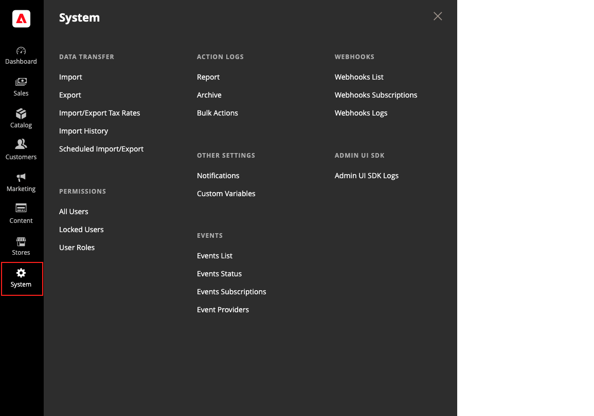

# Menu [!UICONTROL System]

O menu [!UICONTROL System] inclui ferramentas para importar e exportar dados, gerenciar caches e índices do sistema, gerenciar permissões, backups, notificações do sistema e variáveis personalizadas.

>[!BEGINTABS]

>[!TAB Adobe Commerce]

[!BADGE Somente PaaS]{type=Informative url="https://experienceleague.adobe.com/en/docs/commerce/user-guides/product-solutions" tooltip="Aplica-se somente a projetos do Adobe Commerce na nuvem (infraestrutura do PaaS gerenciada pela Adobe) e a projetos locais."}

{width="600" zoomable="yes"}

>[!TAB Adobe Commerce as a Cloud Service]

[!BADGE Somente SaaS]{type=Positive url="https://experienceleague.adobe.com/en/docs/commerce/user-guides/product-solutions" tooltip="Aplicável somente a projetos do Adobe Commerce as a Cloud Service e do Adobe Commerce Optimizer (infraestrutura SaaS gerenciada pela Adobe)."}

{width="600" zoomable="yes"}

>[!ENDTABS]

**_Para exibir o menu [!UICONTROL System]:_**

Na barra lateral _Admin_, clique em **[!UICONTROL System]**.

## [!UICONTROL Data Transfer]

Essas [ferramentas](data-transfer.md) oferecem a você a capacidade de gerenciar vários registros em uma única operação. Você pode importar novos itens e também atualizar, substituir e deletar produtos e alíquotas de imposto existentes.

## [!UICONTROL Extensions]

[!BADGE Somente PaaS]{type=Informative url="https://experienceleague.adobe.com/en/docs/commerce/user-guides/product-solutions" tooltip="Aplica-se somente a projetos do Adobe Commerce na nuvem (infraestrutura do PaaS gerenciada pela Adobe) e a projetos locais."}

Gerencie [integrações de terceiros](integrations.md) e extensões da sua loja.

## [!UICONTROL Tools]

[!BADGE Somente PaaS]{type=Informative url="https://experienceleague.adobe.com/en/docs/commerce/user-guides/product-solutions" tooltip="Aplica-se somente a projetos do Adobe Commerce na nuvem (infraestrutura do PaaS gerenciada pela Adobe) e a projetos locais."}

Use esta coleção de ferramentas para gerenciar os recursos do sistema, incluindo o gerenciamento do [cache](cache-management.md) e do [índice](index-management.md), os [backups](backups.md) e as configurações de instalação.

## [!UICONTROL Support]

[!BADGE Somente PaaS]{type=Informative url="https://experienceleague.adobe.com/en/docs/commerce/user-guides/product-solutions" tooltip="Aplica-se somente a projetos do Adobe Commerce na nuvem (infraestrutura do PaaS gerenciada pela Adobe) e a projetos locais."}

 (somente Adobe Commerce)

As [Ferramentas de suporte](support.md) podem ser usadas como um recurso durante os processos de desenvolvimento e otimização e como uma ferramenta de diagnóstico para ajudar nossa equipe de suporte a identificar e resolver problemas com o seu sistema.

## [!UICONTROL Permissions]

A Adobe Commerce e a Magento Open Source usam [funções e permissões](permissions.md) para criar diferentes níveis de acesso para usuários administradores. Essas ferramentas dão aos administradores a capacidade de conceder permissões _com base no que você precisa saber_ para pessoas que trabalham no seu site.

## [!UICONTROL Action Log]

 (somente Adobe Commerce)

O [Log de Ações](action-log.md) rastreia as atividades dos administradores que trabalham em sua loja. Para a maioria dos eventos, as informações disponíveis incluem a ação, o nome do usuário, se foi um sucesso ou falha, e a ID do objeto que foi o destino da ação. O arquivo de Ações do administrador lista os arquivos de log CSV armazenados no servidor.

## [!UICONTROL Other Settings]

Gerencie as [notificações](notifications.md) na sua caixa de entrada, crie [variáveis personalizadas](variables-custom.md) e gere uma nova [chave de criptografia](encryption-key.md).
