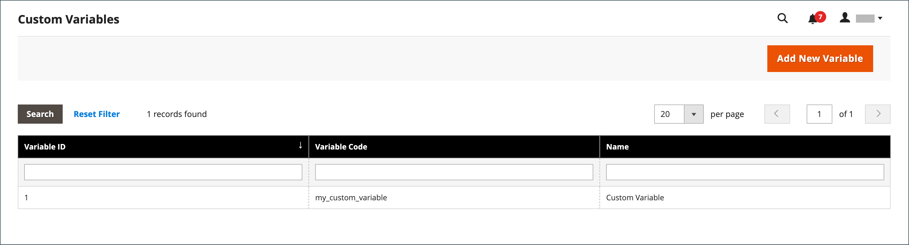

# Adicionar variáveis personalizadas

Para atender às necessidades específicas da sua empresa, você pode criar variáveis personalizadas e inseri-las em [páginas](../content-design/pages.md), [blocos](../content-design/blocks.md), e [modelos de email](email-templates.md). A lista de variáveis permitidas exibida ao clicar no botão _Inserir variável_ O botão inclui ambos [predefinido](variables-predefined.md) e variáveis personalizadas. A lista de variáveis disponíveis para um template de email específico é determinada pelos dados associados ao template. Consulte a [Referência da variável](variables-reference.md) para obter uma lista de modelos de email usados com frequência e suas variáveis associadas.

{width="600" zoomable="yes"}

>[!NOTE]
>
>Somente variáveis predefinidas ou personalizadas permitidas podem ser usadas em modelos de email e boletim informativo.

## Etapa 1: criar uma variável personalizada

1. No _Admin_ barra lateral, vá para **[!UICONTROL System]** > _[!UICONTROL Other Settings]_>**[!UICONTROL Custom Variables]**.

1. Clique em **[!UICONTROL Add New Variable]**.

1. Insira um identificador para **[!UICONTROL Variable Code]**, usando todos os caracteres em minúsculas sem espaços.

   Se necessário, você pode usar um caractere de sublinhado ou hífen para representar um espaço. Por exemplo: `my_custom_variable`

1. Insira um **[!UICONTROL Variable Name]**, que é usado para referência interna. Por exemplo: `My Custom Variable`

1. Para inserir o valor associado à variável, siga um destes procedimentos:

   - Para **[!UICONTROL Variable HTML Value]**, insira o valor da variável formatado com tags HTML simples. Por exemplo:

     `<b>This formatted content appears in place of the variable.</b>`

   - Para **[!UICONTROL Variable Plain Value]**, insira o valor da variável como texto sem formatação. Por exemplo:

     `This unformatted content appears in place of the variable.`

   >[!TIP]
   >
   >Se precisar de mais espaço, arraste o canto inferior direito da caixa de texto.

   {width="600" zoomable="yes"}

1. Quando terminar, clique em **[!UICONTROL Save]**.

## Etapa 2: insira a variável personalizada no conteúdo

Uso [!DNL Page Builder] para inserir uma variável personalizada.

1. Abra a página, o bloco, a categoria ou o produto em que deseja adicionar a variável ao conteúdo.

1. Expandir  o **[!UICONTROL Content]** seção.

1. Clique em **[!UICONTROL Edit with Page Builder]**.

1. No painel esquerdo, clique em **[!UICONTROL Elements]** e siga um destes procedimentos:

   - Clique em uma área de texto existente na qual deseja inserir a variável.

   - Arraste um novo **[!UICONTROL Text]** para o estágio.

1. Na extremidade direita da barra de ferramentas do editor, clique em (  ) para inserir uma variável.

   ![[!DNL Page Builder] estágio e painel](./assets/variable-custom-pagebuilder-stage.png){width="600" zoomable="yes"}

1. Na lista, selecione a variável personalizada que deseja inserir e clique em **[!UICONTROL Insert Variable]**.

   {width="600" zoomable="yes"}

   O identificador da variável aparece como um espaço reservado no editor.

   ![[!DNL Page Builder] estágio - espaço reservado para variável](./assets/pagebuilder-variable-inserted.png){width="600" zoomable="yes"}

1. Quando terminar, clique em **[!UICONTROL Save]**.
