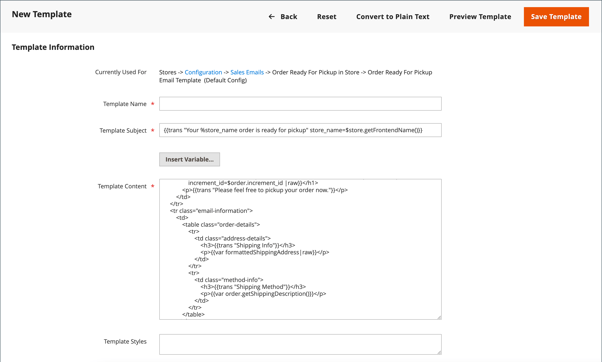
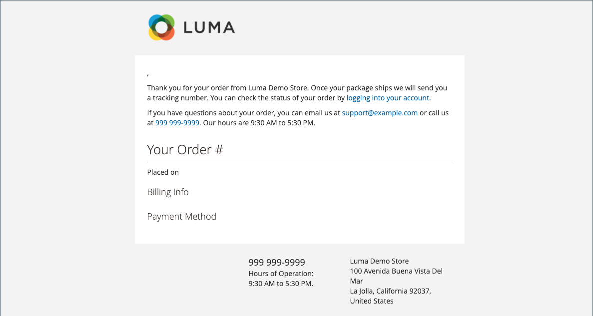

# Usar variáveis predefinidas

As variáveis [Predefinidas](variables-predefined.md) facilitam a personalização dos modelos de [email](email-templates.md) e [informativo](../merchandising-promotions/newsletters.md) e de outros tipos de conteúdo. A lista de variáveis [predefinidas](variables-predefined.md) permitidas é exibida ao clicar no botão Inserir Variável. Como mostrado na imagem a seguir, a lista de variáveis disponíveis para um template de email específico é determinada pelos dados associados ao template. Consulte a [Referência de variáveis](variables-reference.md) para obter uma lista de modelos de email usados com frequência e suas variáveis associadas.

{width="700" zoomable="yes"}

## Adicionar uma variável a um modelo de email

1. Na barra lateral _Admin_, vá para **[!UICONTROL Marketing]** > _[!UICONTROL Communications]_>**[!UICONTROL Email Templates]**.

1. Siga um destes procedimentos:

   - Para adicionar a variável a um modelo existente, clique no modelo na lista para abrir o no modo de edição.

   - Para usar a variável em um novo modelo, clique em **[!UICONTROL Add New Template]** e personalize o código do modelo padrão. Consulte [Modelos de Mensagem](email-template-custom.md#message-templates).

1. Em _[!UICONTROL Load default template]_, escolha a **[!UICONTROL Template]**&#x200B;que deseja personalizar.

1. Para aplicar um modelo, clique em **[!UICONTROL Load Template]**.

   O campo _[!UICONTROL Currently used for]_&#x200B;exibe o caminho de configuração do modelo. O&#x200B;_[!UICONTROL Template Subject]_ e o _[!UICONTROL Template Content]_&#x200B;são gerados automaticamente em relação ao modelo selecionado.

   - **[!UICONTROL Template Subject]** - Este texto é exibido na linha de assunto de um email.

   - **[!UICONTROL Template Content]** - Este texto é exibido no conteúdo completo do email enviado.

   {width="600" zoomable="yes"}

1. Insira um **[!UICONTROL Template Name]**.

1. Para obter uma lista das variáveis [predefinidas](variables-predefined.md) que podem ser usadas com este modelo de email, clique em **[!UICONTROL Insert Variable]**.

   Determine qual variável você deseja inserir no modelo. Em seguida, clique em _Fechar_ (X) no canto superior direito. (Você voltará a isso mais tarde.)

1. Para ver um modelo do modelo, clique em **[!UICONTROL Preview Template]** na barra de botões.

   Quando a visualização for aberta em uma nova guia, determine onde deseja colocar a variável em relação ao outro conteúdo. Em seguida, retorne à guia original para continuar.

   {width="600" zoomable="yes"}

1. Na caixa **[!UICONTROL Template Content]**, posicione o ponto de inserção onde deseja que a variável apareça e clique em **[!UICONTROL Insert Variable...]**.

1. Na lista de variáveis disponíveis, clique na que deseja inserir no modelo.

1. Quando terminar, clique em **[!UICONTROL Save Template]**.

## Converter o modelo em texto simples

1. Abra um modelo no modo de edição.

1. Na parte superior da página, clique em **[!UICONTROL Convert to Plain Text]**.

1. Quando solicitado a retirar tags, clique em **[!UICONTROL OK]**.

1. Para salvar a versão de texto simples, clique em **[!UICONTROL Save Template]**.

## Restaurar a versão do HTML

1. Na parte superior da página, clique em **[!UICONTROL Return HTML Version]**.

1. Para salvar a versão HTML do modelo, clique em **[!UICONTROL Save Template]**.
